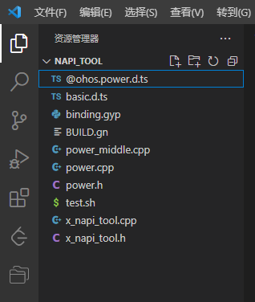

# napi_tool

## Introduction
This paper mainly introduces the NAPi framework code generation tool, which can generate NAPi framework code, business code framework and designed.the GN file according to the TS interface file in the path specified by the user. So developers need to focus on Nodejs related grammar framework layer, interface between c + + with JS type conversion, data type conversion, etc.. This tool is mainly used in the scenario of JS application calling NaPi interface, can focus on business logic implementation, Thus, the development efficiency can be greatly improved. Currently, the tool supports command line and VScode plug-in.

## Software architecture


## Directory Structure

```
├── napi_tool                     # NAPI framework code generation tool
│   ├── docs                      # Plan the current tool capabilities and versions
│   ├── figures                   # Image resource file
│   ├── code                      # Tool source
|   |   ├── tool_code             # Tool source
│   |       ├── gen              
│   |           |── analyze       # Parser
│   │           |── extend        # Extension module, including GN file generation, Linux environment adaptation code, etc
│   │	        |── generate      # Generator
│   │           └── tools         # Public module code, including message body check, file read and write, regular expression
│   |       └── test              # Plug-in test cases    
|   |   └──ts_test                # Example ts files required by the tool  
│   └── README                        
└──README 
```

### code directory source code introduction
This directory is the source code corresponding to the NAPI framework code generation tool, developers can be based on this code for secondary development.

## Software environment preparation

System: Ubuntu 20.04 or windows 10 is recommended

Dependent version: vscode 1.62.0

## Development description

Developers can use the source code to compile and package the corresponding executable files and plug-ins for type conversion between JS and C + +. The development instructions of executable files and plug-ins are as follows:

### Source code

Through the command: git clone git@gitee.com :openharmony-sig/assist_ tools.git to download the corresponding source code.

### pack

#### Executable file development instructions
1.Install pkg :execute the command sudo npm i -g pkg

2.Package three versions : execute the command pkg vscode_plugin/gnapi/gen/cmd_gen.js

After performing the preceding steps，ou can generate Windows, Linux, and MAC executable programs in the Gen directory:cmd_gen-win.exe、cmd_gen-linux、cmd_gen-macos.

#### Plug-in development Instructions
1. Install yo : execute the command npm install -g yo generator-code.

2. Use yo : execute the command yo code，gnapi is a plug-in code framework generated by Yo Code, in which gnAPI/Gen directory is the source code of the automatic generation of NAPI program we developed.

   

3. Run npm i vsce in the napi_generator/vscode_plugin/gnapi directory.

4. Execute the command./node_modules/vsce/vsce package command，The final package generates a plugin, gnapI-0.0.1.vsix.

   

## instructions

1. Copy the Windows executable program cmd_gen-win.exe from the gen directory to the corresponding directory. You do not need to install the program.
2. Copy the Linux executable program cmd_gen-linux from the gen directory to the corresponding directory, and run it directly on the terminal.

### Usage

#### Windows

1) The.d.ts files to be converted should be placed in any directory. It is recommended to put them in the same directory as the executable program cmd_gen-win.exe, for example:


2) Right-click Windows Start menu, click Run, enter CMD, and click OK.


3) In the command line interface (CLI), go to the directory where the previous executable program cmd_gen-win.exe resides and run cmd_gen-win.exe. After cmd_gen-win.exe, the corresponding.


4) After successful operation, the corresponding file will be generated in the directory where the. D. ts file says, for example:


#### Linux

1) Put the.d.ts files to be converted in any directory. It is recommended to put them in the same directory as the executable program cmd_gen-linux, for example:

   

2) In the terminal, go to the directory where the previous executable program cmd_gen-linux resides and run cmd_gen-linux. After cmd_gen-linux, the corresponding. D. s file name, for example:

   

3) After successful operation, the corresponding file will be generated in the directory where the. D. ts file says, for example:

   

#### Mac
Method Step For details about how to use Windows and Linux

## Plug-in usage
### Instruction
Visual Studio Code version 1.62.0 or later

### Steps

1) Open vscode and select plug-in installation in the left sidebar.

   

2) Click the three buttons above, select the install from VSIX option, then select the gnapI-0.0.1. VSIX plug-in file you just generated, and click Install.

   

3) After installation, the gnapi plugin should be visible in vscode's plugin manager.

   

4) Find the.d.ts file to convert in vscode, for example:

   

5) Right click on.d.ts and select.d.ts to generate c++ options.

   

6) The corresponding files will be generated in this directory, for example:

   

## Matters needing attention
The examples above are for Windows. The methods for Linux and MAC are similar.

## Participate in the contribution

Not yet.

## Related to the storehouse

Not yet.