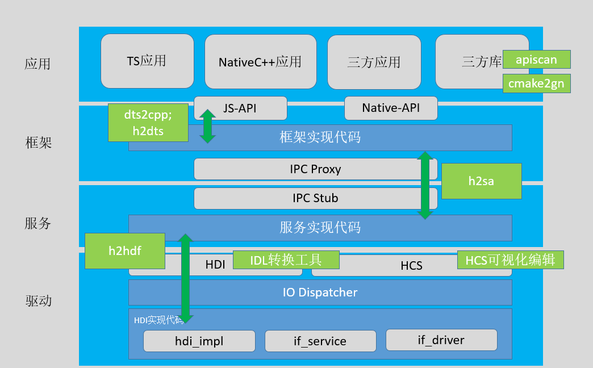

# Introduction

**napi-generator** initially aims to provide NAPI framework code generation tools based on the OpenHarmony standard system to improve development efficiency. Scope of work:

1. Provide NAPI framework code generation tools for developers and IDE platforms on mainstream operating systems
2. Provide usage examples
3. Provide continuous improvement and optimization

**Work Objectives**:

| Work Objective | Status | Remarks |
| -------------- | ------ | ------- |
| NAPI Generation Tool | V1.4.1 | Supports small-scale automatic generation. Basic feature set: can generate corresponding code from simple dts or h files |
| TS Generation Tool (h2dts) | V1.0.0 | Provides command line, VSCode and IntelliJ plugins. Basic feature set: can convert simple h files to dts files |
| Gn Generation Tool (cmake2gn) | V1.0.0 | Basic feature set: can automatically generate gn files in an environment with cmake compilation, but may have issues with multi-project references and other dependencies |
| Service Generation Tool (h2sa) | V1.0.0 | Basic feature set: generates SA service framework code from h files, including Ability registration, proxy/stub class implementation, MessageParcel data packet construction, Service subsystem compilation and service configuration files |
| API Platform Dependency Analysis Scan Tool | V1.0.0 | Scans third-party libraries for interfaces not included in OpenHarmony source code and outputs result.xlsx document |
| HCS Visualization Tool | V1.0.0 | See: drivers_hdf_core/framework/tools/hcs-view |
| IDL Generation Tool | V1.0.0 | See: drivers_hdf_core/framework/tools/idl-gen |
| Provide Usage Examples | | See the content under the example directory in this repository |

**Architecture Diagram**

**Module Descriptions**

- The dts2cpp tool can generate NAPI framework code, business code framework, GN files, etc. with one click based on the ts (typescript) interface files under the user-specified path.

  [readme](https://gitee.com/openharmony/napi_generator/blob/master/src/cli/dts2cpp/dts2cpp_README_ZH.md)

  [Release Notes](https://gitee.com/openharmony/napi_generator/tree/master/src/cli/dts2cpp/docs/release-notes)

- The h2dts tool can generate type-script language ts interface files based on interfaces defined in c++ header files.

  [readme](https://gitee.com/openharmony/napi_generator/blob/master/src/cli/h2dts/h2dts_README_ZH.md)

  [Release Notes](https://gitee.com/openharmony/napi_generator/tree/master/src/cli/h2dts/docs/release-notes/ts_Gen-1.0.md)

- The cmake2gn tool can compile and convert the CMakeLists.txt file of third-party libraries to generate BUILD.gn script files.

  [readme](https://gitee.com/openharmony/napi_generator/blob/master/src/cli/cmake2gn/cmake2gn_README_ZH.md)

  [Release Notes](https://gitee.com/openharmony/napi_generator/tree/master/src/cli/cmake2gn/docs/release-notes/gn-gen-release-notes-0.0.2.md)

- The h2sa tool can generate the entire Service framework code based on a .h header file that defines remote methods, including Ability registration, proxy/stub class implementation, MessageParcel data packet construction, Service subsystem compilation and boot auto-start related configuration files.

  [readme](https://gitee.com/openharmony/napi_generator/blob/master/src/cli/h2sa/README_ZH.md)

  [Release Notes](https://gitee.com/openharmony/napi_generator/tree/master/src/cli/h2sa/docs/release-notes/Service-1.0.md)

- The h2dtscpp tool can generate type-script language ts interface files, NAPI framework code, and automated test case code based on interfaces defined in c++ header files.

  [readme](https://gitee.com/openharmony/napi_generator/blob/master/src/cli/h2dtscpp/h2dtscpp_README_ZH.md)

- The scan tool can scan third-party libraries for interfaces not included in OpenHarmony source code and output result.xlsx document.

  [readme](https://gitee.com/openharmony/napi_generator/blob/master/src/tool/api/scan_README_ZH.md)

**Related Repositories**

[napi](https://gitee.com/openharmony/arkui_napi)
[safwk](https://gitee.com/openharmony/systemabilitymgr_safwk)
[samgr](https://gitee.com/openharmony/systemabilitymgr_samgr)
[hdf](https://gitee.com/openharmony/drivers_hdf_core)
[hidumper](https://gitee.com/openharmony/hiviewdfx_hidumper)
[hilog](https://gitee.com/openharmony/hiviewdfx_hilog)
[hisysevent](https://gitee.com/openharmony/hiviewdfx_hisysevent)