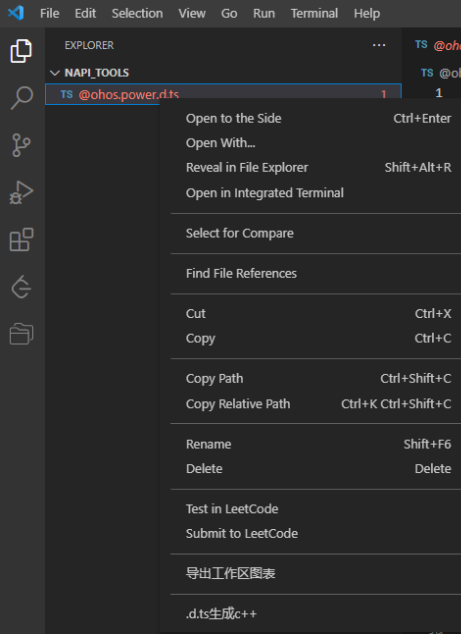
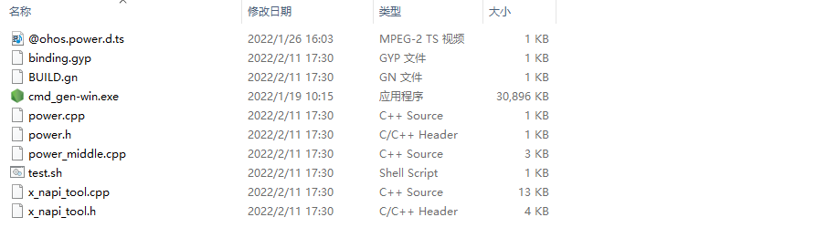

# napi_generator

## 概述
本文主要介绍NAPI框架代码生成工具，它可以根据用户指定路径下的ts接口文件一键生成NAPI框架代码、业务代码框架、GN文件等。在开发JS应用与NAPI间接口时，底层框架开发者无需关注Nodejs语法、C++与JS之间的数据类型转换等上层应用转换逻辑，只关注底层业务逻辑即可，专业的人做专业的事，从而可以大大提高开发效率。目前工具支持命令行、VScode插件两种入口。

## 软件架构


## 目录

```
├── napi_generator                # NAPI框架代码生成工具
│   ├── docs                      # 工具当前能力、版本规划
│   ├── figures                   # 图片资源文件
│   ├── prebuilt                  # 可执行文件、插件文件
│   ├── release-notes             # 发布说明
│   ├── src                       # 工具源码
|   |   └── gen                  
│   |       ├── analyze           # 解析器
│   |       |── extend            # 扩展模块，包括gn文件生成、linux环境适配代码等
│   │       |── generate          # 生成器
│   │       └── tools             # 公共模块代码，包括消息体校验、文件读写、正则表达式转换等  
|   ├── ts_test                   # 工具需要的ts文件样例  
│   └── README                    # 工具使用指导    

```
### code目录源码介绍
此目录为NAPI框架代码生成工具对应的源码，开发者可基于此代码进行二次开发。

## 软件环境准备

系统：建议Ubuntu 20.04或者Windows 10

依赖版本：vscode 1.62.0

## 开发说明

开发者可以利用源码来编译打包生成对应的可执行文件和插件，用于在JS和c++之间进行类型转换。可执行文件和插件的开发说明如下：

### 源码

通过命令：git clone git@gitee.com:openharmony-sig/napi_generator.git   下载对应的源码。

### 打包

### 开发说明

   https://gitee.com/openharmony-sig/napi_generator/blob/master/DEVELOP.md

## 使用说明

1. 将gen目录下Windows可执行程序napi_generator-win.exe拷贝到对应目录下，不需要安装，可以在cmd命令行中直接运行。
2. 将gen目录下Linux可执行程序napi_generator-linux拷贝到对应目录下，可以在终端下直接运行。

### 可执行程序使用方法

#### Windows

1) 将要转换的.d.ts文件放到任意目录下，建议放到可执行程序napi_generator-win.exe同级目录下，并且检查需要转换的d.ts文件中是否声明了import的d.ts文件，如果存在需要将import的d.ts文件也放入到待转换的d.ts文件相同的目录下，比如，目前需要待转换的d.ts文件是@ohos.power.d.ts，在该文件中存在import {AsyncCallback} from './basic';这段逻辑，所以需要将basic.d.ts放入到@ohos.power.d.ts相同的目录下。例如：


2) 右键windows开始菜单，点击运行，输入cmd，点击确定。


3. 在命令行中进入到之前可执行程序napi_generator-win.exe所在的目录，并运行napi_generator-win.exe，在napi_generator-win.exe后面要加参数-f，后面在加要对应的.d.ts文件名，如果不加参数-o，输出文件就默认在当前目录下，例如：

   ```
   E:\napi_tool>napi_generator-win.exe -f @ohos.power.d.ts
   
   ```

   命令行参数如下，-f是必须添加的参数，-o是可选参数，如果不加就默认当前目录。

   ```
   -f, --filename <ARG1>         .d.ts file                                            -o, --out <ARG1>              output directory ("." by default)
   ```

   

4. 运行成功后会在.d.ts文件说在的目录下生成对应的文件，例如：


#### Linux

1) 将要转换的.d.ts文件放到任意目录下，建议放到可执行程序napi_generator-linux同级目录下，并且检查需要转换的d.ts文件中是否声明了import的d.ts文件，如果存在需要将import的d.ts文件也放入到待转换的d.ts文件相同的目录下，例如：

   ```
   xudong@xudong:~/napi_tool$ ls
   napi_generator-linux  @ohos.power.d.ts  basic.d.ts
   xudong@xudong:~/napi_tool$ 

   ```

2) 在终端中进入到之前可执行程序napi_generator-linux所在的目录，并运行napi_generator-linux，在napi_generator-linux后面要加参数-f，后面在加要对应的.d.ts文件名，如果不加参数-o，输出文件就默认在当前目录下，例如：

   ```
   xudong@xudong:~/napi_tool$ ls
   napi_generator-linux  @ohos.power.d.ts  basic.d.ts
   xudong@xudong:~/napi_tool$ ./napi_generator-linux -f @ohos.power.d.ts 
   
   ```
3) 运行成功后会在.d.ts文件说在的目录下生成对应的文件，例如：

   ```
   xudong@xudong:~/napi_tool$ ls
   binding.gyp  BUILD.gn  cmd_gen-linux  @ohos.power.d.ts  power.cpp  power.h  power_middle.cpp  test.sh  x_napi_tool.cpp  x_napi_tool.h
   xudong@xudong:~/napi_tool$ 
   
   ```
#### Mac
方法步骤参考windows、Linux的使用方法

## 插件使用方法
### 说明
visual studio code 版本需1.62.0及以上

### 步骤

1) 打开vscode，在左侧边栏中选择插件安装。

   

2) 点击上面三个点的按钮，选择从VSIX安装选项，然后选择刚才生成的gnapi-0.0.1.vsix插件文件，再点击安装。

   

3) 安装完成后就会在vscode的插件管理器中能看到gnapi这个插件了。

   

4) 在vscode中找到需要转换的.d.ts文件，例如：

   

5) 鼠标在.d.ts上点击右键，选择.d.ts生成c++选项。

   

6) 之后就会在该目录下生成对应文件，例如：

   

## 使用场景
1) 系统框架层新增子系统，需对应用层提供接口

2) 系统框架层已有子系统增强能力后，需对应用层提供新接口

## 使用对象
系统框架开发者

## 使用效果
根据指定的ts文件生成C/C++接口框架，如ts_test\gen\@ohos.napitest.d.ts转换后生成napitest.cpp文件。
效果图如下：


```
#include "napitest.h"


namespace napitest {

bool TestClass1::if_direct(std::string &v1, std::string &out) {
    // TODO
    return true;
}

bool TestClass1::if_callback(std::string &v1, std::string &out) {
    // TODO
    return true;
}

bool TestClass1::if_async(std::string &v1, std::string &out) {
    // TODO
    return true;
}

bool fun2(std::string &v2, std::vector<NUMBER_TYPE_4> &numcc, Human &mancc, std::vector<Human> &out) {
    // TODO
    return true;
}

bool fun3(std::string &v2, std::string &out) {
    // TODO
    return true;
}

bool fun4(std::string &v2, std::string &out) {
    // TODO
    return true;
}

namespace Space3 {

bool fun3(std::string &v3, std::string &out) {
    // TODO
    return true;
}

namespace Space4 {

bool TestClass3::add(std::vector<NUMBER_TYPE_7> &v1, NUMBER_TYPE_8 &out) {
    // TODO
    return true;
}

bool fun3(std::string &v3, std::string &out) {
    // TODO
    return true;
}

}

}

}
```

## FAQ

https://gitee.com/openharmony-sig/napi_generator/blob/master/FAQ.md

## 注意事项
以上插件使用示例为windows的，linux、mac的使用方法类似。

## 参与贡献

暂无

## 相关仓

暂无
