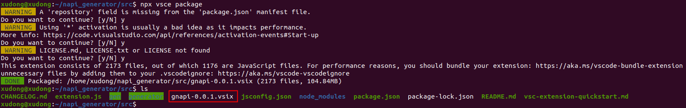
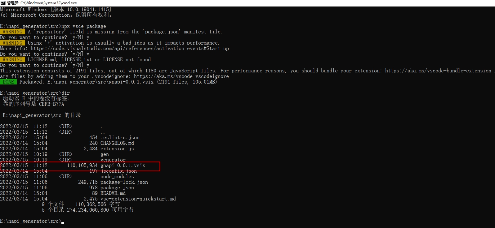
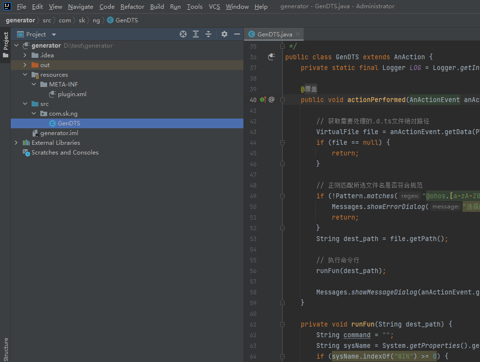
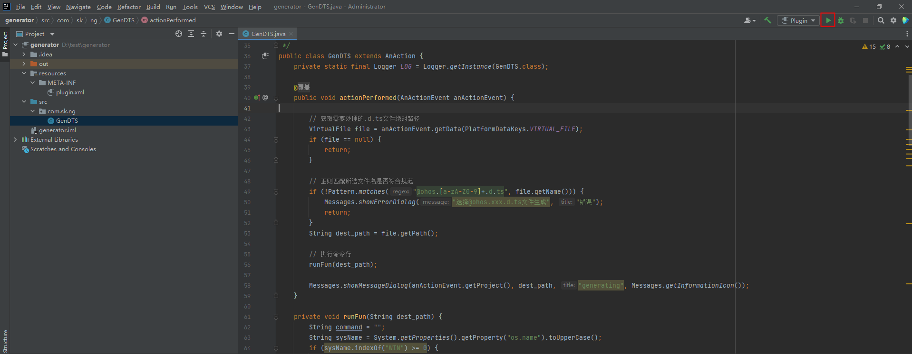
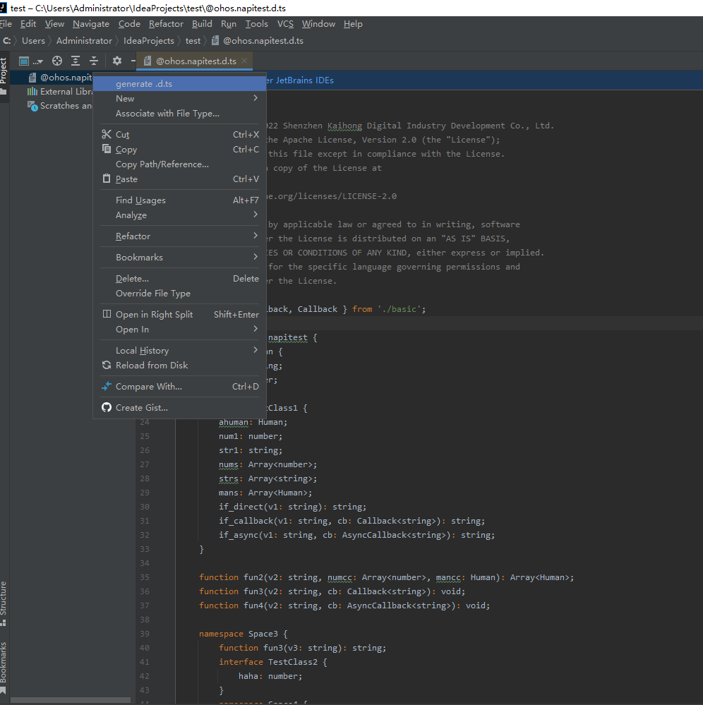
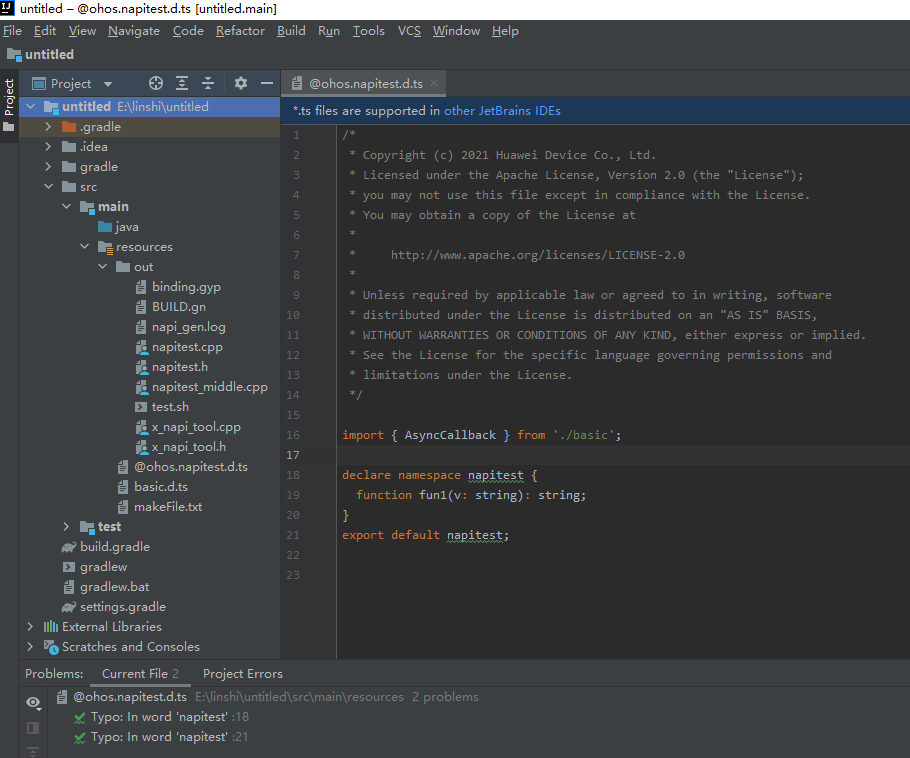

# NAPI框架生成工具开发说明
若当前工具功能不满足开发者需求，开发者需增强工具能力，则可基于已有源码进行工具二次开发，编译打包生成自定义的可执行文件和插件。

## 工具开发

### 可执行文件开发说明

#### 环境说明

系统：建议Ubuntu 20.04或者Windows 10

#### 开发步骤

1.安装typescript：在napi_generator目录下和napi_generator/src目录下分别都执行命令：

	npm i typescript

2.安装stdio：在napi_generator目录下执行命令：

	npm i stdio

3.安装pkg : 在napi_generator目录下执行命令：

	sudo npm i -g pkg

4.打包三个版本 : 执行命令：

	pkg .

执行以上步骤后，即可在gen目录下生成Windows、linux、mac系统下的可执行程序:

	napi_generator-win.exe、napi_generator-linux、napi_generator-macos

### VS插件开发说明

#### Linux

1. 在napi_generator/src这个目录下执行命令：

    npm i typescript

2. 在napi_generator/src这个目录下执行命令：

    npm i vsce

3. 在napi_generator/src这个目录下执行命令：

	npx vsce package

4. 每个选项都选择y，然后回车，最终会在当前目录下打包生成一个插件gnapi-0.0.1.vsix。结果如下：

  
		   
#### Windows

1. 在napi_generator/src这个目录下执行命令：

    npm i typescript

2. 在napi_generator/src这个目录下执行命令：

    npm i vsce
   
3. 在napi_generator/src这个目录下执行命令：

    npx vsce package

4. 每个选项都选择y，然后回车，最终会在当前目录下打包生成一个插件gnapi-0.0.1.vsix。结果如下：

  

### IntelliJ插件开发说明

#### 环境说明

系统：建议Ubuntu 20.04或者Windows 10

#### 开发步骤

1.通过IntelliJ IDEA打开generator目录下的代码。

2.执行IntelliJ IDEA工具右上角的run。

3.IntelliJ IDEA会自动拉起一个应用程序。

4.选择.d.ts文件,右键选择generate.d.ts选项，生成文件。

5.执行结束后会在目录下生成对应的文件。

## 工具测试
  进行工具二次开发后，本地可进行单元测试、特性测试确保工具的可用性。

  [单元测试方法](https://gitee.com/openharmony-sig/napi_generator/blob/master/test/unittest/README_ZH%20.md)

  [特性测试方法](https://gitee.com/openharmony-sig/napi_generator/blob/master/test/storytest/README_ZH.md)
