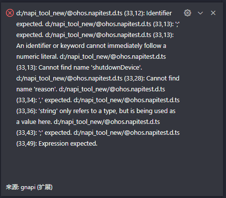
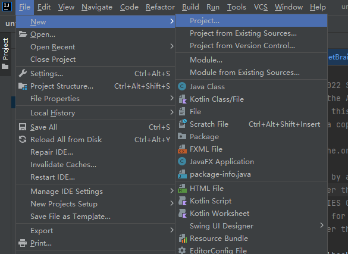
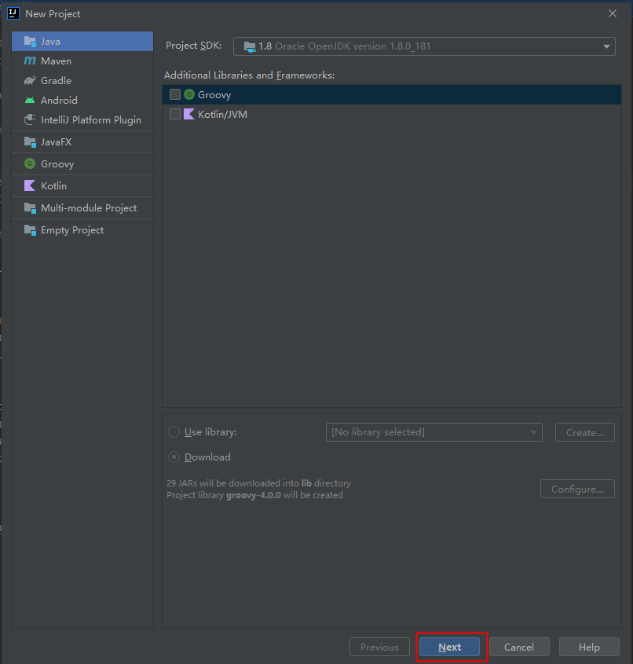
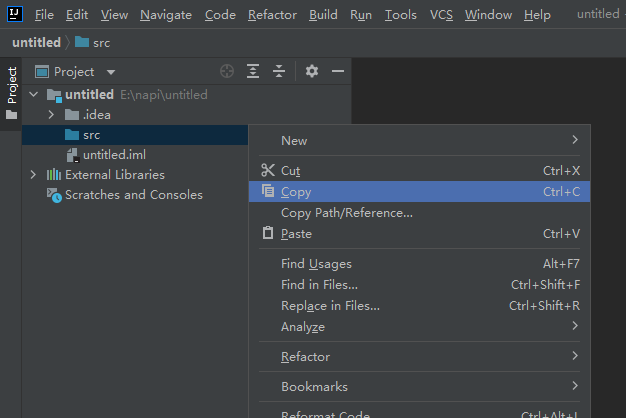
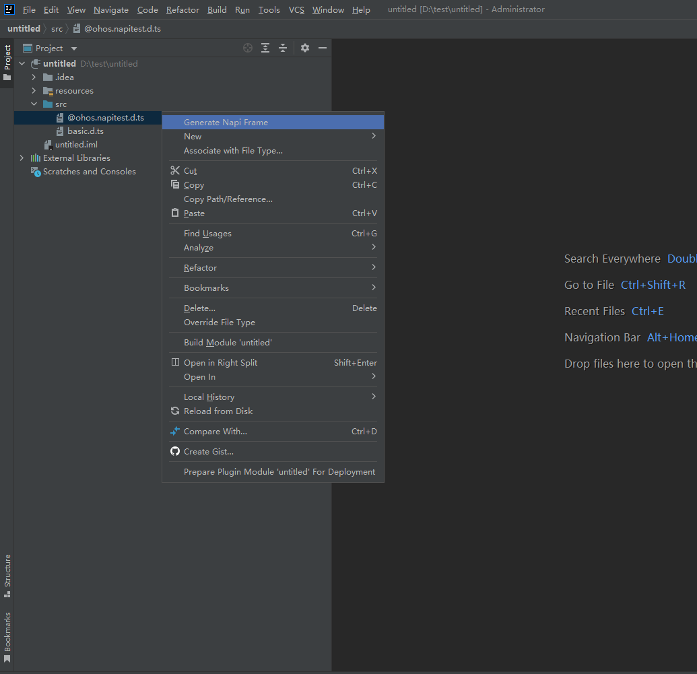
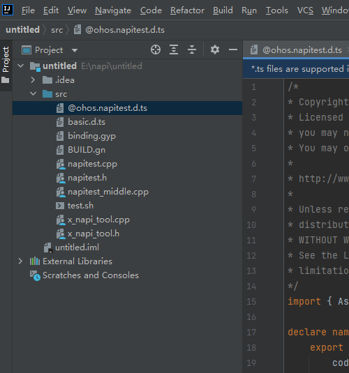

# NAPI框架生成工具使用说明
## 简介
NAPI框架生成工具支持三种入口，分别是可执行程序、VS Code插件、IntelliJ插件，在napi_generator/prebuilt目录下存有已生成的文件，用户可直接使用。
生成文件说明如下：

```
├── napi_generator                # NAPI框架代码生成工具
│   ├── prebuilt                  # 可执行程序、插件文件
│   |   ├── generator.jar           # IntelliJ插件
│   |   |── gnapi-0.0.1.vsix        # VS插件
│   │   |── napi_generator-linux    # Linux可执行程序 
│   │   |── napi_generator-win.exe  # Windows可执行程序    
|   |   └── napi_generator-macos    # Mac可执行程序              

```


## 预检查
napi_generator的可执行程序方式和插件方式都具有预检查的功能，如果.d.ts文件中存在语法错误，那么执行的时候命令行会打印出错误信息，指出代码中存在错误的行号，例如：

### Linux

```
joey@joey-virtual-machine:~/code/napi_test$ ./napi_generator-linux -f @ohos.napitest.d.ts
@ohos.napitest.d.ts (33,12): Identifier expected.
@ohos.napitest.d.ts (33,13): ';' expected.
@ohos.napitest.d.ts (33,13): An identifier or keyword cannot immediately follow a numeric literal.
@ohos.napitest.d.ts (33,13): Cannot find name 'shutdownDevice'.
@ohos.napitest.d.ts (33,28): Cannot find name 'reason'.
@ohos.napitest.d.ts (33,34): ',' expected.
@ohos.napitest.d.ts (33,36): 'string' only refers to a type, but is being used as a value here.
@ohos.napitest.d.ts (33,43): ';' expected.
@ohos.napitest.d.ts (33,49): Expression expected.

joey@joey-virtual-machine:~/code/napi_test$ 
```

其中括号中第一个参数含义为行号，第二个参数含义为列号

### VS Code插件



### Windows

```
D:\napi_tool>napi_generator-win.exe -f @ohos.napitest.d.ts                                                                      @ohos.napitest.d.ts (33,12): Identifier expected.                                                                              @ohos.napitest.d.ts (33,13): ';' expected.                                                                                    @ohos.napitest.d.ts (33,13): An identifier or keyword cannot immediately follow a numeric literal.                            @ohos.napitest.d.ts (33,13): Cannot find name 'shutdownDevice'.                                                                @ohos.napitest.d.ts (33,28): Cannot find name 'reason'.                                                            @ohos.napitest.d.ts (33,34): ',' expected.                                                                                      @ohos.napitest.d.ts (33,36): 'string' only refers to a type, but is being used as a value here.                                @ohos.napitest.d.ts (33,43): ';' expected.                                                                                      @ohos.napitest.d.ts (33,49): Expression expected.    
```

## 生成框架

### 可执行程序使用方法
#### Linux

1) 将要转换的.d.ts文件放到任意目录下，建议放到可执行程序napi_generator-linux同级目录下，并且检查需要转换的d.ts文件中是否声明了import的d.ts文件，如果存在需要将import的d.ts文件也放入到待转换的d.ts文件相同的目录下，例如：

   ```
   xudong@xudong:~/napi_tool$ ls
   napi_generator-linux  @ohos.napitest.d.ts  basic.d.ts
   xudong@xudong:~/napi_tool$ 

   ```

2) 在终端中进入到之前可执行程序napi_generator-linux所在的目录，并运行napi_generator-linux，在napi_generator-linux后面要加参数-f，后面再加要对应的.d.ts文件名，如果不加参数-o，输出文件就默认在当前目录下，例如：

   ```
   xudong@xudong:~/napi_tool$ ls
   napi_generator-linux  @ohos.napitest.d.ts  basic.d.ts
   xudong@xudong:~/napi_tool$ ./napi_generator-linux -f @ohos.napitest.d.ts 
   
   ```
3) 运行成功后会在.d.ts文件说在的目录下生成对应的文件，例如：

   ```
   xudong@xudong:~/napi_tool$ ls
   binding.gyp  BUILD.gn  cmd_gen-linux  @ohos.napitest.d.ts  napitest.cpp  napitest.h  napitest_middle.cpp  test.sh  x_napi_tool.cpp  x_napi_tool.h
   xudong@xudong:~/napi_tool$ 
   
   ```
#### Windows

将要转换的.d.ts文件放到任意目录下，建议放到可执行程序napi_generator-win.exe同级目录下，并且检查需要转换的d.ts文件中是否声明了import的d.ts文件，如果存在需要将import的d.ts文件也放入到待转换的d.ts文件相同的目录下。示例如下：

1) 需要转换的d.ts文件是@ohos.napitest.d.ts，在该文件中存在import {AsyncCallback} from './basic';所以需要将basic.d.ts放入到@ohos.napitest.d.ts相同的目录下。示例中用到的@ohos.napitest.d.ts和basic.d.ts文件在napi_generator\examples\gen下，例如：


2) 右键windows开始菜单，单击运行，输入cmd，单击确定。


3. 在命令行中进入到之前可执行程序napi_generator-win.exe所在的目录，并运行napi_generator-win.exe，在napi_generator-win.exe后面要加参数-f，后面再加要对应的.d.ts文件名，如果不加参数-o，输出文件就默认在当前目录下，例如：

   ```
   E:\napi_tool>napi_generator-win.exe -f @ohos.napitest.d.ts
   
   ```

   命令行参数如下，-f是必须添加的参数，-o是可选参数，如果不加就默认当前目录。

   ```
   -f, --filename <ARG1>         .d.ts file                                            -o, --out <ARG1>              output directory ("." by default)
   ```

   

4. 运行成功后会在.d.ts文件说在的目录下生成对应的文件，例如：


#### Mac
方法步骤参考windows、Linux的使用方法

### VS Code插件使用方法
#### 说明
visual studio code 版本需1.62.0及以上

#### 步骤

1) 打开VS Code，在左侧边栏中选择插件安装。

   

2) 单击上面三个点的按钮，选择从VSIX安装选项，然后选择刚才生成的gnapi-0.0.1.vsix插件文件，再单击安装。

   

3) 安装完成后就会在VS Code的插件管理器中能看到gnapi这个插件了。

   

4. 在VS Code中找到需要转换的.d.ts文件，并且检查需要转换的d.ts文件中是否声明了import的d.ts文件，如果存在需要将import的d.ts文件也放入到待转换的d.ts文件相同的目录下，例如

   

5. 鼠标在.d.ts上单击右键，选择.d.ts生成c++选项。

   

6. 转换成功就会提示“生成成功”的信息，并且在该目录下生成对应文件，例如：

   

   


### IntelliJ插件使用方法
#### 依赖
系统：不限

开发工具：IntelliJ IDEA

#### 使用指导
在napi_generator/prebuilt目录下提供了插件包，其名称为generator.jar，开发者只需要下载插件包按照下述步骤安装使用即可：

1.新建或打开项目工程，以下以新建项目工程为例。

File->New->Project



左侧栏选择Java，右侧默认选择Groovy，单击Next,继续单击Next,单击Finish,新的工程就创建好了



2.复制本地napi_generator/test/unittest/basic.d.ts文件，进入IntelliJ新建项目中选中src粘贴，将basic.d.ts文件放入src目录。



3.把需要转换的.d.ts文件放到项目中。


4.安装插件，File->Settings->Plugins->Installed->Install Plugin from Disk...
选择从项目prebuilt目录下generator.jar
安装成功之后重启IDE


5.选择.d.ts文件,右键选择Generate Napi Frame选项，生成文件



6.执行结束后会在目录下生成对应的文件




## 集成测试
NAPI框架代码生成后，系统框架开发者进行二次开发后，即可集成到OpenHarmony编译系统，生成对应的库文件，供应用开发者调用接口，指导如下：

https://gitee.com/openharmony-sig/napi_generator/blob/master/docs/NAPI集成到OpenHarmony系统集成测试.md
