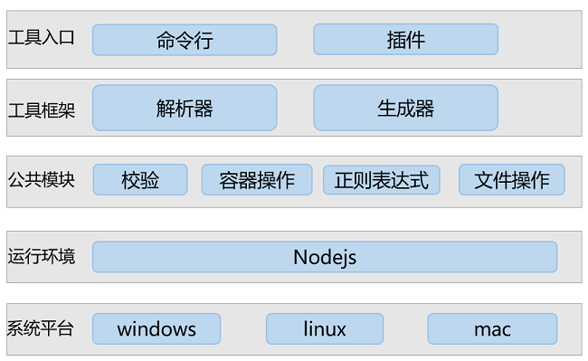
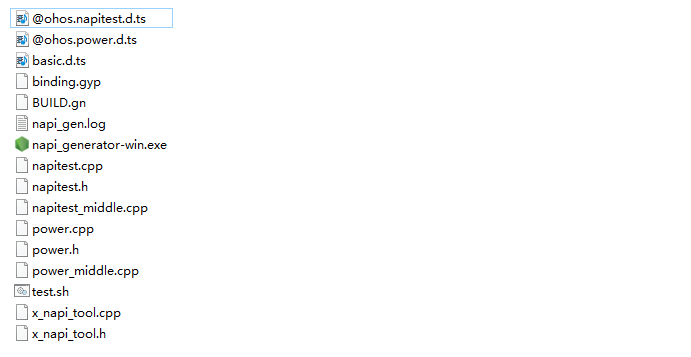

# NAPI框架生成工具使用说明
## 简介

NAPI框架生成工具支持三种入口，分别是可执行程序、VS Code插件、IntelliJ插件，使用者可以根据自己的需要选择合适的工具。可执行文件、IntelliJ插件、VS Code插件下载路径如下，选择napi_generator_outputs.zip下载。

[下载链接](http://ftp.kaihongdigi.com:5000/fsdownload/mKjfCmPjk/generator_outputs_NAPI_0930)

下载文件说明如下：

	│   │   |── generator.jar           # IntelliJ插件
	│   │   |── gnapi-0.0.1.vsix        # VS Code插件
	│   │   |── napi_generator-linux    # Linux可执行程序 
	│   │   |── napi_generator-win.exe  # Windows可执行程序    
	│   │   └── napi_generator-macos    # Mac可执行程序                

## 工具介绍

通过NAPI框架生成工具，使用者可输入一个接口定义的ts文件，一键生成NAPI框架代码、业务代码框架、GN脚本等文件，并使用生成的NAPI接口及功能。NAPI框架生成工具的软件架构如下：

## 预检查

napi_generator的可执行程序方式和插件方式都具有预检查的功能，如果.d.ts文件中存在语法错误，那么执行的时候命令行会打印出错误信息，指出代码中存在错误的行号。使用效果如下：

	joey@joey-virtual-machine:~/code/napi_test$ ./napi_generator-linux -f @ohos.napitest.d.ts
	@ohos.napitest.d.ts (33,12): Identifier expected.
	@ohos.napitest.d.ts (33,13): ';' expected.
	@ohos.napitest.d.ts (33,13): An identifier or keyword cannot immediately follow a numeric literal.
	@ohos.napitest.d.ts (33,13): Cannot find name 'shutdownDevice'.
	@ohos.napitest.d.ts (33,28): Cannot find name 'reason'.
	@ohos.napitest.d.ts (33,34): ',' expected.
	@ohos.napitest.d.ts (33,36): 'string' only refers to a type, but is being used as a value here.
	@ohos.napitest.d.ts (33,43): ';' expected.
	@ohos.napitest.d.ts (33,49): Expression expected.
	
	joey@joey-virtual-machine:~/code/napi_test$ 

@ohos.napitest.d.ts (33,49)，其中括号中第一个参数含义为行号，第二个参数含义为列号。

预检查的触发方式与生成框架的入口一致，使用方法参见生成框架描述。

## 生成框架

### 可执行程序使用方法
#### Linux

1.将要转换的.d.ts文件放到任意目录下，建议放到可执行程序napi_generator-linux同级目录下，并且检查需要转换的d.ts文件中是否声明了import的d.ts文件，如果存在需要将import的d.ts文件也放入到待转换的d.ts文件相同的目录下。此处新建out文件夹，用于存放生成框架代码。整体目录文件如下：

	harmony@Ubuntu-64:~/napi/napi_generator_5/examples/gen$ ls
	basic.d.ts  napi_generator-linux  @ohos.napitest.d.ts  out

2.在终端中进入到之前可执行程序napi_generator-linux所在的目录，并运行napi_generator-linux。-f为d.ts接口文件，-o为生成框架代码的输出路径，若不加-o参数，默认输出到当前目录下，命令如下：

	harmony@Ubuntu-64:~/napi/napi_generator_5/examples/gen$ ./napi_generator-linux -f @ohos.napitest.d.ts -o out 

3.运行成功后会在out目录下生成对应的文件。例如：

	harmony@Ubuntu-64:~/napi/napi_generator_5/examples/gen/out$ ls
	binding.gyp  BUILD.gn  napi_gen.log  napitest.cpp  napitest.h  napitest_middle.cpp  test.sh  tool_utility.cpp  tool_utility.h

4.此外，工具还支持指定路径下d.ts文件转换、同一目录下多个d.ts文件同时转换、多级模块d.ts文件转换、d.ts接口import多个文件等场景。

1）指定路径下.d.ts文件转换（可转换路径下所有.d.ts文件）。napi_generator-linux文件存放在~/napi/napi_generator_5/examples/gen目录下，.d.ts文件存放在~/napi/napi_generator_5/examples/ts目录下，框架代码转换命令如下：

	harmony@Ubuntu-64:~/napi/napi_generator_5/examples/gen$ ./napi_generator-linux -d '../ts' -o out

2）同一目录下多个.d.ts文件同时转换。.../gen目录下存在两个.d.ts文件，分别为@ohos.napitest.d.ts和@ohos.power.d.ts，多个文件中间以“，”隔开，注意文件中namespace后的名称不可相同。框架代码转换命令如下：

	harmony@Ubuntu-64:~/napi/napi_generator_5/examples/gen$ ./napi_generator-linux -f @ohos.napitest.d.ts,@ohos.power.d.ts -o out 

3）多级模块.d.ts文件转换。.../gen目录下存在@ohos.napi_.test.A.d.ts文件，转换命令如下：

	harmony@Ubuntu-64:~/napi/napi_generator_5/examples/gen$ ./napi_generator-linux -f @ohos.napi_.test.A.d.ts -o out

4）待转换的d.ts引用多个d.ts文件。若当前d.ts文件引用多个d.ts文件，且被引用的接口文件也需生成框架代码，此时需要将工具import开关打开，且需将basic.d.ts文件放置在待转换d.ts文件上一级目录下。-i参数默认为false，此处需置为true,执行命令如下：

	harmony@Ubuntu-64:~/napi/napi_generator_5/examples/gen$ ./napi_generator-linux -f @ohos.napitest.d.ts -o out -i true

#### Windows

1.将要转换的.d.ts文件放到任意目录下，建议放到可执行程序napi_generator-win.exe同级目录下，并且检查需要转换的d.ts文件中是否声明了import的d.ts文件，如果存在需要将import的d.ts文件也放入到待转换的d.ts文件相同的目录下。示例如下：

1) 将@ohos.napitest.d.ts和basic.d.ts文件放在napi_generator\examples\gen目录下。例如：

2) 右键windows开始菜单，单击运行，输入cmd，单击确定。

2.在命令行中进入到之前可执行程序napi_generator-win.exe所在的目录，并运行napi_generator-win.exe。-f参数后为d.ts接口文件，-o为生成框架代码输出路径，若不加此参数，默认输出到当前目录下，命令如下：

	E:\napi_tool>napi_generator-win.exe -f @ohos.napitest.d.ts

3.运行成功后会在当前目录下生成对应的文件。例如：

4.此外，工具还支持指定路径下d.ts文件转换、同一目录下多个d.ts文件同时转换、多级模块d.ts文件转换、d.ts接口import多个文件等场景。

1）指定路径下.d.ts文件转换（可转换路径下所有.d.ts文件）。napi_generator-win.exe文件存放在E:\napi_generator\napi_generator-master\examples\gen>目录下，.d.ts文件存放在E:\demo目录下。命令执行成功后，gen目录中生成对应的文件如上图所示。框架代码转换命令如下：

	E:\napi_generator\napi_generator-master\examples\gen>napi_generator-win.exe -d "E:\demo"

2）同一目录下多个.d.ts文件同时转换。.../gen目录下存在两个.d.ts文件，分别为@ohos.napitest.d.ts和@ohos.power.d.ts，多个文件中间以“，”隔开，注意文件中namespace后的名称不可相同。框架代码转换命令如下：

	E:\napi_generator\napi_generator-master\examples\gen>napi_generator-win.exe -f @ohos.napitest.d.ts,@ohos.power.d.ts

3)多级模块.d.ts文件转换。.../gen目录下存在@ohos.napi_.test.A.d.ts文件。命令执行成功后，gen目录中成功生成对应的文件，与指定路径下.d.ts文件转换效果图一致，转换命令如下：
	
	E:\napi_generator\napi_generator-master\examples\gen>napi_generator-win.exe -f @ohos.napi_.test.A.d.ts

4）待转换的d.ts引用多个d.ts文件。若当前d.ts文件引用多个d.ts文件，且被引用的接口文件也需生成框架代码，此时需要将工具import开关打开，且需将basic.d.ts文件放置在待转换d.ts文件上一级目录下。-i参数默认为false，此处需置为true,执行命令如下：

	E:\napi_generator\napi_generator-master\examples\gen>napi_generator-win.exe -f @ohos.napitest.d.ts -i true -o out

#### Mac

方法步骤参考windows、Linux的使用方法。

### VS Code插件使用方法

具体的插件使用步骤，可以左键单击以下链接了解：

[VS插件使用说明](https://gitee.com/openharmony/napi_generator/blob/master/napi_vs_plugin/docs/INSTRUCTION_ZH.md)

### IntelliJ插件使用方法

具体的插件使用步骤，可以左键单击以下链接了解：

[IntelliJ插件使用说明](https://gitee.com/openharmony/napi_generator/blob/master/napi_IntelliJ_plugin/docs/INSTRUCTION_ZH.md)

### 注意

对于ts文件中的number类型，默认转为C++ uint32_t类型，修改框架生成目录中的napitest.h类型赋值，可实现number类型到C++指定数据类型的转换。

## 集成测试
NAPI框架代码生成后，系统框架开发者进行二次开发后，即可集成到OpenHarmony编译系统，生成对应的库文件，供应用开发者调用接口。工具集成测试的具体操作步骤可以左键单击以下链接了解：

  [工具集成测试](https://gitee.com/openharmony/napi_generator/blob/master/docs/INTEGRATION_TESTING_ZH.md)

