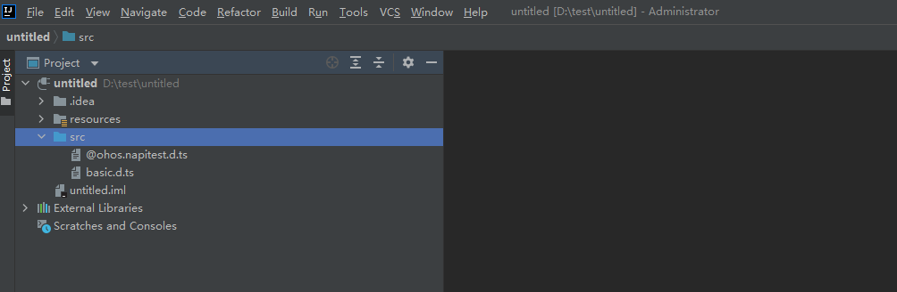
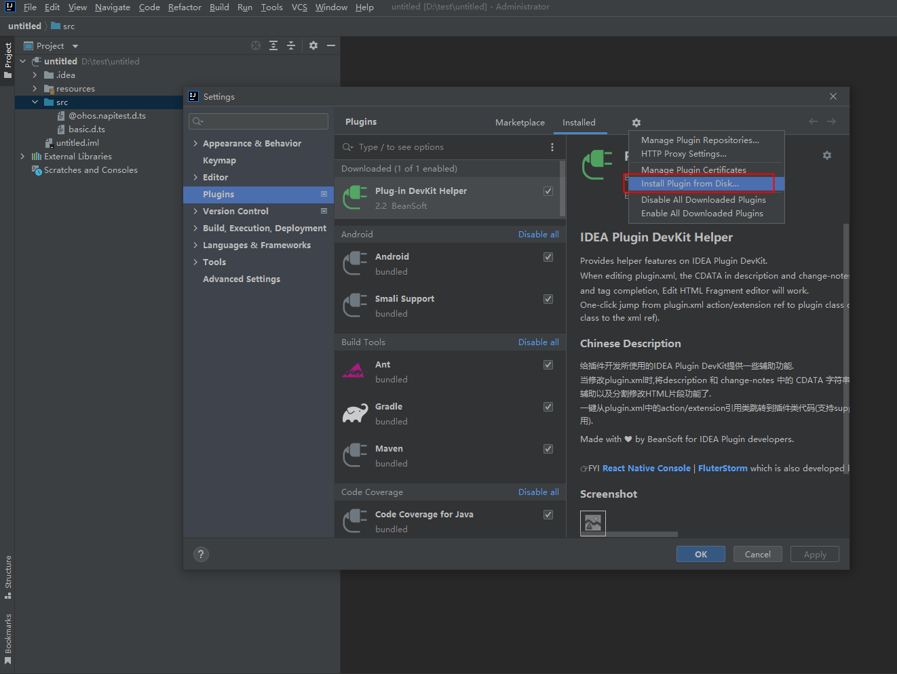
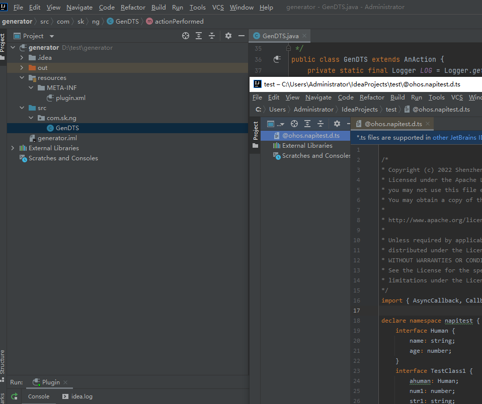
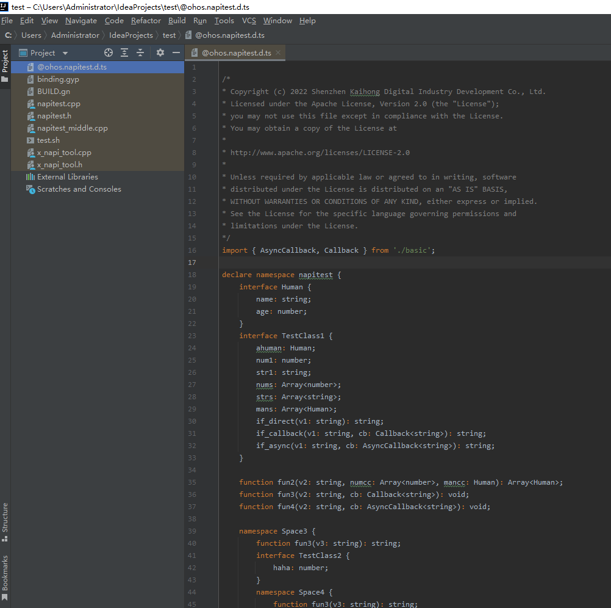

# IntelliJ插件源码

## 概述
本文主要介绍IntelliJ插件源码。

## 目录

```
├── napi_generator         # NAPI框架代码生成工具
│   ├── ...                # 其他文件夹
│   ├── src                      
|   |   ├── gen            # 工具源码
|   |   └── generator      # IntelliJ插件源码
 
```
### generator目录源码介绍
此目录为IntelliJ插件代码生成工具对应的源码，开发者可基于此代码进行二次开发。

## 软件环境准备

系统：不限

开发工具：IntelliJ IDEA

## 使用说明

1.通过IntelliJ IDEA打开generator目录下的代码



2.执行IntelliJ IDEA工具右上角的run



3.IntelliJ IDEA会自动拉起一个应用程序



4.选择.d.ts文件,右键选择generate.d.ts选项，生成文件



5.执行结束后会在目录下生成对应的文件


## 相关仓

暂无
