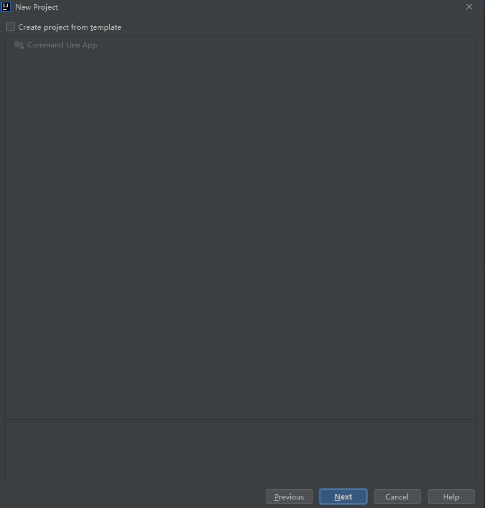
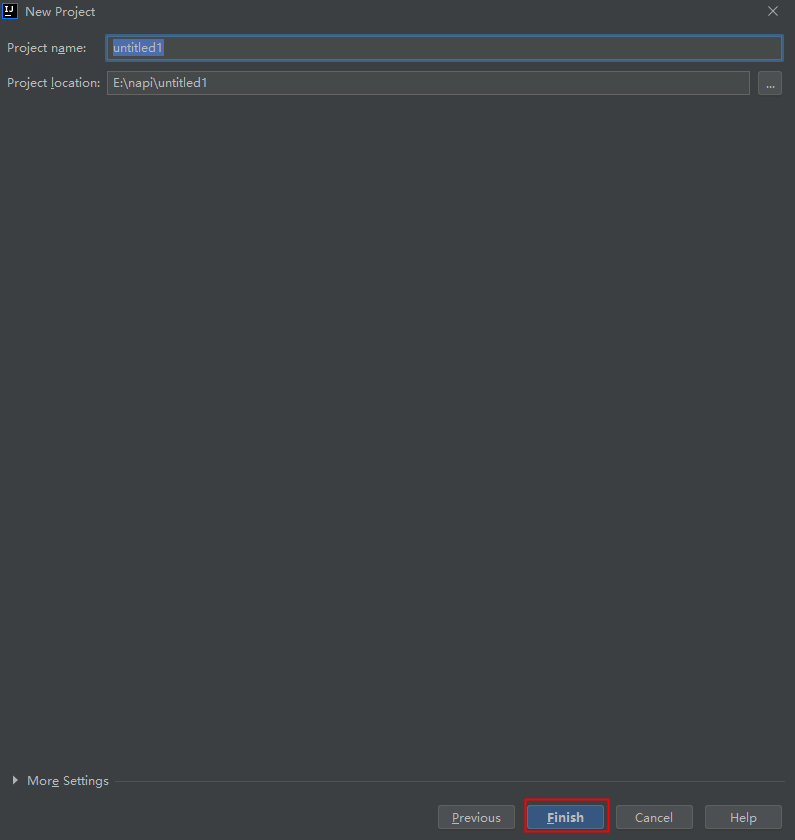

# IntelliJ插件源码

## 概述
本文主要介绍IntelliJ插件源码。

## 目录

```
├── napi_generator         # NAPI框架代码生成工具
│   ├── ...                # 其他文件夹
│   ├── src                      
|   |   ├── gen            # 工具源码
|   |   └── generator      # IntelliJ插件源码
 
```
### generator目录源码介绍
此目录为IntelliJ插件代码生成工具对应的源码，开发者可基于此代码进行二次开发。

## 软件环境准备

系统：不限

开发工具：IntelliJ IDEA

## 使用说明
IntelliJ插件我们提供了Jar包，在项目的prebuilt目录下generator.jar，开发者只需要下载这个jar包按照下述步骤安装使用即可：

1.新建或打开项目工程，以下以新建项目工程为例。

File->New->Project


左侧栏选择Java，右侧默认选择，点击Next


点击Next



点击Finish



2.复制本地napi_generator/test/unittest/basic.d.ts文件，进入IntelliJ新建项目中选中src粘贴，将basic.d.ts文件放入src目录。


3.把需要转换的.d.ts文件放到项目中。


4.安装插件，File->Settings->Plugins->Installed->Install Plugin from Disk...
选择从项目prebuilt目录下generator.jar
安装成功之后重启IDE


5.选择.d.ts文件,右键选择generate.d.ts选项，生成文件


6.执行结束后会在目录下生成对应的文件


## 相关仓

暂无
