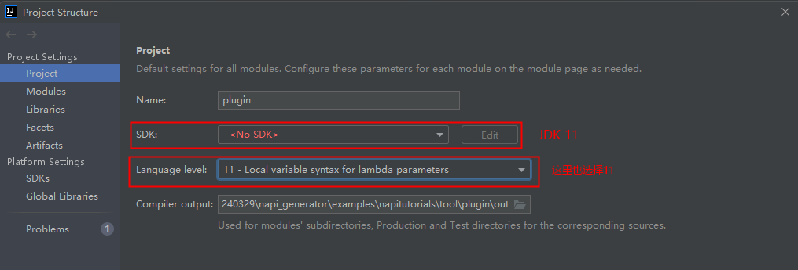
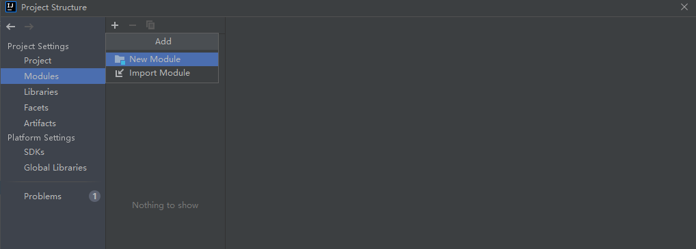
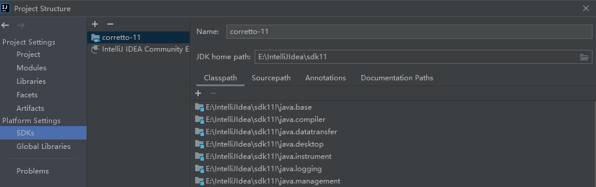
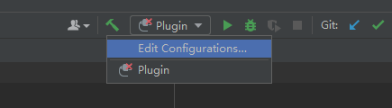
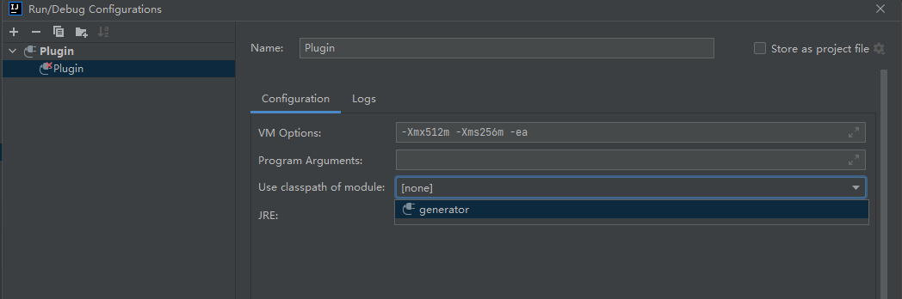

# Native生成工具IntelliJ插件开发说明

## 工具代码框架介绍

native生成工具由由C++语法解释器和代码生成器两部分组成。C++语法解释器解析用户输入的.h文件内容，通过C++语法解析，将文件内容分解为类、方法、入参、成员属性等元素；代码生成器根据从语法解析器得到的这些元素，转换为对应的typescript语法的接口、方法、参数代码，生成.ts文件内容；同时通过语法解析器得到的元素，生成.h文件对应的napi框架代码和接口调用测试代码。native生成工具支持命令行和IntelliJ插件，本文主要介绍IntellIJ插件。

## 工具开发

### IntelliJ 插件开发说明

#### 环境说明

系统：建议Windows 10

#### 开发步骤

##### 环境准备

1.生成native_gen程序

1.1 安装typescript：使用管理员身份在napi_generator/examples/napitutorials/tool/commandLine/src目录下执行命令：

```
npm i typescript
```

1.2 安装stdio：使用管理员身份在napi_generator/examples/napitutorials/tool/commandLine目录下执行命令：

```
npm i stdio
```

1.3 安装pkg : 使用管理员身份在napi_generator/examples/napitutorials/tool/commandLine目录下执行命令：

```
npm i -g pkg
```

1.4 打包三个版本 : 使用管理员身份执行命令：

```
pkg .
```

执行以上步骤后，即可在napi_generator/examples/napitutorials/tool/commandLine目录下生成Windows、linux、mac系统下的可执行程序:

```
native_gen-win.exe、native_gen-linux、native_gen-macos
```

1.4.1（可选步骤）根据需求打包指定系统下的可执行文件。若想只打包windows系统下可执行文件，可执行命令：

```
pkg -t node14-win . -o napi_generator-win.exe
```

2.生成header_parser  

2.1 安装python库 CppHeaderParser，在header_parser/src_code中下载CppHeaderParser.zip，解压后替换本地Python文件夹中CppHeaderParser(如 /usr/local/lib/python3.8/dist-packages/CppHeaderParser)目录下的全部文件

[下载链接1](http://ftpkaihongdigi.i234.me:5000/sharing/kBG1c7CvT)

[下载链接2](http://ftp.kaihong.com:5000/sharing/kBG1c7CvT)

[下载链接3](http://ftp.kaihongdigi.com:5000/sharing/kBG1c7CvT)

2.2 修改py脚本（防止循环引用报错）

修改python/Lib/json/encoder.py文件中_iterencode_dict方法，在raise ValueError("Circular reference detected")前加入下面两行代码：

```
yield '{}'
return
```

2.3 安装 pyinstaller

	pip install pyinstaller

2.4 将python脚本打包成独立可执行文件
进入 napi_generator/examples/napitutorials/tool/commandLine/src/tsGen 目录后执行如下命令：

	pyinstaller -F header_parser.py

打包后的可执行文件在dist目录中
./src/tsGen/dist/header_parser.exe

3.将生成的native_gen-win.exe可执行程序和生成的header_parser.exe拷贝到napi_generator/examples/napitutorials/tool/resources/cmds/win目录下。

4.下载并安装IDEA Community：IntelliJ IDEA 2021.3.3 (Community Edition）、JDK11配置好环境。IDEA Community版本可以左键单击以下链接下载。

[下载链接](https://gitee.com/link?target=https%3A%2F%2Fwww.jetbrains.com%2Fidea%2Fdownload%2F)

5.打开IDEA Community应用程序。 依次点击项目File>Open 选择napi_generator/examples/napitutorials/tool/plugin项目文件夹。


6.项目打开完成，点击File>Project Structure,在出现的界面中点击Project,下图的SDK选择JDK 11，Language level也选择版本11，选择或者新建complier output目录为项目文件下的out目录。

 

7.Project Settings > Modules 新建Modules。点击上方“-”删除原有的Modules，然后点击“+”选择 New Module。

 

8.在New Module对话框中，选择IntelliJ Platform Plugin。若Module SDK中无可选SDK，请在Module SDK 下拉框中点击 Add IntelliJ Platform Plugin SDK 选择IDEA Community安装目录，点击OK。 


9.Content root选择~/napi_generator/hdc/ts/ts_IntelliJ_plugin文件夹，module name填写generator。点击Finish，若出现提示已存在是否覆盖的提示，请点“Yes”完成配置。 


10.Modules配置完成后，若在SDKs中无相应JDK和Plugin SDK,请点击+号分别添加 Add Java JDK和Add Intellij PlantForm Plugin SDK,Java JDK为java11的安装目录，Plugin SDK为 IDEA Community 2021.3.3的安装目录。



11.若完成以上步骤配置，点击OK完成配置。Rebuild项目，若IDEA不能点击右上角的运行，点击Plugin后下三角选择Edit Configurations...选项，Run/Debug Configurations框中Use classpath of moudle选择generator，点击ok，等待安装完成。





12.点击Intellij IDEA工具右上角Built Project按钮，等待工程built完成。


13.在IDEA Community中依次点击Build>Prepare All Plugin Modules for development"，jar包生成完成后在工具右下角提示jar包生成成功，且包含jar包存放位置。


