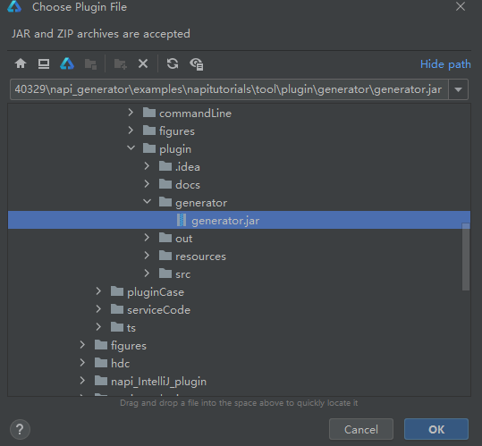

# Native接口生成工具IntelliJ插件使用说明
## 简介

Native生成工具支持两种入口，分别是命令行、IntelliJ插件，使用者可以根据自己的需要选择合适的工具。            

## 工具介绍

通过Native生成工具，使用者可以将已有的.h接口文件生成.d.ts文件，并生成napi框架代码和接口测试代码。

## IntelliJ插件使用方法

### 依赖

系统：建议Windows 10

开发工具：DevEco Studio

### 使用指导

1.打开项目工程，以下以打开项目工程为例。

File->Open

选择napi_generator/examples/napitutorials工程后点击OK

2.安装插件，File->Settings->Plugins->Installed->Install Plugin from Disk...，选择编译生成的generator.jar，安装成功之后重启IDE。




3.将待转换的.h文件放入该工程目录下任意位置，例如：将test.h文件放入./entry/src/main/cpp目录下。

4.选择.h文件,点击右键选择Generate Native Frame


3.运行成功后插件会弹出消息 Generate Native Successfully


并在./entry/src/main/cpp会生成test.cpp文件，其中是接口napi层模板；在./entry/src/main/cpp/types/libentry/index.d.ts文件中会追加写入生成的ts接口；在./entrysrc/ohosTest/ets/test/Ability.test.ets生成接口测试代码模板。用户根据自身需求在test.cpp中增加业务代码，并在Ability.test.ets中增加合适断言之后，即可连接开发板并运行测试用例测试验证生成napi代码是否正确。例如：

在生成的test.cpp模板中 // Todo下增加一行：

```
res = value0 + value1;
```

在Ability.test.ets文件中增加断言：

```
expect(result).assertEqual(2+3)
```

连接开发板，运行Ability.test.ets中的测试用例：


