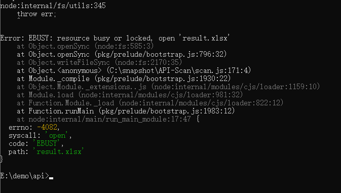

# API扫描工具 问题反馈

## 问题反馈

1、工具扫描三方库时，报错“Error: EBUSY: resource busy or locked, open 'result.xlsx'”。

问题定位：工具扫描三方库项目时result.txt文档打开，扫描结果无法写入result.txt文档，因此报错“resource busy or locked”。

问题解决：关闭result.txt文档，重新扫描三方库，即可解决以上问题。