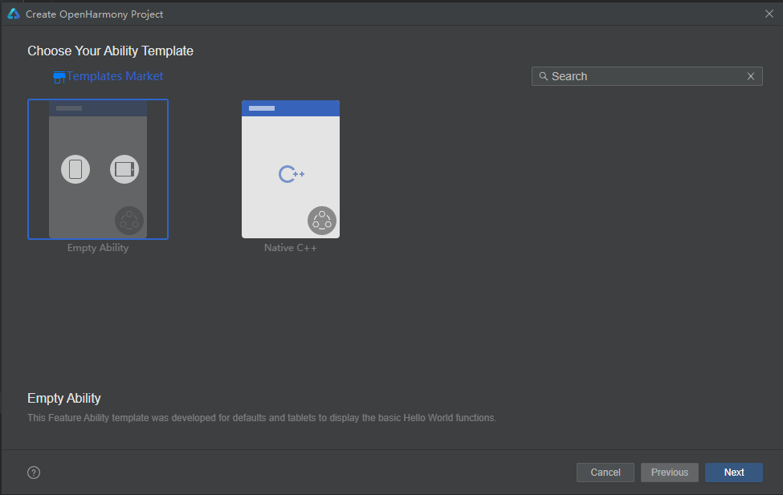
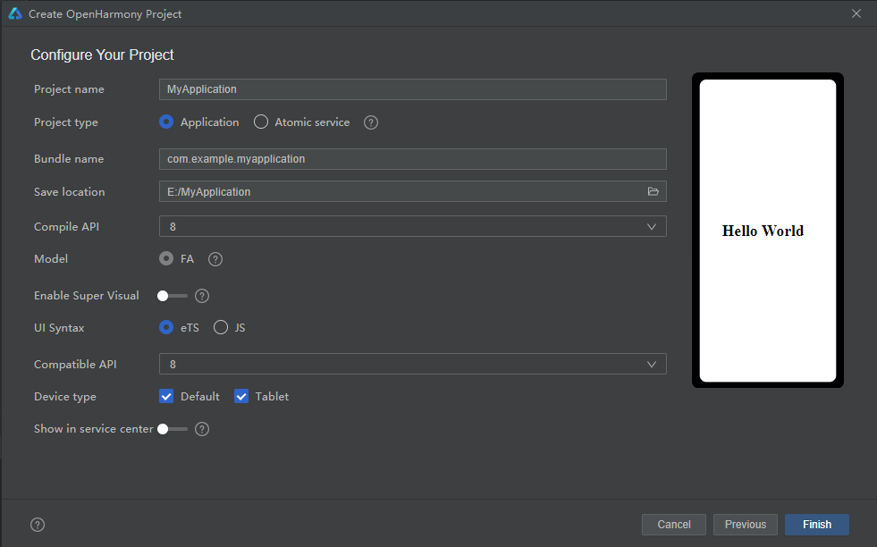
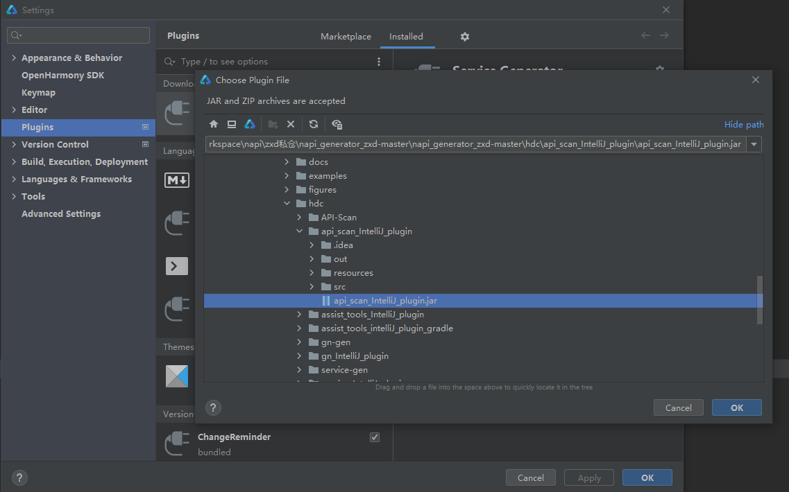
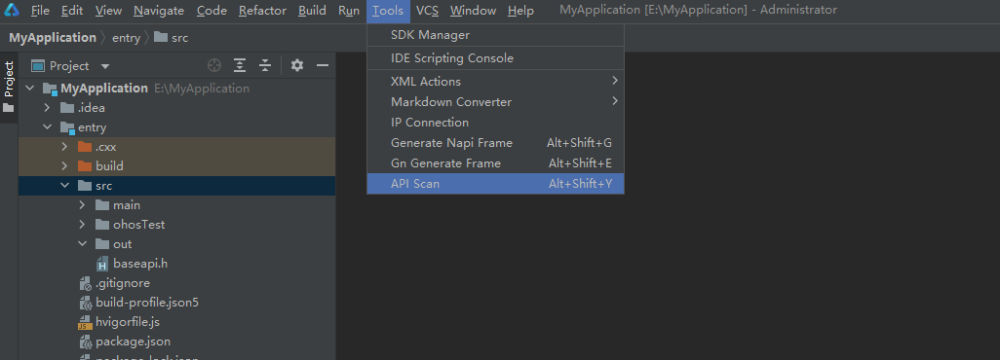
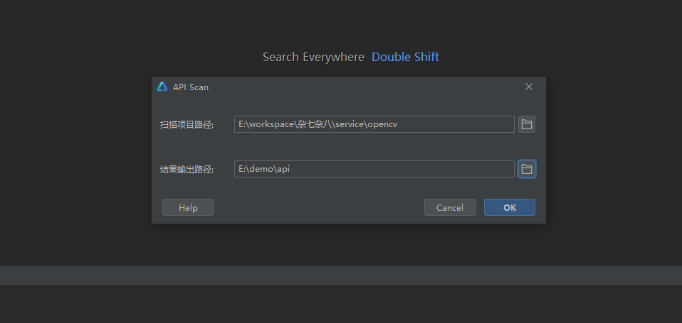

# API扫描工具IntelliJ插件使用说明

## 简介

API扫描工具目前支持三种入口，分别是可执行程序、IntelliJ插件、VS Code插件，本文主要介绍IntelliJ插件使用说明。IntelliJ插件下载路径如下：

[下载链接](暂无)               

## IntelliJ插件使用方法

### 依赖

系统：建议Windows 10

开发工具：DevEco Studio

### 使用指导

1、新建或打开项目工程，以下以新建项目工程为例。

File->New->Create Project。

Ability Template选择Empty Ability,单击Next。

填写Project name、Save location,其他选项可不修改，单击Finish,新的工程就创建好了。

2、安装插件。File->Settings->Plugins->Installed->Install Plugin from Disk...，选择下载的api_scan_IntelliJ_plugin.jar，安装成功之后重启IDE。

3、Tools->API Scan,打开API Scan选择框。

4、工具打开API Scan窗口，扫描项目路径框填写将要扫描项目的绝对路径，结果输出路径框自动填写与扫描项目相同路径，使用者可以根据实际情况修改结果输出路径，然后点击ok。

5、执行结束后会在结果输出路径下生成result.xlsx文件。