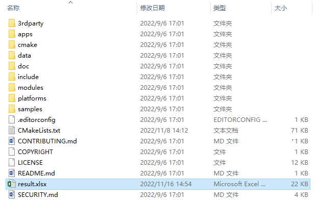

# API扫描工具VS code插件说明

## 简介

API扫描工具，它可以根据用户给定三方库项目扫描输出风险接口以及.h头文件。目前工具支持VS Code插件一种入口，本文主要介绍VS Code插件使用说明。

## 目录 

	├── api                           # API扫描工具
	│   ├── ...                       # 其他文件
	│   ├── api_scan_vs_plugin        # VS Code插件代码
	│   │   ├── docs                  # VS Code插件说明
	│   │   ├── src    				  # VS Code插件源码
	│   │   ├── package.json    	  # package.json 文件
	│   │   └── README_zh.md          # VS Code插件说明

## 约束 

系统：建议Ubuntu 20.04或者Windows 10

依赖版本：VS Code 1.62.0

## 使用方法 

### 使用对象

系统开发者

### 使用场景

1)移植三方库到OpenHarmony前预知风险接口或.h头文件。

### 工具使用

具体的工具使用步骤，可以左键单击以下链接了解：

[工具使用说明](https://gitee.com/openharmony/napi_generator/tree/master/hdc/api/api_scan_vs_plugin/docs/INSTRUCTION_ZH.md)

### 工具输出

根据使用者指定三方库项目源码，工具会输出风险接口、.h头文件。为了方便使用者快速上手工具，此处使用opencv项目为例，项目目录如下：

在window环境下的，根据输入三方库项目,生成的输出文件result.xlsx，如下所示：

其中生成的result.xlsx文件，sheet1为风险接口，如下所示：

sheet2为风险.h头文件，如下所示：

## FAQ

对于常见问题解决方法指导如下：

[FAQ](https://gitee.com/openharmony/napi_generator/tree/master/hdc/api/FAQ.md)

## 相关仓

暂无