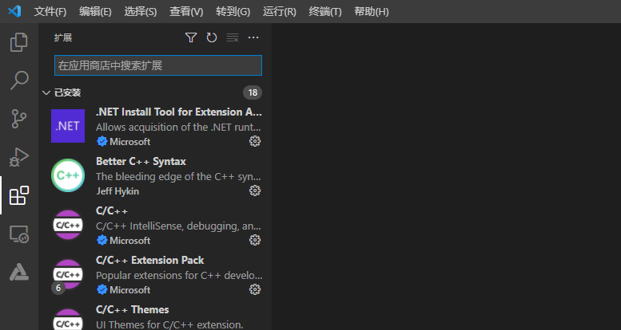
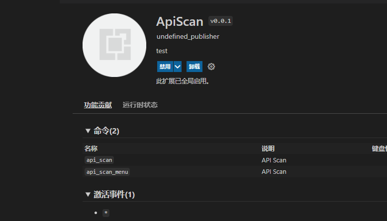
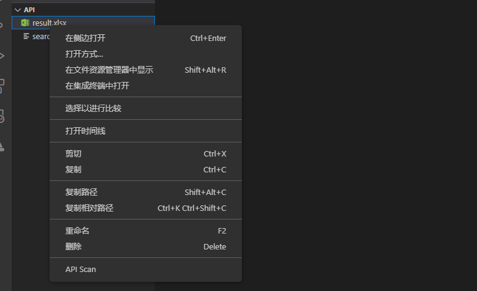
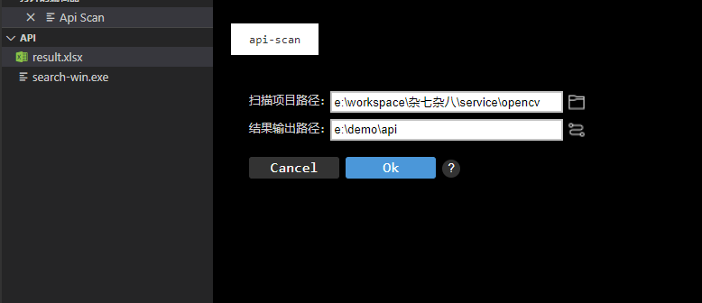

# API扫描工具VSCode插件使用说明
## 简介

API扫描工具目前支持一种入口，即VS Code插件，本文主要介绍VS Code插件使用说明。

## VS Code插件使用方法

### 说明

visual studio code 版本需1.62.0及以上。

### 步骤

1、 打开VS Code，在左侧边栏中选择插件安装。

2、 在应用商店搜索api_scan插件，再单击安装。

3、 安装完成后就会在VS Code的插件管理器中能看到API Scan这个插件了。

4、 选中任意文件或文件夹，单击右键，选择API Scan选项。

5、 工具打开API Scan窗口，扫描项目路径框填写将要扫描项目的绝对路径，结果输出路径框自动填写与扫描项目相同路径，使用者可以根据实际情况修改结果输出路径，然后点击ok。

6、执行结束后会在结果输出路径下生成result.xlsx文件。
