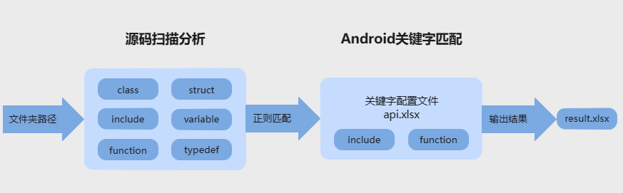

# API扫描工具使用说明
## 简介

API扫描工具支持一种入口，即VS Code插件，使用者可以根据自己的需要下载工具使用。

VS Code插件可在VS Code插件市场直接下载。        

## 工具介绍

通过API扫描工具，开发者可以扫描输出三方库中存在，而OpenHarmony源码中不存在的风险接口，移植之前预知风险，降低移植难度，提高开发效率。

## 生成result文件

### VS Code插件使用方法

具体的插件使用步骤，可以左键单击以下链接了解：

[VS插件使用说明](https://gitee.com/openharmony/napi_generator/tree/master/hdc/api/api_scan_vs_plugin/docs/INSTRUCTION_ZH.md)

