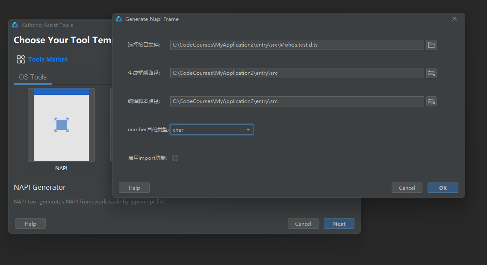
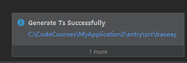
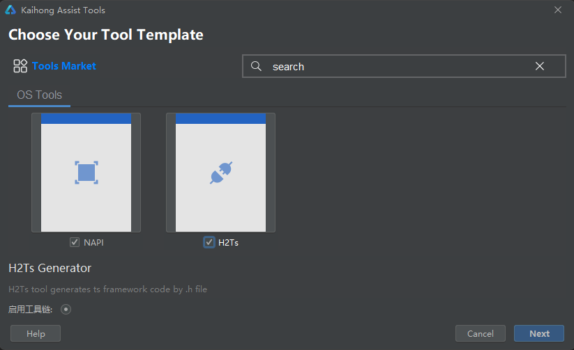
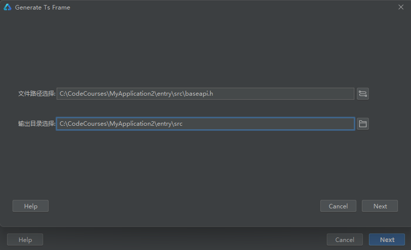
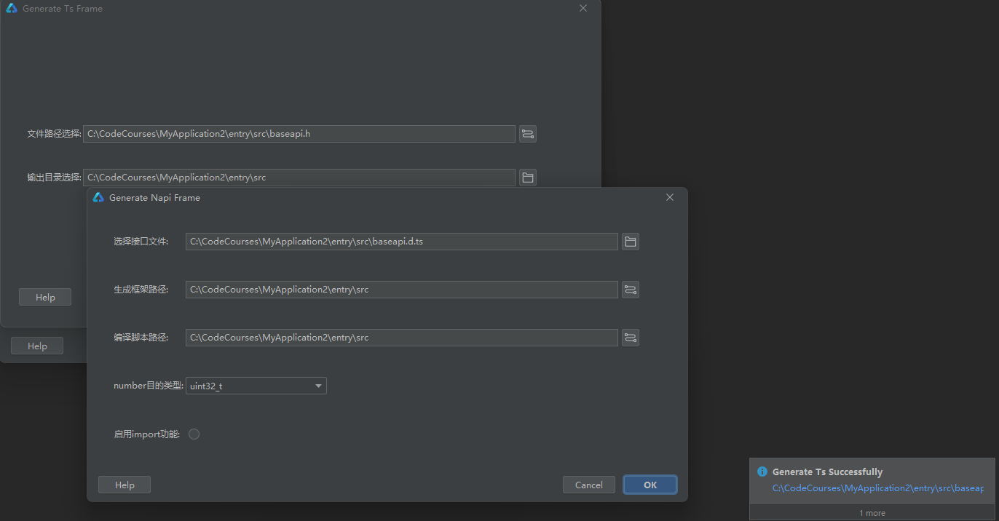

# ASSIST_TOOLS工具IntelliJ插件使用说明

## 简介

Assist_tools工具目前支持一种入口，即IntelliJ插件，本文主要介绍IntelliJ插件使用说明。IntelliJ插件下载路径如下，点击download下载。

[下载链接](https://plugins.jetbrains.com/plugin/21430-assist-tools/edit/versions)

## IntelliJ插件使用方法

### 依赖

系统：建议Windows 10

开发工具：DevEco Studio

### 使用指导

1.新建或打开项目工程，以下以新建项目工程为例。

File->New->Create Project。

Ability Template选择Empty Ability,单击Next。

填写Project name、Save location,其它选项可不修改，单击Finish,新的工程就创建好了。

2.安装插件，File->Settings->Plugins->Installed->Install Plugin from Disk...，选择下载的generator.jar，安装成功之后重启IDE。

3.点击Tools->Assist Tools，工具弹出统一入口窗口

4.点击NAPI，然后点击Next，工具弹出Generate Napi Frame弹窗。接口文件文本框填写.d.ts文件路径；生成框架路径文本框填写生成框架存放路径；编译脚本路径填写生成CMakeList.txt文件输出路径；number目的类型此处选择char；启用import功能不选择（待转换.d.ts文件未引用其它文件）；点击ok，执行结束后将会在输出路径下生成napi框架文件。

5.点击H2Ts，若不启用工具链，则直接点击Next，工具弹出Generate Ts Frame弹窗。文件路径文本框填写.h文件路径；输出目录选择文本框填写生成.d.ts文件存放路径，点击ok，执行结束后将会在输出路径下生成ts框架文件。

若启用工具链，点击启用工具链按钮，选择启用工具链所需的工具，至少选择两个工具，点击Next，将会弹出Generate Ts Farme弹窗；文件路径文本框填写.h文件路径；输出目录选择文本框填写生成.d.ts文件存放路径，点击Next，将会生成.d.ts文件；接着会弹出Generate Napi Frame弹窗，弹窗中自动填入.h文件生成的.d.ts文件路径，点击ok，执行结束后将会在输出路径下生成napi框架文件。

