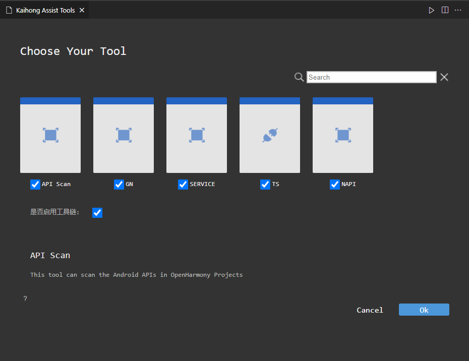
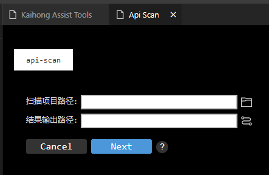
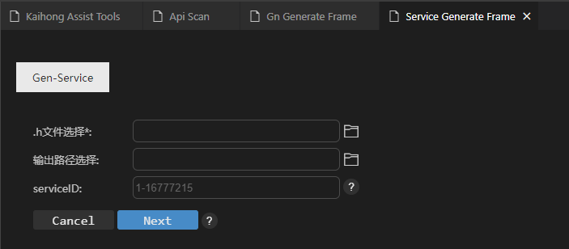

# ASSIST_TOOLS工具VS Code插件使用说明
## 简介

ASSIST统一入口工具，可以将南北向各工具统一起来，用户只需下载统一入口工具，在统一入口工具中按需下载各南北向工具，实现对工具链的使用。统一入口工具支持两种入口，分别是DevEco Studio使用的IntelliJ插件、VS Code插件，使用者可以根据自己的需要选择合适的工具。本文主要介绍VS Code插件使用方法。  

## VS Code插件使用方法

### 说明

visual studio code 版本需1.62.0及以上。

### 步骤

1、 打开VS Code，在左侧边栏中选择插件安装。

2、 在应用商店搜索assist_tools插件，再单击安装。

3、 安装完成后就会在VS Code的插件管理器中能看到 Kaihong Assist Tools 这个插件了。

4、 右键单击任意文件或文件夹，选择“Kaihong Assist Tools”选项。

5、 工具打开 Kaihong Assist Tools 窗口，选择是否启用工具链：

若不启用工具链，选择任意一个工具使用，如，使用API Scan工具，点击 API Scan 图标，再点击Ok, Kaihong Assist Tools将会下载并启动 API Scan工具，工具打开API Scan窗口，扫描项目路径框填写将要扫描项目的路径，结果输出路径框自动填写与扫描项目相同路径，使用者可以根据实际情况修改结果输出路径，然后点击ok。选择其它工具使用与选择 API Scan 工具类似。

若启用工具链，用户根据需求选择工具组成工具链，Kaihong Assist Tools将会下载并启动工具链中的工具供用户使用，如：启用工具链选择“API Scan”,"GN","SERVICE","TS","NAPI"工具组成工具链，然后点击 Ok, Kaihong Assist Tools将会从插件市场下载所有选中的工具，并按照 API Scan -> GN -> SERVICE -> TS -> NAPI 顺序启用工具

首先启用工具 API Scan, 填写相应参数完毕 API Scan 界面后点击Next, 扫描完成，并启动 GN 工具；

进入 GN 工具填写相应参数后点击Next , 生成build_tmp文件夹，build_tmp文件夹中包含BUILD.gn文件，并启动 SERVICE 工具；

进入 SERVICE 工具填写相应参数后点击Next , 生成service框架代码文件，并启动 TS 工具；

进入 TS 工具填写相应参数后点击Next , 生成.d.ts文件，并启动 NAPI 工具, NAPI工具是工具链中最后一个工具，NAPI工具的输入参数可以是TS工具的输出，填写完相应参数后，点击 Ok, 生成napi框架代码。

