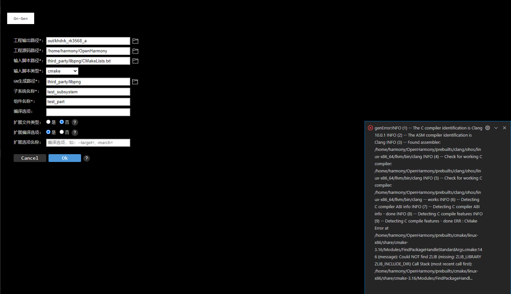
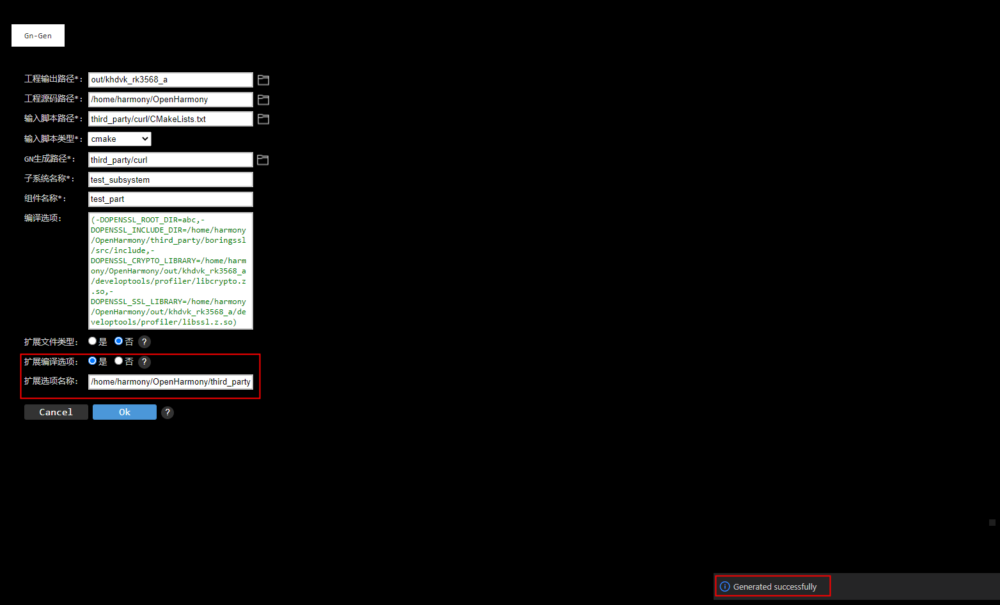
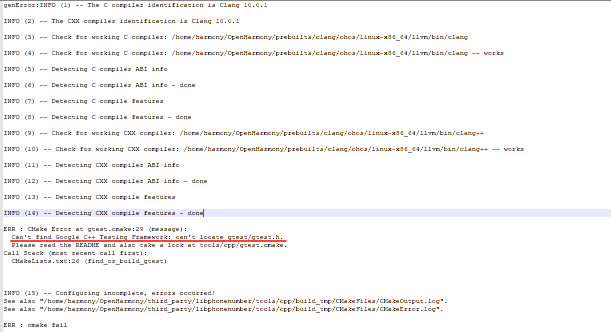
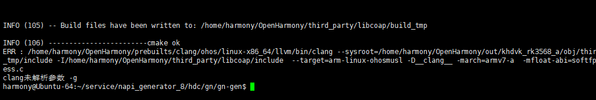
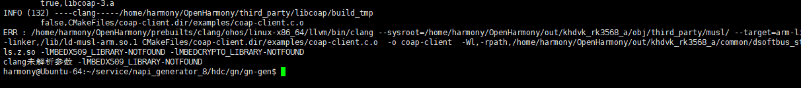
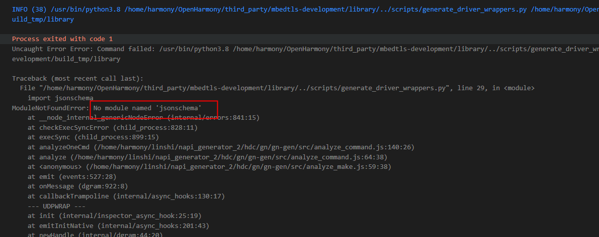

# GN脚本转换工具 问题记录

## 具体三方库转换生成gn脚本问题记录

### 转换third_party/libpng库

1、使用VS Code插件转换libpng库时，参数填写如图所示，点击ok之后，右下角弹出genError日志，可将日志信息全部复制到日记本等工具，详细日志显示报错: "Could NOT find ZLIB (missing: ZLIB_LIBRARY ZLIB_INCLUDE_DIR)"。

问题定位：libpng三方库中引用到zlib库，但转换生成gn脚本时，未指定libzlib.z.so路径及zlib三方库源码路径，导致转换失败。

问题解决：OpenHarmony源码中存在zlib三方库源码，若已编译成功过镜像，则out目录下会包含libzlib.z.so镜像。因此，在使用VS Code插件转换生成gn脚本时，在编译选项中指定libzlib.z.so路径、zlib库源文件路径即可，具体命令如下：

	(-DM_LIBRARY=,-DZLIB_LIBRARY=/home/harmony/OpenHarmony/out/khdvk_rk3568_a/appexecfwk/bundle_framework/libzlib.z.so,-DZLIB_INCLUDE_DIR=/home/harmony/OpenHarmony/third_party/zlib)

### 转换third_party/curl库

1、使用VS Code插件转换curl库时，参数填写如图所示，点击ok之后，右下角弹出genError日志，可将日志信息全部复制到日记本等工具，查看日志显示: "system variable OPENSSL_ROOT_DIR (missing: OPENSSL_CRYPTO_LIBRARY OPENSSL_INCLUDE_DIR)"。

问题定位：curl三方库中引用到openssl三方库，但工具转换时未指定libcrypto.z.so路径以及openssl源码路径，导致转换失败。

问题解决：OpenHarmony源码存在openssl库，且在out路径下包含libcrypto.z.so镜像。因此，在使用VS Code插件转换生成gn脚本时，在编译选项中指定libcrypto.z.so路径、openssl库源文件路径即可，命令如下：

	(-DOPENSSL_ROOT_DIR=abc,-DOPENSSL_INCLUDE_DIR=/home/harmony/OpenHarmony/third_party/boringssl/src/include,-DOPENSSL_CRYPTO_LIBRARY=/home/harmony/OpenHarmony/out/khdvk_rk3568_a/developtools/profiler/libcrypto.z.so)

2、根据步骤1后发现新的错误，具体报错日志为：未设置OPENSSL_SSL_LIBRARY路径。

问题定位：工具在转换时未指定libssl.z.so路径,导致转换失败。

问题解决：编译转换时增加指定libssl.z.so路径，命令如下：

	(-DOPENSSL_ROOT_DIR=abc,-DOPENSSL_INCLUDE_DIR=/home/harmony/OpenHarmony/third_party/boringssl/src/include,-DOPENSSL_CRYPTO_LIBRARY=/home/harmony/OpenHarmony/out/khdvk_rk3568_a/developtools/profiler/libcrypto.z.so,-DOPENSSL_SSL_LIBRARY=/home/harmony/OpenHarmony/out/khdvk_rk3568_a/developtools/profiler/libssl.z.so)

3、根据步骤2后再次发现新的错误，具体报错日志为：“clang未解析参数 /home/harmony/OpenHarmony/third_party/boringssl/src/include”，具体日志信息如下：

问题定位：编译脚本中存在工具不支持的特殊编译选项。

问题解决：在转换三方库时，可将扩展编译选项选择是，然后在扩展选项名称中填写“/home/harmony/OpenHarmony/third_party/boringssl/src/include”，具体操作如下所示：

### 转换third_party/libphonenumber库

1、使用VS Code插件转换libphonenumber库时，参数填写如图所示，点击ok之后，右下角弹出genError日志，可将日志信息全部复制到日记本等工具，查看日志显示: "Can't find Google C++ Testing Framework"。

问题定位：工具在转换时未指定gtest路径，导致转换生成gn脚本时找不到“Google C++ Testing Framework”。

问题解决：OpenHarmony源码存在gtest库，因此在使用VS Code插件转换时，在编译选项处指定gtest路径即可，具体填写如下：

	(-DGTEST_INCLUDE_DIR=/home/harmony/OpenHarmony/third_party/googletest/googletest/include)

2、根据步骤1后发现新的错误，具体报错日志为未设置GTEST_SOURCE_DIR路径。

问题定位：工具在转换时未指定GTEST_SOURCE_DIR路径，导致转换生成gn脚本时找不到gtest源文件。

问题解决：在工具编译选项处增加指定GTEST_SOURCE_DIR路径，具体填写如下：

	(-DGTEST_INCLUDE_DIR=/home/harmony/OpenHarmony/third_party/googletest/googletest/include,-DGTEST_SOURCE_DIR=/home/harmony/OpenHarmony/third_party/googletest/googletest)

如上图所示生成gn脚本成功。

### 转换third_party/libcoap库

1、使用可执行程序转换libcoap库时，报错如下：

问题定位：该三方库引用到mbedtls三方库，但工具在转换时未指定mbedtls源码路径以及libmbedtls.z.so镜像路径，导致转换失败。

问题解决：OpenHarmony源码中存在mbedtls三方库，且out目录下包含libmbedtls.z.so镜像，在转换libcoap库时增加-a参数，且指定MBEDTLS_INCLUDE_DIRS路径、MBEDTLS_LIBRARY路径即可，具体命令如下：

	harmony@Ubuntu-64:~/linshi/napi_generator_2/hdc/gn/gn-gen$./gn-gen-linux -o out/khdvk_rk3568_a -p /home/harmony/OpenHarmony -f  third_party/libcoap/CMakeLists.txt -a "(-DM_LIBRARY=,-DMBEDTLS_INCLUDE_DIRS=/home/harmony/OpenHarmony/third_party/mbedtls,-DMBEDTLS_LIBRARY=/home/harmony/OpenHarmony/out/khdvk_rk3568_a/common/dsoftbus_standard/libmbedtls.z.so)"

2、根据步骤1后发现新的错误，根据日志信息显示为“clang未解析参数 -g”。

问题定位：当前工具源码不支持解析参数-g，导致转换失败。

问题解决：在res/cfg.json文件的compileflag参数中添加-g，如下所示：

	{
    "fileSuffix": ".cpp, .cxx, .cc, .hpp",
    "compileflag": "--target=, -march=，-g"
	}

3、根据步骤2后发现新的错误，根据日志信息显示为“clang未解析参数 -lMBEDX509_LIBRARY-NOTFOUND”。

问题定位：当前工具源码不支持解析参数-lMBEDX509_LIBRARY-NOTFOUND，导致转换失败。

问题解决：在res/cfg.json文件的compileflag参数中添加-lMBEDX509_LIBRARY-NOTFOUND，如下所示：

	{
    "fileSuffix": ".cpp, .cxx, .cc, .hpp",
    "compileflag": "--target=, -march=，-g,-lMBEDX509_LIBRARY-NOTFOUND"
	}

4、根据步骤2后发现新的错误，根据日志信息显示为“clang未解析参数 -lMBEDCRYPTO_LIBRARY-NOTFOUND”。

问题定位：当前工具源码不支持解析参数-lMBEDCRYPTO_LIBRARY-NOTFOUND，导致转换失败。

问题解决：在res/cfg.json文件的compileflag参数中添加-lMBEDCRYPTO_LIBRARY-NOTFOUND，如下所示：

	{
    "fileSuffix": ".cpp, .cxx, .cc, .hpp",
    "compileflag": "--target=, -march=，-g,-lMBEDX509_LIBRARY-NOTFOUND,-lMBEDCRYPTO_LIBRARY-NOTFOUND"
	}

### 转换third_party/mbedtls-development库

1、转换生成gn脚本时，报“No module named 'jsonschema'。

问题定位：当前环境中没有安装jsonschema库。

问题修改：安装jsonschema库，安装命令如下：

	pip install jsonschema

4、转换生成gn脚本时，报“No module named 'jinja2'。

问题定位：当前环境中没有安装jinja2库。

问题修改：安装jinja2库，安装命令如下：

	pip install jinja2