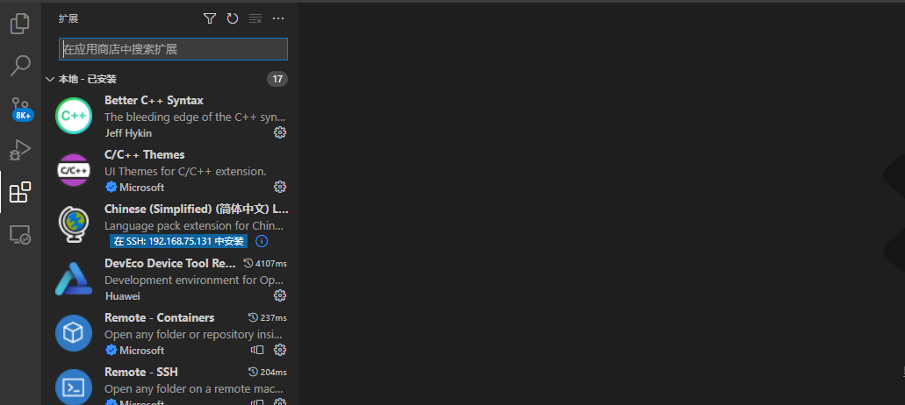
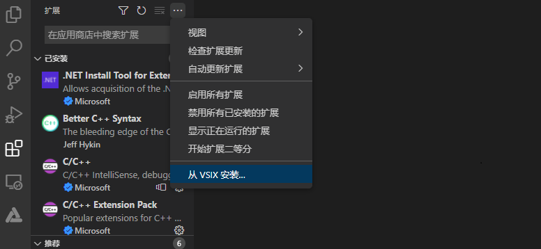
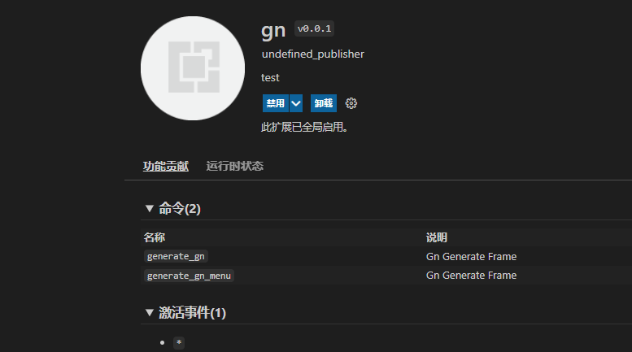
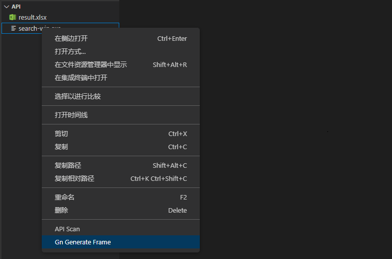
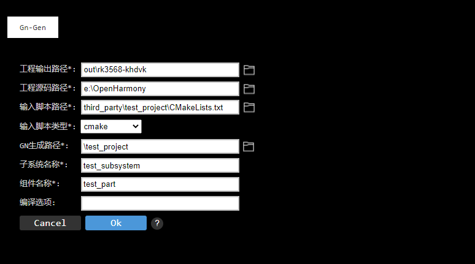

# GN脚本转换工具VSCode插件使用说明
## 简介

VS Code插件下载路径如下：

[下载链接](暂无)               

## VS Code插件使用方法

### 说明

visual studio code 版本需1.62.0及以上。

### 步骤
1、windows中下载OpenHarmony源码，并编译成功一个产品的镜像包，此处以RK3568A为例。

2、将待转换的三方库项目放置在third_party文件夹下，如下所示：

	E:\OpenHarmony\third_party\test_project>dir /B
	CMakeLists.txt
	main.c

3、 打开VS Code，在左侧边栏中选择插件安装。

4、 单击上面三个点的按钮，选择从VSIX安装选项，然后选择刚才生成的gn-0.0.1.vsix插件文件，再单击安装。

5、 安装完成后就会在VS Code的插件管理器中能看到gn这个插件了。

6、 选中任意文件或文件夹，点击右键，选择“Gn Generate Frame”选项。

7、 Gn Generate Frame窗口中工具输出路径选择E:\OpenHarmony\out\rk3568-khdvk后，工程源码路径、输入脚本路径均自动填写为E:\OpenHarmony；输入脚本路径修改为三方库项目CMakeLists.txt的路径后，GN生成路径自动填写为CMakeLists.txt文件所在路径，使用者可根据实际情况修改路径；输入脚本类型默认为cmake，此处不做修改；子系统名称、组件名称使用者可根据具体情况修改；编译选项根据具体三方库项目选填。以上参数填写完成后，点击ok。

8、执行结束后会在E:\OpenHarmony\third_party\test_project目录下生成build_temp文件夹，文件夹下内容如下所示：

	E:\OpenHarmony\third_party\test_project\build_tmp>dir /B
	BUILD.gn
	CMakeCache.txt
	CMakeFiles
	cmake_install.cmake
	hello
	Makefile
	ohos.toolchain.cmake

