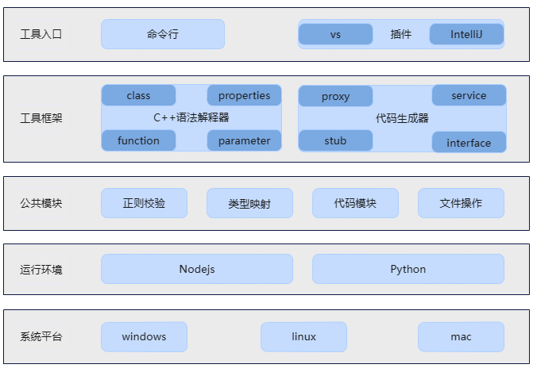

# SERVICE框架生成工具使用说明
## 简介

SERVICE框架生成工具支持一种入口，即VS Code插件，使用者可以根据自己的需要下载工具使用。

## 工具介绍

通过SERVICE框架生成工具，使用者只需提供一个定义远程方法的.h头文件，一键生成SERVICE框架代码，主要包含Ability注册、proxy/stub类实现、MessageParcel数据包构造、Service子系统编译及开机自启动相关配置文件。

## 生成框架

### VS Code插件使用方法

具体的插件使用步骤，可以左键单击以下链接了解：

[VS插件使用说明](https://gitee.com/openharmony/napi_generator/tree/master/hdc/service/service_vs_plugin/docs/INSTRUCTION_ZH.md)

## 集成

Service框架代码生成后，系统框架开发者进行二次开发后，即可集成到OpenHarmony编译系统，生成对应的库文件，供应用开发者调用接口。工具集成到OpenHarmony的具体操作步骤可以左键单击以下链接了解：

 [工具集成](https://gitee.com/openharmony/napi_generator/blob/master/hdc/service/docs/ENSEMBLE_METHOD_ZH.md)

