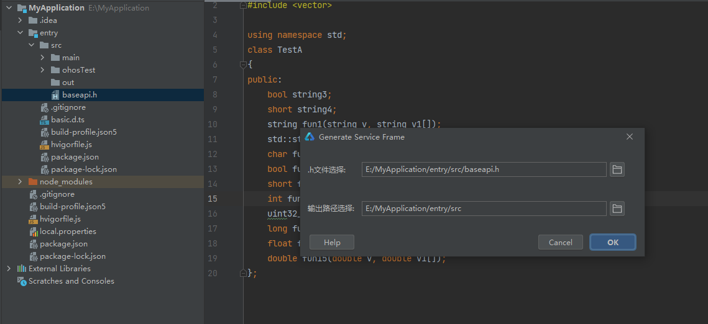

# SERVICE框架生成工具IntelliJ插件使用说明

## 简介

IntelliJ插件下载路径如下：

[下载链接](暂无)               

## IntelliJ插件使用方法

### 依赖

系统：不限

开发工具：DevEco stdio

### 使用指导

1、新建或打开项目工程，以下以新建项目工程为例。

File->New->Create Project。

Ability Template选择Empty Ability,单击Next。

填写Project name、Save location,其他选项可不修改，单击Finish,新的工程就创建好了。

2、安装插件，File->Settings->Plugins->Installed->Install Plugin from Disk...，选择下载的service_IntelliJ_plugin.jar，安装成功之后重启IDE。

3、把需要转换的.h文件放在DevEco stdio新建项目的src目录下。

4、选择.h文件,右键选择 Generate Service Frame选项。

5、工具打开 Generate Service Frame窗口，.h文件选择框默认填写被操作的.h文件的绝对路径；输出路径选择框默认填写.h文件所在文件夹路径，可修改为任意路径；serviceID默认填写9000，可修改为其他id,然后点击ok。

6、执行结束后会在目录下生成对应的文件。

