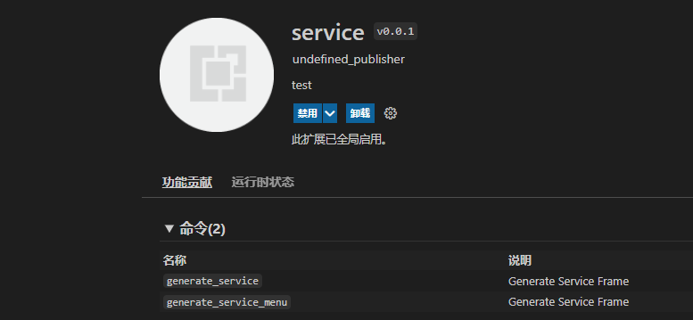
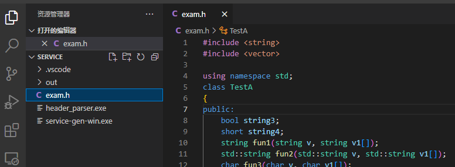
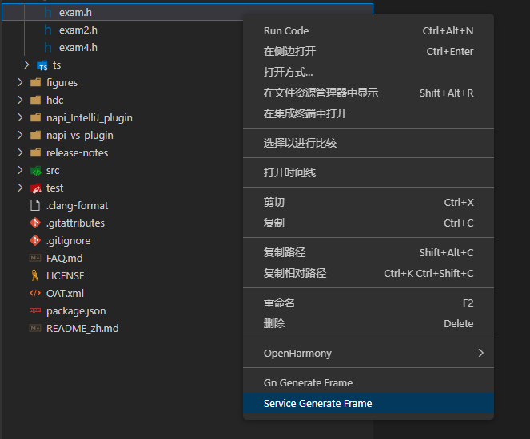

# SERVICE框架生成工具VSCode插件使用说明
## 简介

SERVICE框架生成工具支持一种入口，即VS Code插件，使用者可以根据自己的需要下载工具使用。本文主要介绍VS Code插件使用方法。     

## VS Code插件使用方法

### 说明

visual studio code 版本需1.62.0及以上。

### 步骤

1、 打开VS Code，在左侧边栏中选择插件安装。

2、 在应用商店搜索service-gen插件，再单击安装。

3、 安装完成后就会在VS Code的插件管理器中能看到service-gen这个插件了。

4、 在VS Code中找到需要转换的.h文件，如下：

5、 右键单击.h文件，选择“ Service Generate Frame”选项。

6、 工具打开 Service Generate Frame窗口，.h文件选择框默认填写被操作的.h文件的绝对路径；输出路径选择框默认填写.h文件所在文件夹路径，可修改为任意路径；serviceID范围是1-16777215之间的整数，超出范围会提示错误，填入正确的serviceID，然后点击ok。

7、 转换成功后，在输出路径下生成service框架代码文件。

## 集成

Service框架代码生成后，系统框架开发者进行二次开发后，即可集成到OpenHarmony编译系统，生成对应的库文件，供应用开发者调用接口。工具集成到OpenHarmony的具体操作步骤可以左键单击以下链接了解：

 [工具集成](https://gitee.com/openharmony/napi_generator/blob/master/hdc/service/docs/ENSEMBLE_METHOD_ZH.md)

