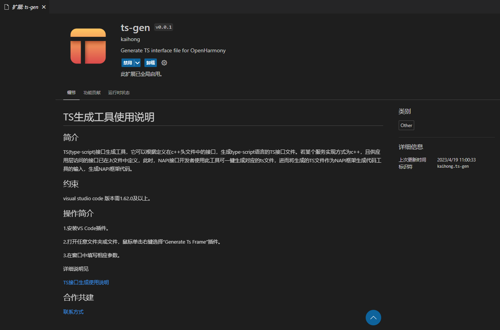
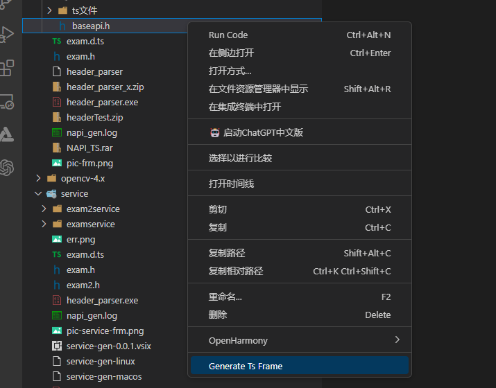

# Ts接口生成工具VSCode插件使用说明
## 简介

Ts接口生成工具可以根据定义在c++头文件中的接口，生成type-script语言的ts接口文件，工具支持三种入口，分别是可执行程序、IntelliJ插件、VS Code插件，使用者可以根据自己的需要选择合适的工具。本文主要介绍VS Code插件使用说明。           

## VS Code插件使用方法

### 说明

visual studio code 版本需1.62.0及以上。

### 使用指导

1.打开VS Code，在左侧边栏中选择插件安装。

2. 在应用商店搜索ts-gen插件，再单击安装。

3.安装完成后就会在VS Code的插件管理器中能看到ts-gen这个插件了。

4.把需要转换的.h文件放到任意目录下。

5.选择.h文件,点击右键选择 Generate Ts Frame，工具弹出Generate Ts Frame弹窗。文件路径文本框填写.h文件路径；输出目录选择文本框填写生成.d.ts文件存放路径，点击ok。

6.执行结束后会在out目录下生成.d.ts代码文件。

