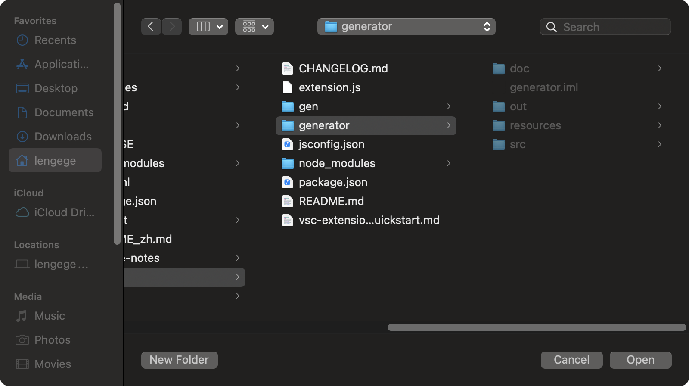
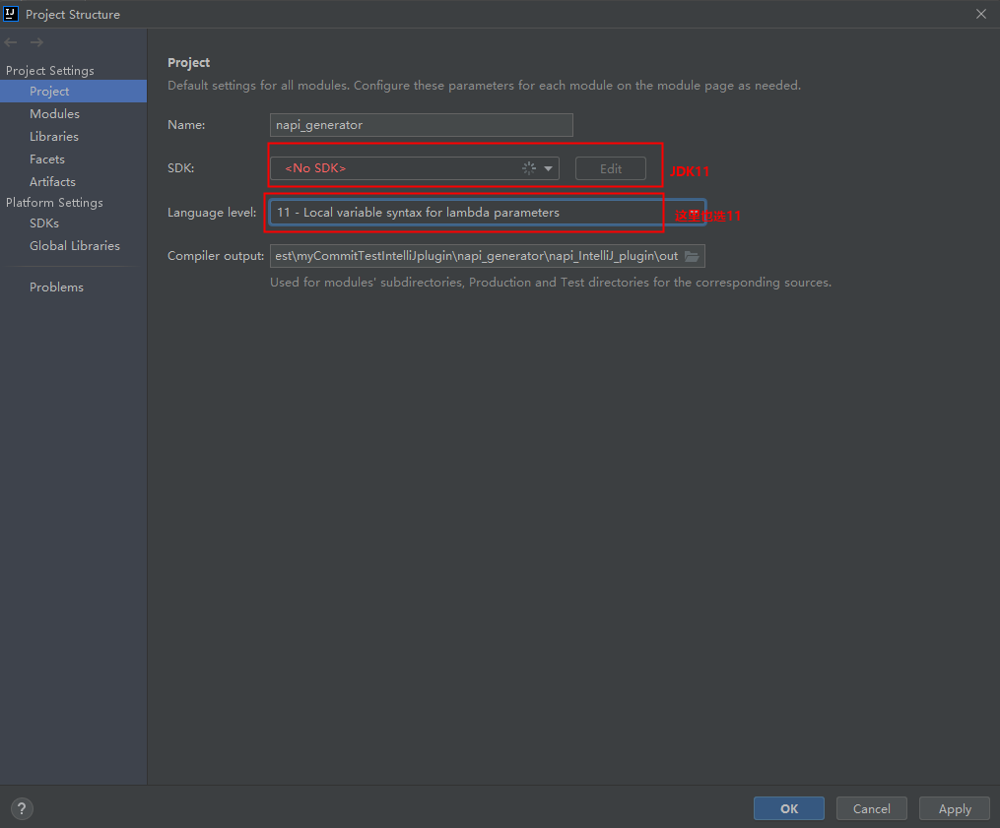
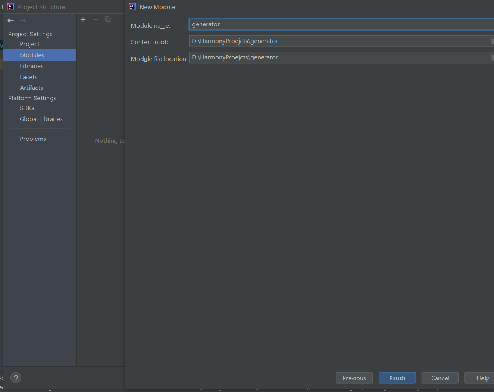

# NAPI框架生成工具IntelliJ插件开发说明

若当前工具功能不满足开发者需求，开发者需增强工具能力，则可基于已有源码进行工具二次开发，编译打包生成自定义的IntelliJ插件。

## IntelliJ插件打包说明

### 环境说明

系统：建议Windows 10

### 开发步骤

#### 环境准备

1.将napi_generator目录下的可执行文件分别放置在napi_generator/napi_IntelliJ_plugin/resources/cmds目录下对应系统的文件夹下。

2.下载并安装IDEA Community、JDK11配置好环境。IDEA Community版本可以左键单击以下链接下载。

[下载链接](https://www.jetbrains.com/idea/download/)

3.打开IDEA Community应用程序。
依次点击项目File>Open 选择napi_generator/napi_IntelliJ_plugin项目文件夹。

4.配置Project
项目打开完成，点击File>Project Structure,在出现的界面中点击Project,下图的SDK选择JDK 11，选择或者新建complier output目录为项目文件下的out目录。

5.配置Modules
Project Settings > Modules 新建Modules。点击上方“-”删除原有的Modules，然后点击“+”选择 New Module。

6.配置Module SDK.
在New Module对话框中，选择IntelliJ Platform Plugin。若Module SDK中无可选SDK，请在Module SDK 下拉框中点击 Add IntelliJ Platform Plugin SDK 选择IDEA Community安装目录，点击OK,在Select Internal Java Platform 选择 JAVA SDK 11（213版本只支持 11)，点击New Module对话框中Next。

7.配置Content root.
Content root选择~/napi_generator/napi_IntelliJ_plugin文件夹，module name填写generator。点击Finish，若出现提示已存在是否覆盖的提示，请点“Yes”完成配置。

8.Modules配置完成后，若在SDKs中无相应JDK和Plugin SDK,请点击+号分别添加 Add Java JDK和Add Intellij PlantForm Plugin SDK,Java JDK为java11的安装目录，Plugin SDK为 IDEA Community 2021.3.3的安装目录。

9.若完成以上步骤配置，点击OK完成配置。Rebuild项目，若IDEA不能点击右上角的运行，点击Plugin后下三角选择Edit Configurations...选项，Run/Debug Configurations框中Use classpath of moudle选择generator，点击ok，等待安装完成。

10.点击Intellij IDEA工具右上角Built Project按钮，等待工程built完成。

11.在IDEA Community中依次点击Build>Prepare All Plugin Modules for development"，然后在Select Modules框中点击ok，jar包生成完成后在工具右下角提示jar包生成成功，且包含jar包存放位置。

## 工具测试

进行工具二次开发后，本地可进行单元测试、story特性测试确保工具的可用性。左键单击以下链接了解详情：

[单元测试](https://gitee.com/openharmony/napi_generator/blob/master/test/unittest/README_ZH.md)

[story测试](https://gitee.com/openharmony/napi_generator/blob/master/test/storytest/README_ZH.md)

