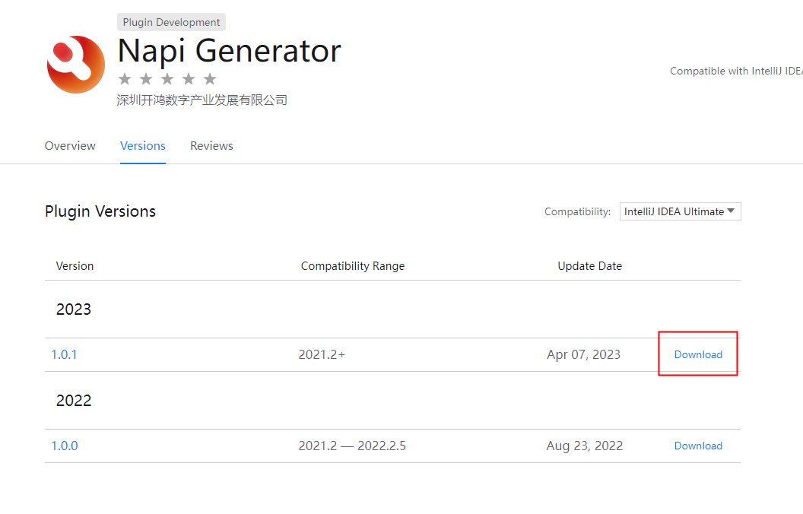
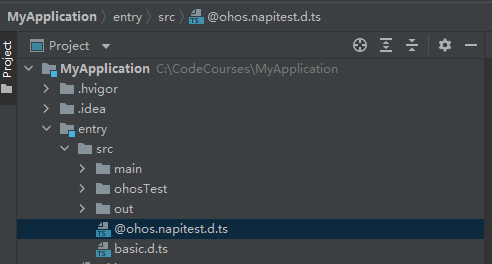
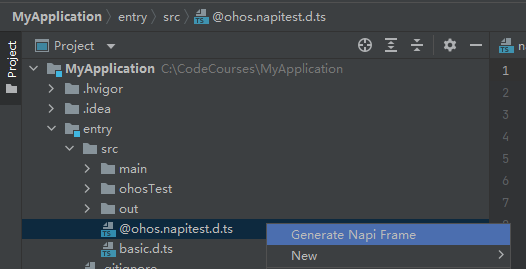
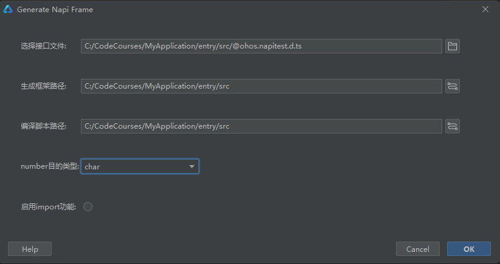

# NAPI框架生成工具IntelliJ插件使用说明

## 简介

NAPI框架生成工具目前支持三种入口，分别是可执行程序、DevEco Studio上使用的IntelliJ插件、VS Code插件，本文主要介绍DevEco Studio上使用的IntelliJ插件使用说明。DevEco Studio上使用的IntelliJ插件下载路径如下，选择新版本下载。

[DevEco Studio上使用的IntelliJ插件下载链接](https://plugins.jetbrains.com/plugin/19593-napi-generator/versions)

## DevEco Studio上使用的IntelliJ插件使用方法

### 依赖

系统：建议Windows 10

开发工具：DevEco Studio

### 使用指导

1.新建或打开项目工程，以下以新建项目工程为例。

File->New->Create Project。

Ability Template选择Native C++,单击Next。

填写Project name、Save location,其它选项可不修改，单击Finish,新的工程就创建好了。

2.安装插件，File->Settings->Plugins->Installed->Install Plugin from Disk...，选择下载的napi_generator包，安装成功之后重启IDE。

v1.0.3之前版本，安装jar包

v1.0.3及之后版本，安装zip包

3.使用工具的准备工作：使用工具之前，需要做以下准备工作，链接如下：

[PREPERATION_ZH](https://gitee.com/openharmony/napi_generator/blob/master/napi_IntelliJ_plugin/docs/napi/PREPERATION_ZH.md)

新建项目的src目录，把待转换的.d.ts文件放在DevEco Studio新建项目的src目录下；新建生成框架路径generatorCode；将业务代码放在./src/main/cpp目录下。若.d.ts文件中声明了basic.d.ts文件，将basic.d.ts文件放置在待转换.d.ts文件同一级目录；若除此之外还声明其它.d.ts文件，将此类文件放置在待转换.d.ts文件同级目录。

4.配置工具参数：选择.d.ts文件,点击右键选择 "Generate Napi Frame"，工具弹出"Generate Napi Frame"弹窗。接口文件文本框填写.d.ts文件路径；"生成框架路径"填写生成框架存放路径；"编译脚本路径"填写生成CMakeList.txt文件输出路径；"number目的类型"此处选择uint32_t；因待转换.d.ts文件未引用其它文件，"启用import功能"不选择；"配置业务代码"按钮用于配置接口的业务代码，框架根据配置自动粘合工具代码与业务代码；若用户想手动配置业务代码，则不点击配置按钮配置。点击ok。

5.执行结束后会在对应生成框架路径目录下生成napi框架代码文件，会修改编译脚本路径下的CMakeLists.txt，且在此路径下会生成业务代码配置的cfg.json文件，其中cfg.json文件内容如下所示：

[cfg.json](https://gitee.com/openharmony/napi_generator/blob/master/examples/pluginCase/cfg.json)

## 集成应用Native工程说明
NAPI框架代码生成后，系统框架开发者进行二次开发后，可在DevEco Studio将生成代码集成到应用Native工程中，并进行编译打包生成对应的库文件，供应用开发者调用接口。集成应用Native工程说明的具体操作步骤可以左键单击以下链接了解：

[集成应用Native工程说明](https://gitee.com/openharmony/napi_generator/blob/master/napi_IntelliJ_plugin/docs/napi/ENSEMBLE_ZH.md)

