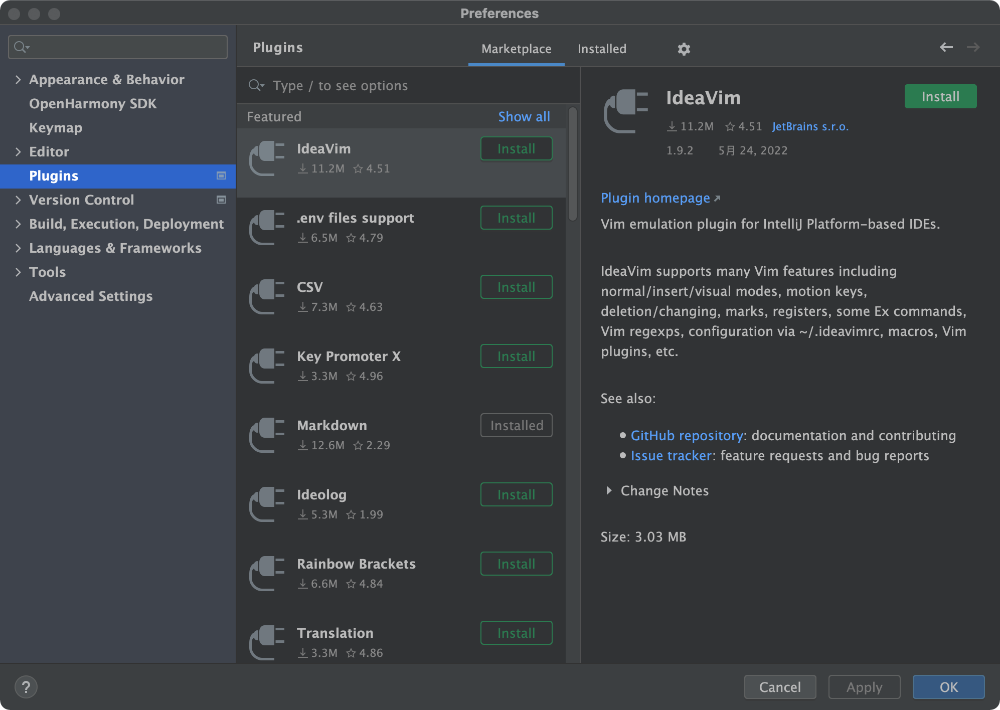

# IDEA插件开发环境配置

基础环境要求：
JDK 11 ，IDEA Community 2021.3.3

1.下载IDEA Community 与 JDK11 配置好环境
点击 https://www.jetbrains.com/idea/download/ 下载Community版本，并完成安装。

2.打开IDEA Community 应用程序。
依次点击项目File>Open 选择napi_generator/src/generator项目文件夹。

3.项目配置
项目打开完成，点击File>Project Structure

4.配置Modules.
Project Settings > Modules 新建Modules.点击上方“-”删除原有的Modules，“+”选择 New Modules。

5.配置Module SDK.
在New Modules对话框中，选择IntelliJ Platform Plugin。若为首次环境配置，请在Module SDK 下拉框中点击 Add IntelliJ Platform Plugin SDK 选择IDEA Community安装目录，点击OK,在Select Internal Java Platform 选择 JAVA SDK 11（213版本只支持 11)

6.配置Root Content.
在上图界面点击Next，选择Content root:为napi_generator/src/generator文件夹，module name会自动变为generator,若出现提示已存在是否覆盖的提示，请点“是”完成配置。

7.配置完成Modules后，若在SDKs中无相应JDK和Plugin SDK,请点击+号分别添加 Add Java JDK和Add Intellij PlantForm Plugin SDK,Java JDK为java11的安装目录，Plugin SDK为 IDEA Community 2021.3.3的安装目录。

8.若完成步骤7配置，点击OK完成配置。Rebuild项目，若IDEA依然不能点击右上角的运行。请重新配置一次Modules。

9.项目运行成功后，会另起一个IDEA应用程序。插件运行在IDEA中，只需要新建一个Grandle Project,添加相应的TS文件到项目文件夹里面，就可以右击文件，选择Generate napi Frame出现插件主界面进行相应操作。

10.在Deveco stdio中安装插件。
请在IDEA Community中依次点击Build>Prepare Plugin Module " " for development"生成jar包(jar一般生成在generator目录下)。打开DevEco Studio 工具，点击File>settings>plugin。点击右方齿轮选择install plugin from disk选择jar包，点击确定完成。重新IDE完成安装
