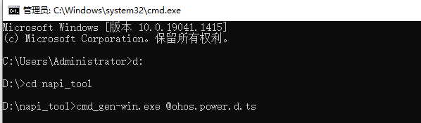
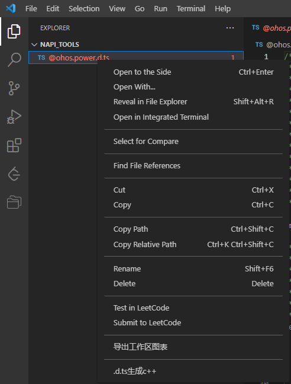

# napi_tool

#### 介绍
NAPI框架代码生成工具,根据用户指定的路径下的ts接口文件可以一键生成NAPI框架代码、业务代码框架、GN文件等，这样框架层开发者无需关注Nodejs相关语法，C++与JS之间的接口类型转换、数据类型转换等，只需关注业务实现逻辑即可，从而可以大大提高开发效率。目前工具支持命令行、VScode插件两种入口。

#### 软件架构


#### 目录

```
├── napi_tool            # NAPI框架代码生成工具
│   ├── doc              # 工具当前能力、版本规划
│   ├── image            # 图片资源文件
│   ├── output           # 工具对应的可执行程序与插件程序
│   ├── code             # 工具源码
│   └── README           # 工具使用指导    
└──README 
```

#### 安装教程

1. 将output目录下Windows可执行程序cmd_gen-win.exe拷贝到对应目录下，不需要安装，可以在cmd命令行中直接运行。
2. 将output目录下Linux可执行程序cmd_gen-linux拷贝到对应目录下，可以在终端下直接运行。

#### 使用说明

##### 可执行程序使用方法

###### Windows

 1) 将要转换的.d.ts文件放到任意目录下，建议放到可执行程序cmd_gen-win.exe同级目录下，例如：

   

 2) 右键windows开始菜单，点击运行，输入cmd，点击确定。

   

3) 在命令行中进入到之前可执行程序cmd_gen-win.exe所在的目录，并运行cmd_gen-win.exe，在cmd_gen-win.exe后面要对应的.d.ts文件名，例如：



4) 运行成功后会在.d.ts文件说在的目录下生成对应的文件，例如：

   

###### Linux

1) 将要转换的.d.ts文件放到任意目录下，建议放到可执行程序cmd_gen-linux同级目录下，例如：

   

2) 在终端中进入到之前可执行程序cmd_gen-linux所在的目录，并运行cmd_gen-linux，在cmd_gen-linux后面要对应的.d.ts文件名，例如：

   

3) 运行成功后会在.d.ts文件说在的目录下生成对应的文件，例如：

   

###### Mac
 方法步骤参考windows、Linux的使用方法

##### 插件使用方法
###### 说明
   visual studio code 版本需1.62.0及以上

###### 步骤

1) 打开vscode，在左侧边栏中选择插件安装。

   

2) 点击上面三个点的按钮，选择从VSIX安装选项，然后选择刚才生成的gnapi-0.0.1.vsix插件文件，再点击安装。

   

3) 安装完成后就会在vscode的插件管理器中能看到gnapi这个插件了。

   

4) 在vscode中找到需要转换的.d.ts文件，例如：

   

5) 鼠标在.d.ts上点击右键，选择.d.ts生成c++选项。

   

6) 之后就会在该目录下生成对应文件，例如：

   

注：以上插件使用示例为windows的，linux、mac的使用方法类似。

#### 参与贡献

1.  Fork 本仓库
2.  新建开发分支
3.  提交代码
4.  新建 Pull Request

