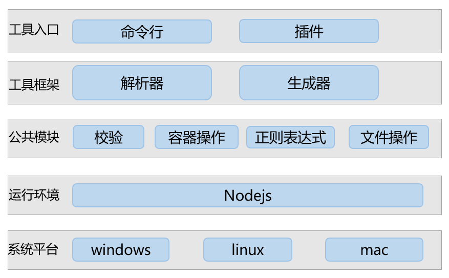
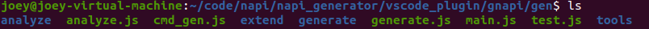
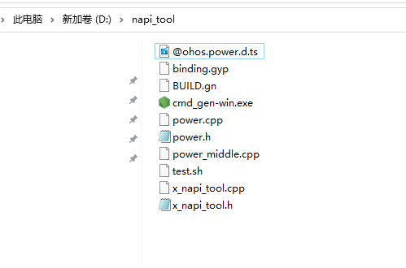
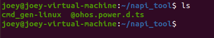
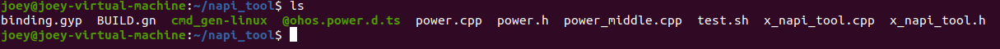
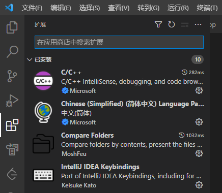
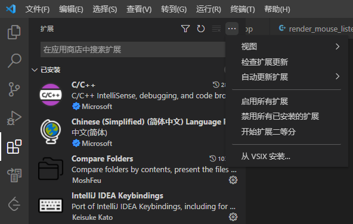
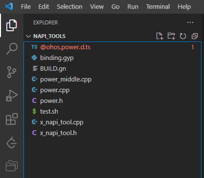

# napi_tool

## 概述
本文主要介绍NAPI框架代码生成工具，它可以根据用户指定路径下的ts接口文件一键生成NAPI框架代码、业务代码框架、GN文件等。在开发JS应用与NAPI间接口时，底层框架开发者无需关注Nodejs语法、C++与JS之间的数据类型转换等上层应用转换逻辑，只关注底层业务逻辑即可，专业的人做专业的事，从而可以大大提高开发效率。目前工具支持命令行、VScode插件两种入口。

## 软件架构


## 目录

```
├── napi_tool                     # NAPI框架代码生成工具
│   ├── docs                      # 工具当前能力、版本规划
│   ├── figures                   # 图片资源文件
│   ├── code                      # 工具源码
|   |   ├── tool_code             # 工具源码
│   |       ├── gen              
│   |           |── analyze       # 解析器
│   │           |── extend        # 扩展模块，包括gn文件生成、linux环境适配代码等
│   │	        |── generate      # 生成器
│   │           └── tools         # 公共模块代码，包括消息体校验、文件读写、正则表达式转换等
│   |       └── test              # 插件测试用例    
|   |   └──ts_test                # 工具需要的ts文件样例  
│   └── README                    # 工具使用指导    
└──README 
```
### code目录源码介绍
此目录为NAPI框架代码生成工具对应的源码，开发者可基于此代码进行二次开发。

## 软件环境准备

系统：建议Ubuntu 20.04或者Windows 10

依赖版本：vscode 1.62.0

## 开发说明

开发者可以利用源码来编译打包生成对应的可执行文件和插件，用于在JS和c++之间进行类型转换。可执行文件和插件的开发说明如下：

### 源码

通过命令：git clone git@gitee.com:openharmony-sig/assist_tools.git  下载对应的源码。

### 打包

#### 可执行文件开发说明
1.安装pkg : 执行命令sudo npm i -g pkg

2.打包三个版本 : 执行命令pkg vscode_plugin/gnapi/gen/cmd_gen.js

执行以上步骤后，即可在gen目录下生成Windows、linux、mac系统下的可执行程序:cmd_gen-win.exe、cmd_gen-linux、cmd_gen-macos。

#### 插件开发说明
1. 安装yo : 执行命令npm install -g yo generator-code。

2. 使用yo : 执行命令yo code，gnapi是使用yo code生成的插件代码框架，其中gnapi/gen目录下是我们开发的自动化生成napi程序的源代码。

   

3. 在napi_generator/vscode_plugin/gnapi这个目录中执行命令npm i vsce。

4. 执行命令./node_modules/vsce/vsce package命令，最终会打包生成一个插件gnapi-0.0.1.vsix。

   

## 使用说明

1. 将gen目录下Windows可执行程序cmd_gen-win.exe拷贝到对应目录下，不需要安装，可以在cmd命令行中直接运行。
2. 将gen目录下Linux可执行程序cmd_gen-linux拷贝到对应目录下，可以在终端下直接运行。

### 可执行程序使用方法

#### Windows

1) 将要转换的.d.ts文件放到任意目录下，建议放到可执行程序cmd_gen-win.exe同级目录下，例如：


2) 右键windows开始菜单，点击运行，输入cmd，点击确定。


3) 在命令行中进入到之前可执行程序cmd_gen-win.exe所在的目录，并运行cmd_gen-win.exe，在cmd_gen-win.exe后面要对应的.d.ts文件名，例如：


4) 运行成功后会在.d.ts文件说在的目录下生成对应的文件，例如：



#### Linux

1) 将要转换的.d.ts文件放到任意目录下，建议放到可执行程序cmd_gen-linux同级目录下，例如：

   

2) 在终端中进入到之前可执行程序cmd_gen-linux所在的目录，并运行cmd_gen-linux，在cmd_gen-linux后面要对应的.d.ts文件名，例如：

   

3) 运行成功后会在.d.ts文件说在的目录下生成对应的文件，例如：

   

#### Mac
方法步骤参考windows、Linux的使用方法

## 插件使用方法
### 说明
visual studio code 版本需1.62.0及以上

### 步骤

1) 打开vscode，在左侧边栏中选择插件安装。

   

2) 点击上面三个点的按钮，选择从VSIX安装选项，然后选择刚才生成的gnapi-0.0.1.vsix插件文件，再点击安装。

   

3) 安装完成后就会在vscode的插件管理器中能看到gnapi这个插件了。

   

4) 在vscode中找到需要转换的.d.ts文件，例如：

   

5) 鼠标在.d.ts上点击右键，选择.d.ts生成c++选项。

   

6) 之后就会在该目录下生成对应文件，例如：

   

## 注意事项
以上插件使用示例为windows的，linux、mac的使用方法类似。

## 参与贡献

暂无
