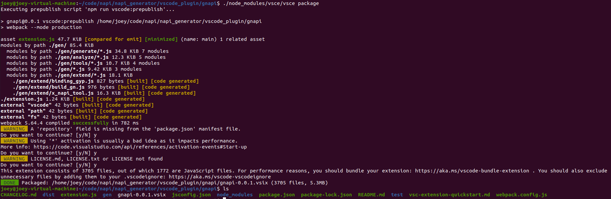

# napi_tool_code

#### 介绍
此目录为NAPI框架代码生成工具对应的源码，开发者可基于此代码进行二次开发。

#### 目录
```
/napi_tool/code
├── tool_code            # 工具源码
│   ├── gen              
│   |   |── analyze		 # 解析器
│   │   |── extend		 # 扩展模块，包括gn文件生成、linux环境适配代码等
│   │	|── generate	 # 生成器
│   │   └── tools		 # 公共模块代码，包括消息体校验、文件读写、正则表达式转换等
│   └── test           # 插件测试用例    
└──ts_test 			   # 工具需要的ts文件样例  
```

#### 说明
##### 可执行文件开发说明
1.安装pkg : 执行命令sudo npm i -g pkg

2.打包三个版本 : 执行命令pkg vscode_plugin/gnapi/gen/cmd_gen.js

执行以上步骤后，即可在gen目录下生成Windows、linux、mac系统下的可执行程序。

##### 插件开发说明
1. 安装yo : 执行命令npm install -g yo generator-code。

2. 使用yo : 执行命令yo code，gnapi是使用yo code生成的插件代码框架，其中gnapi/gen目录下是我们开发的自动化生成napi程序的源代码。

   

3. 在napi_generator/vscode_plugin/gnapi这个目录中执行命令npm i vsce。

4. 执行命令./node_modules/vsce/vsce package命令，最终会打包生成一个插件gnapi-0.0.1.vsix。

   