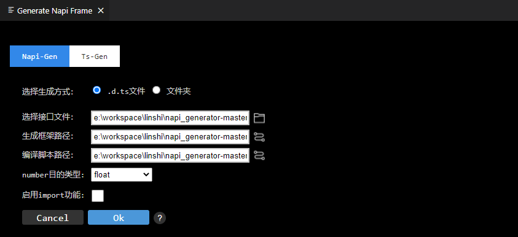

# NAPI框架生成工具VSCode插件使用说明
## 简介

NAPI框架生成工具目前支持三种入口，分别是可执行程序、DevEco Studio上使用的IntelliJ插件、VS Code插件，本文主要介绍VS Code插件使用说明。

## VS Code插件使用方法

### 说明

visual studio code 版本需1.62.0及以上。

### 步骤

1.打开VS Code，在左侧边栏中选择插件安装。

2.在应用商店搜索NAPI插件，再单击安装。

3.安装完成后就会在VS Code的插件管理器中能看到napi-gen这个插件了。

4.在VS Code中找到需要转换的.d.ts文件，若.d.ts文件中声明了basic.d.ts文件，将basic.d.ts文件放置在待转换.d.ts文件同一级目录；若除此之外还声明其它.d.ts文件，将此类文件放置在待转换.d.ts文件同级目录。例如：

5.选择.d.ts文件,点击右键选择 Generate Napi Frame，工具弹出Generate Napi Frame弹窗。接口文件文本框填写.d.ts文件路径；生成框架路径文本框填写生成框架存放路径；编译脚本路径默认填写；number目的类型此处选择float；启用import功能不选择（待转换.d.ts文件未引用其它文件）；点击ok。

6.执行结束后会在out目录下生成框架代码文件。

## 集成测试
NAPI框架代码生成后，系统框架开发者进行二次开发后，即可集成到OpenHarmony编译系统，生成对应的库文件，供应用开发者调用接口。工具集成测试的具体操作步骤可以左键单击以下链接了解：

  [工具集成测试](https://gitee.com/openharmony/napi_generator/blob/master/docs/INTEGRATION_TESTING_ZH.md)

