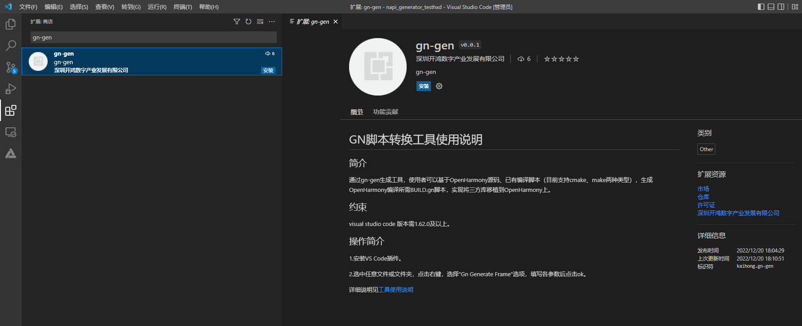
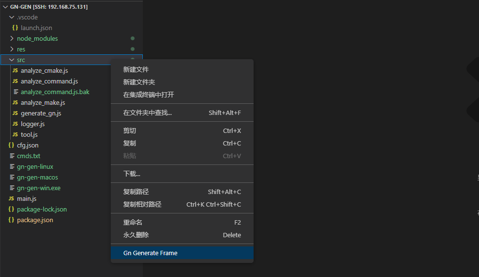
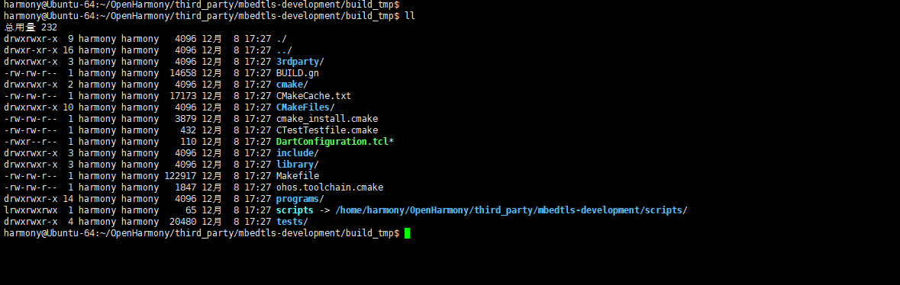

# GN脚本转换工具插件使用说明

### VS Code插件使用方法

#### 环境说明

1、安装cmake，安装命令如下：

	sudo apt-get install cmake

#### 生成ohos.toolchain.cmake

1、Ubuntu中下载OpenHarmony源码，并编译成功一个产品的镜像包，此处以RK3568为例。源码如下所示：

2、将待转换的三方库项目（路径：[三方库项目](https://gitee.com/openharmony/third_party_mbedtls)）放置在third_party文件夹下，如下所示：

3、打开VS Code，在左侧边栏中选择插件安装。

4、 在应用商店搜索gn-gen插件，再单击安装。

5、 安装完成后就会在VS Code的插件管理器中能看到gn这个插件了。

6、 选中任意文件或文件夹，点击右键，选择“Gn Generate Frame”选项。

7、 Gn Generate Frame中参数填写完成之后，点击ok，如下所示：

参数详情如下：

工程输出路径：必填参数，ohos产品输出相对路径(例如：out/khdvk_rk3568_a)；

工程源码路径：必填参数，ohos项目路径(例如：/home/harmony/OpenHarmony)；

输入脚本路径：必选参数，待转换三方库cmake文件相对路径(例如：third_party/mbedtls-development/CMakeLists.txt);

输入脚本类型: 可选参数，默认为cmake;

GN生成路径: 可选参数，工具默认填写待转换三方库cmake文件所在文件夹相对路径，使用者可根据实际情况修改路径；

子系统名称： 可选参数，默认填写“test_subsystem”，使用者可根据实际情况修改名称；

组件名称：可选参数，工具默认填写“test_part”，使用者可根据实际情况修改名称；

编译选项：可选参数，待转换三方库中引用其它三方库时需填写该选项，具体填写方法可参考FAQ中libpng转换时问题解决方法，详细FAQ内容可左键单击以下链接了解：[FAQ](https://gitee.com/openharmony/napi_generator/blob/master/src/cli/cmake2gn/docs/guide/FAQ.md)

扩展文件类型：默认为否，部分三方库编译脚本需要支持的特殊文件类型，具体填写方法可参考FAQ中libpng转换时问题解决方法，详细FAQ内容可左键单击以下链接了解：[FAQ](https://gitee.com/openharmony/napi_generator/blob/master/src/cli/cmake2gn/docs/guide/FAQ.md)

扩展编译选项：默认为否，部分三方库编译脚本需要支持的特殊编译选项，具体填写方法可参考FAQ中curl转换时步骤3解决方法，详细FAQ内容可左键单击以下链接了解：[FAQ](https://gitee.com/openharmony/napi_generator/blob/master/src/cli/cmake2gn/docs/guide/FAQ.md)

8.运行完成后，进入/OpenHarmony/third_party/mbedtls-development/build_tmp目录下，查看是否存在ohos.toolchain.cmake文件，如下所示：

	 harmony@Ubuntu-64:~/service/example$ cd /home/harmony/OpenHarmony/third_party/mbedtls-development/build_tmp/
	 harmony@Ubuntu-64:~/OpenHarmony/third_party/mbedtls-development/build_tmp$ ll -A
	 总用量 228
	 drwxrwxr-x  3 harmony harmony   4096 12月 16 11:54 3rdparty/
	 -rw-rw-r--  1 harmony harmony  14658 12月 16 11:55 BUILD.gn
	 drwxrwxr-x  2 harmony harmony   4096 12月 16 11:54 cmake/
	 -rw-rw-r--  1 harmony harmony  17144 12月 16 11:54 CMakeCache.txt
	 drwxrwxr-x 10 harmony harmony   4096 12月 16 11:54 CMakeFiles/
	 -rw-rw-r--  1 harmony harmony   3879 12月 16 11:54 cmake_install.cmake
	 -rw-rw-r--  1 harmony harmony    432 12月 16 11:54 CTestTestfile.cmake
	 -rwxr--r--  1 harmony harmony    110 12月 16 11:54 DartConfiguration.tcl*
	 drwxrwxr-x  3 harmony harmony   4096 12月 16 11:54 include/
	 drwxrwxr-x  3 harmony harmony   4096 12月 16 11:55 library/
	 -rw-rw-r--  1 harmony harmony 122917 12月 16 11:54 Makefile
	 -rw-rw-r--  1 harmony harmony   1851 12月 16 11:54 ohos.toolchain.cmake
	 drwxrwxr-x 14 harmony harmony   4096 12月 16 11:54 programs/
	 lrwxrwxrwx  1 harmony harmony     65 12月 16 11:54 scripts -> /home/harmony/OpenHarmony/third_party/mbedtls-development/scripts/
	 drwxrwxr-x  4 harmony harmony  20480 12月 16 11:55 tests/

#### 运行make脚本

1、若build_tmp下存在ohos.toolchain.cmake文件，在终端中进入build_tmp目录下，运行make，查看cmake环境是否可以正常使用，命令如下：

	 harmony@Ubuntu-64:~/OpenHarmony/third_party/mbedtls-development/build_tmp$ cmake .. -DCMAKE_TOOLCHAIN_FILE=ohos.toolchain.cmake
	 -- The C compiler identification is Clang 10.0.1
	 -- Check for working C compiler: /home/harmony/OpenHarmony/prebuilts/clang/ohos/linux-x86_64/llvm/bin/clang
	 -- Check for working C compiler: /home/harmony/OpenHarmony/prebuilts/clang/ohos/linux-x86_64/llvm/bin/clang -- works
	 -- Detecting C compiler ABI info
	 -- Detecting C compiler ABI info - done
	 -- Detecting C compile features
	 -- Detecting C compile features - done
	 -- Configuring done
	 -- Generating done
	 -- Build files have been written to: /home/harmony/OpenHarmony/third_party/mbedtls-development/build_tmp

根据以上日志可发现make运行成功，环境正常使用。若运行make失败，则根据报错信息修改，直到make运行成功，环境正常使用为止。

#### 生成gn脚本

1、 Gn Generate Frame中参数填写如下：

具体参数填写参考生成ohos.toolchain.cmake中步骤7。

2.运行成功后会在/OpenHarmony/third_party/mbedtls-development目录下生成build_tmp文件夹，build_tmp文件夹中包含BUILD.gn文件，如下所示：

## 将三方库集成到OpenHarmony的方法

具体的将三方库集成到OpenHarmony的步骤，可以左键单击以下链接了解：

[将三方库集成到OpenHarmony的方法](https://gitee.com/openharmony/napi_generator/tree/master/src/cli/cmake2gn/docs/usage/ENSEMBLE_METHOD_ZH.md)