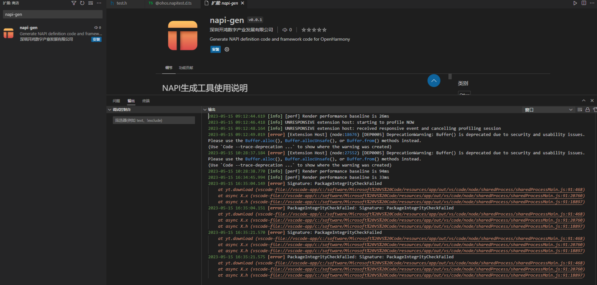

# NAPI框架生成工具 问题反馈

## 问题反馈

### 1. pkg cmd_gen.js 生成.exe程序失败

问题描述：在Linux命令行入口安装辅助工具过程中，按文档步骤，在使用pkg命令打包生成.exe文件时，发生报错。

	~/workspace/assist_tool/assist_tools/napi_tool/code/tool_code/gen$ pkg cmd_gen.js
	
	> pkg@5.5.2
	> Targets not specified. Assuming:
	> node10-linux-x64, node10-macos-x64, node10-win-x64
	> Fetching base Node.js binaries to PKG_CACHE_PATH
	> fetched-v10.24.1-linux-x64 [ ] 0%> Not found in remote cache:
	> {"tag":"v3.2","name":"node-v10.24.1-linux-x64"}
	> Building base binary from source:
	> built-v10.24.1-linux-x64
	> Error! AssertionError [ERR_ASSERTION]: The expression evaluated to a falsy value:

问题定位：这是由于在使用pkg命令打包生成.exe文件时，需要连接github来生成对应的可执行程序，由于国内的网络的问题，连接github的时候有时候时连接不上的。

问题解决：如果失败继续执行这个命令，多执行几次就会成功。

### 2. 用可执行程序生成c++代码失败

问题描述：在windows下用cmd_gen-win.exe生成对应的c++代码报错。

	D:\napi_tool>cmd_gen-win.exe @ohos.power.d.ts                                                                                                                                                                                                pkg/prelude/bootstrap.js:1794                                                                                                                                                                                                                      return wrapper.apply(this.exports, args);                                                                                                                                                                                                                   ^                                                                                                                                                                                                                                                                                                                                                                                                                                                                    TypeError: Cannot read property 'name' of undefined                                                                                                                                                                                              at GenerateAll (C:\snapshot\gen\generate.js)                                                                                                                                                                                                 at Object.DoGenerate (C:\snapshot\gen\main.js)                                                                                                                                                                                               at Object.<anonymous> (C:\snapshot\gen\cmd_gen.js)                                                                                                                                                                                           at Module._compile (pkg/prelude/bootstrap.js:1794:22)                                                                                                                                                                                        at Object.Module._extensions..js (internal/modules/cjs/loader.js:1114:10)                                                                                                                                                          at Module.load (internal/modules/cjs/loader.js:950:32)                                                                                                                                                                             at Function.Module._load (internal/modules/cjs/loader.js:790:12)                                                                                                                                                                   at Function.runMain (pkg/prelude/bootstrap.js:1847:12)                                                                                                                                                                                       at internal/main/run_main_module.js:17:47  

问题定位：在windows命令行中执行cmd_gen-win.exe的时候后面没有加d.ts文件所在的路径（absolute path），导致d.ts文件没有找到。

问题解决：在执行cmd_gen-win.exe的时候后面要加.d.ts文件所在的路径（absolute path），或者把d.ts文件放入到cmd_gen-win.exe所在的目录中。例如直接执行：

	cmd_gen-win.exe @ohos.power.d.ts

### 3.未安装系统依赖插件，运行测试用例失败

问题描述：初次运行UT或ST用例失败。

	Error: Cannot find module '../../node_modules/typescript'
	Require stack:
	 - /home/harmony/hhhh/napi_generator_1/src/gen/tools/common.js
	 - /home/harmony/hhhh/napi_generator_1/src/gen/analyze.js
	 - /home/harmony/hhhh/napi_generator_1/test/unittest/analyze.test.js
	    at Function.Module._resolveFilename (internal/modules/cjs/loader.js:902:15)
	    at Function.Module._load (internal/modules/cjs/loader.js:746:27)
	    at Module.require (internal/modules/cjs/loader.js:974:19)
	    at require (internal/modules/cjs/helpers.js:101:18)
	    at Object.<anonymous> (/home/harmony/hhhh/napi_generator_1/src/gen/tools/common.js:16:13)

问题定位：初次运行测试用例,napi_generator目录下、napi_generator/src目录下依赖插件未全部安装。

问题解决：napi_generator目录下、napi_generator/src目录下重新安装依赖即可，直到napi_generator/src/package.json文件中包含以下所有插件：

	"devDependencies": {
			"@types/glob": "^7.1.4",
			"@types/mocha": "^9.0.0",
			"@types/node": "14.x",
			"@types/vscode": "^1.62.0",
			"@vscode/test-electron": "^1.6.2",
			"eslint": "^8.1.0",
			"glob": "^7.1.7",
			"mocha": "^9.1.3",
			"webpack": "^5.64.4",
			"webpack-cli": "^4.9.1"
		}

### 4.未安装rewire插件，运行测试用例失败

问题描述：readme中插件全部安装完成后，执行测试用例失败。

	Error: Cannot find module 'rewire'
	Require stack:
	- /home/harmony/myNapi/napi_generator_1/test/unittest/extend.test.js
	    at Function.Module._resolveFilename (internal/modules/cjs/loader.js:902:15)
	    at Function.Module._load (internal/modules/cjs/loader.js:746:27)
	    at Module.require (internal/modules/cjs/loader.js:974:19)

问题定位：由于ut用例代码中引入rewire，执行用例时未安装该插件，导致执行用例失败。

问题解决：执行命令：

	npm i rewire

  安装插件之后，再次运行用例即可。

### 5.后缀为gyp文件中包含/*注释，执行用例失败

问题描述：代码中后缀为gyp的文件中包含/*注释，执行用例失败。

	File "/home/harmony/myNapi/napi_generator/node_moduless/node-gyp/gyp/pylib/gyp/input.py",line 237,in LoadOneBuildFile
	  build_file_data = eval(build_file_contents,{"__builtins__":{}},None)
	File "bingding.gyp",Line 1
	  /*
	  ^

问题定位：代码中后缀为gyp的文件中包含/*，但工具不能解析，只能解析#后面的注释，导致执行用例失败。

问题解决：修改代码。

### 6.VS Code 1.76.0以上版本下载napi-gen VS Code插件报错

问题描述：VS Code 1.76.0以上版本下载VS Code插件’napi-gen‘时报错，如下所示：

问题解决：

(1)关闭vscode

(2)按WIN + R，输入cmd，打开终端，然后输入命令

code --no-sandbox

(3)再重启vscode，就可以正常使用了。

## 已知Bug

### 1.Map<string,string>类型的函数转换框架代码失败

问题描述：当待转换的ts文件中包含map数据类型，且书写方式为Map<string,string>时，框架代码转换失败。

	2022-6-28 9:16:42 [ERR] @ohos.napitest.d.ts (17,20): Cannot find name 'Map'. Do you need to change your target library? Try changing the 'lib' compiler option to 'es2015' or later.
	2022-6-28 9:16:42 [INF] fail@ohos.napitest.d.ts (17,20): Cannot find name 'Map'. Do you need to change your target library? Try changing the 'lib' compiler option to 'es2015' or later.

问题定位：当前代码不支持Map<string,string>此种书写方式。

问题解决：当ts文件中包含Map<string,string>书写方式的方法时，通过可执行文件方式进行框架代码转换之前安装@types/node依赖，即可转换成功，命令如下：

	npm install @types/node -D

通过Intellij IDEA插件或VS Code插件转换时，不支持ts文件包含Map<string,string>书写方式的方法，敬请期待后续更新解决方案。

### 2.枚举值中包含左移右移等符号的函数框架代码转换失败

问题描述：当待转换的ts文件中包含enum数据类型，且enum中包含左移右移时，框架代码转换失败，函数如下：

	enum HiTraceFlag {
		DEFAULT           = 0,
		DONOT_CREATE_SPAN = 1 << 1,
		TP_INFO           = 1 << 2,
	}
	function begin(name: string, flags: HiTraceFlag): HiTraceFlag;

问题定位：当前代码不支持Map<string,string>此种书写方式。

### 3.array<Map<string,any>>与array<{[key:string]:any}>数据类型框架代码转换失败

问题描述：当待转换的ts文件中包含array<map>数据类型时，框架代码转换失败，函数如下：

	function fun1(v: Array<{ [key: string]: string }>): void;
	function fun2(v: Array<Map<string, string>>): string;

问题定位：当前代码不支持Map<string,string>此种书写方式。