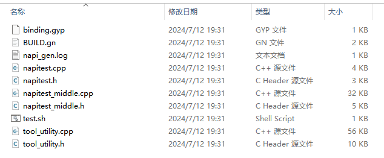

# dts2cpp工具

## 简介
dts2cpp工具，它可以根据用户指定路径下的ts(typescript)接口文件一键生成NAPI框架代码、业务代码框架、GN文件等。在开发JS应用与NAPI间接口时，底层框架开发者无需关注js语法、C++与JS之间的数据类型转换等上层应用转换逻辑，只关注底层业务逻辑即可，专业的人做专业的事，从而可以大大提高开发效率。

## 约束
系统：建议Ubuntu 20.04或者Windows 10

依赖版本：VS Code 1.62.0

## 使用方法

### 生成框架

1.安装typescript：在napi_generator/src/cli/dts2cpp/src目录下执行命令：

	npm i typescript

2.安装stdio：在napi_generator/src/cli/dts2cpp目录下执行命令：

	npm i stdio

3.将待转换的文件@ohos.napitest.d.ts拷贝到napi_generator/src/cli/dts2cpp/src/gen下，并在该目录下新建out目录；@ohos.napitest.d.ts如下所示：

```
declare namespace napitest {
  function funcTest(v: boolean): string;
}
export default napitest;
```

4.在napi_generator/src/cli/dts2cpp/src/gen下执行以下命令生成napi框架代码：

```
node cmd_gen.js -f @ohos.napitest.d.ts -o out
```

其中，参数详情如下：

   -f, 待转换的.d.ts文件，若同时转换多个文件，文件之间用“,”隔开；

  -d, 根据指定路径转换该文件夹中所有.d.ts文件；

  -i, 可选参数，默认false，待转换.d.ts文件中引用非basic.d.ts的ts文件时打开开关；

  -o, 可选参数，默认为当前目录，指定生成框架代码输出路径；

  -n, 可选参数，默认为uint32_t，指定生成框架代码中number类型全部为指定类型；

  -s, 可选参数，默认为不配置业务代码，指定生成框架代码的业务配置文件，用于粘合工具代码和业务代码的配置。

  备注1：-f与-d两个参数只选其中一个参数即可。

  备注2：若.d.ts文件中声明了其它.d.ts文件，将此类文件放置在待转换.d.ts文件同级目录。

5.输出文件如下所示：



### 集成

[生成代码集成到OpenHarmony的方法](https://gitee.com/openharmony/napi_generator/blob/master/src/cli/dts2cpp/docs/usage/dts2cpp_ENSEMBLE_METHOD_ZH.md)

### 调用

NAPI框架代码生成后，系统框架开发者进行二次开发后，即可集成到OpenHarmony编译系统，生成对应的库文件，供应用开发者调用接口。工具集成测试的具体操作步骤可以左键单击以下链接了解：

[工具集成测试](https://gitee.com/openharmony/napi_generator/blob/master/src/cli/dts2cpp/docs/usage/dts2cpp_INTEGRATION_TESTING_ZH.md)