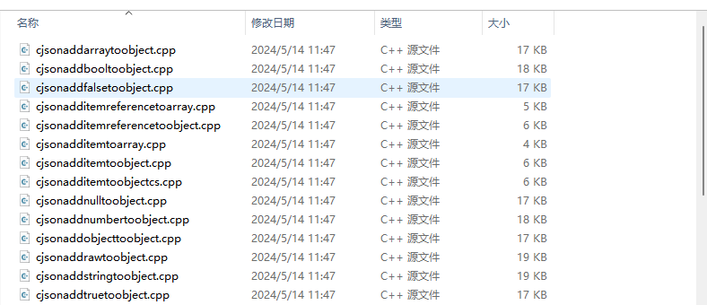

# h2dtscpp工具

## 简介

h2dtscpp工具由C++语法解释器和代码生成器两部分组成。C++语法解释器解析用户输入的.h文件内容，通过C++语法解析，将文件内容分解为类、方法、入参、成员属性等元素；代码生成器根据从语法解析器得到的这些元素，转换为对应的typescript语法的接口、方法、参数代码，生成.ts文件内容；同时通过语法解析器得到的元素，生成.h文件对应的napi框架代码和接口调用测试代码。

## 约束

系统：建议Windows 10

## 使用方法

### 生成

1.安装typescript：使用管理员身份在napi_generator/src/cli/h2dtscpp/src目录下执行命令：

	npm i typescript

2.安装stdio：使用管理员身份在napi_generator/src/cli/h2dtscpp/src目录下执行命令：

	npm i stdio

3.下载header_parser.exe文件：[header_parser.exe](https://gitee.com/openharmony/napi_generator/releases/tag/生成工具)；选择 tool.rar下载并解压，将解压后的文件中的header_parser.exe拷贝到拷贝到node Js执行路径下（如C:\software\nodeJs）

4.将待转换的.h文件拷贝到napi_generator/src/cli/h2dtscpp/src下，如 [cJSON测试三方库](https://gitee.com/openharmony/napi_generator/releases/tag/测试用资源) 的cJSON.h。

5.在napi_generator/src/cli/h2dtscpp/src执行以下命令：

```
node src\main.js -f cJSON.h
```

其中，参数详情如下：

-f, 必选参数，待转换的.h文件；如cJSON.h。

-t, 可选参数，测试用例文件Ability.test.ets文件路径，默认路径为.h文件目录下testout文件夹下创建的xxxAbility.test.ets文件路径（如：testout/cJSONAbility.test.ets）。

-i, 可选参数，ts声明文件index.s.ts文件路径，默认路径为.h文件目录下tsout文件夹下创建的index.d.ts文件路径（如：tsout/index.d.ts）

index.d.ts文件路径；

-o, 可选参数，生成的.cpp文件所在路径，默认路径为.h文件目录下创建的cppout文件夹路径；

6.执行成功后在napi_generator/src/cli/h2dtscpp/src目录下生成以下文件夹


tsout文件夹下内容如下所示：


testout文件夹下内容如下所示：


cppout文件夹下内容（部分文件截图）如下所示：



### 测试

查看生成代码是否能正确编译，点击下面链接查看：

[工具使用说明](https://gitee.com/openharmony/napi_generator/tree/master/src/cli/h2dtscpp/docs/usage/INSTRUCTION_ZH.md)