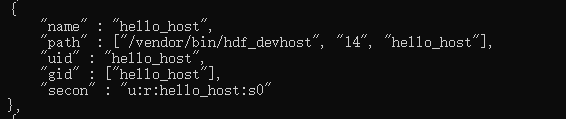
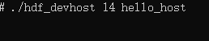
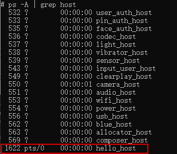
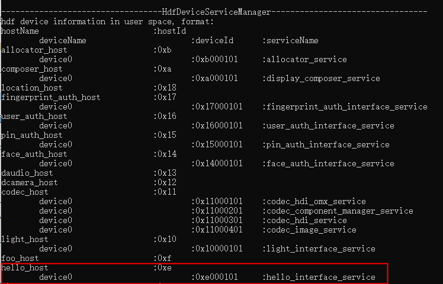
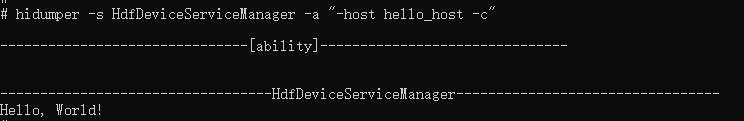

# Usage Guide

## 简介
在OpenHarmony系统中，上层应用或服务层通过调用HDF框架提供的HDI接口，能够以一种标准化和抽象化的方式与底层硬件设备进行交互。使用h2hdf工具，用户只需提供一个drivername，工具会自动生成整个框架的代码，包含驱动配置文件、idl接口、驱动程序driver和驱动服务框架。

## 约束
系统：建议Ubuntu 20.04或者Windows 10

依赖版本：VS Code 1.62.0

## 使用方法

### 生成

1.安装typescript：在napi_generator/src/cli/h2hdf/src目录下执行命令：

	npm i typescript

2.安装stdio：在napi_generator/src/cli/h2hdf目录下执行命令： 

	npm i stdio

3.在napi_generator/src/cli/h2hdf/src下执行以下命令生成ts声明文件：

```
node main.js -n hello
```

其中，参数详情如下：

  -n, drivername，例如：hello

  -v, 可选参数，版本，默认为v4_1

  -o, 可选参数，默认为当前目录，指定生成框架代码输出路径。

6.执行成功后在napi_generator/src/cli/h2hdf/src/下生成hellohdf文件夹，文件夹中目录结构如下所示：

```
hellohdf
├── HcsConfig                                      # hcs配置文件
│   ├── device_info.hcs                            # 内容配置到源码vendor/hihope/rk3568/hdf_config/uhdf/device_info.hcs文件中
├── IdlInterface                                                             
│   ├── hello                                      # 拷贝到源码drivers/interface          
│   │   ├── v1_0              
│   │   │   ├── BUILD.gn                           
│   │   │   ├── IHelloInterface.idl                # idl接口               
│   │   ├── bundle.json
├── Peripheral                                     # 拷贝到源码drivers/peripheral
│   ├── hello                                             
│   │   ├── hal                                           
│   │   │   ├── include
│   │   │   │   ├── hello_dump.h                          
│   │   │   ├── BUILD.gn
│   │   │   ├── hello_dump.c                       # hidump实现              
│   │   ├── hdi_service                            # hdi_service
│   │   │   ├── BUILD.gn                           # 编译两个动态库：libhello_driver、libhello_interface_service_1.0
│   │   │   ├── hello_interface_driver.cpp         # driver：定义驱动入口的对象，将驱动入口注册到HDF框架中；在加载驱动时HDF框架会先调用Bind函数，再调用Init函数加载该驱动；当Init调用异常时，HDF框架会调用Release释放驱动资源并退出
│   │   │   ├── hello_interface_service.cpp        # 驱动服务
│   │   │   ├── hello_interface_service.h
│   │   ├── utils/interface
│   │   │   ├── hello_log.h                        # 日志文件
│   │   ├── BUILD.gn                               
│   │   ├── bundle.json
```

### 编译

1.将hellohdf/Peripheral文件夹下的hello文件夹拷贝到源码drivers/peripheral目录下

```
cp hellohdf/Peripheral/hello 源码/drivers/peripheral
```

将hellohdf/IdlInterface文件夹下的hello文件夹拷贝到源码drivers/interface目录下

```
cp hellohdf/IdlInterface/hello 源码/drivers/interface
```

将hellohdf/HcsConfig/device_info.hcs中的内容拷贝到源码vendor/hihope/rk3568/hdf_config/uhdf/device_info.hcs文件中，如下所示：

```
 root {
    device_info {
       ...
       hello :: host {
            hostName = "hello_host";
            priority = 50;
            hello_device :: device {
                device0 :: deviceNode {
                    preload = 0;
                    policy = 2;
                    priority = 100;
                    moduleName = "libhello_driver.z.so";
                    serviceName = "hello_interface_service";
                }
            }
        }
        ...
     }
 }
```

2.配置产品：以rk3568为例，在源码vendor/hihope/rk3568/config.json文件中hdf子系统的components中增加以下内容：

```
{
  "component": "drivers_interface_hello",
  "features": []
},
{
  "component": "drivers_peripheral_hello",
  "features": []
}
```

注意：drivers_interface_hello为drivers/interface/hello/v1_0/BUILD.gn中的part_name。drivers_peripheral_hello为drivers/peripheral/hello/bundle.json中的component。

3.编译，在源码下执行以下命令进行编译：

```
./build.sh --product-name rk3568
```

编译成功后，将源码下out/rk3568/packages/phone/image镜像烧录在dayu200开发板上

### 验证

#### 动态加载

1.查看hostId：hdc连接开发板，进入/vendor/etc/init路径下，并查看hdf_devhost.cfg文件，使用hdc命令如下：

```
cat hdf_devhost.cfg
```

根据hostName找到对应hostId，如本例的hostName为hello_host，对应找到“name”为“hello_host”那一项，查看“path”的第二个参数，则为hostName对应的hostId，即14，如下所示：



2.运行可执行文件hdf_devhost，手动拉起host：进入/vendor/bin路径下，运行可执行文件hdf_devhost，传入一个参数为hostId，第二个参数为hostName；运行命令如下所示：

```
./hdf_devhost 14 hello_host
```



注意 ：不可将进程kill

3.查看host是否加载：新开一个命令行窗口，hdc进入开发板，执行以下命令查看进程是否拉起：

```
ps -A | grep host
```

屏幕显示hello_host进程号，则表明host已被拉起



4.使用hidumper查看更多细节信息：

查询所有正在运行的host

```
 hidumper -s HdfDeviceServiceManager -a "-query"
```



使用hidumper查看更多信息

```
hidumper -s HdfDeviceServiceManager -a "-host hello_host -c"
```

打印出Hello, World!



#### 静态加载

// todo 待补充

