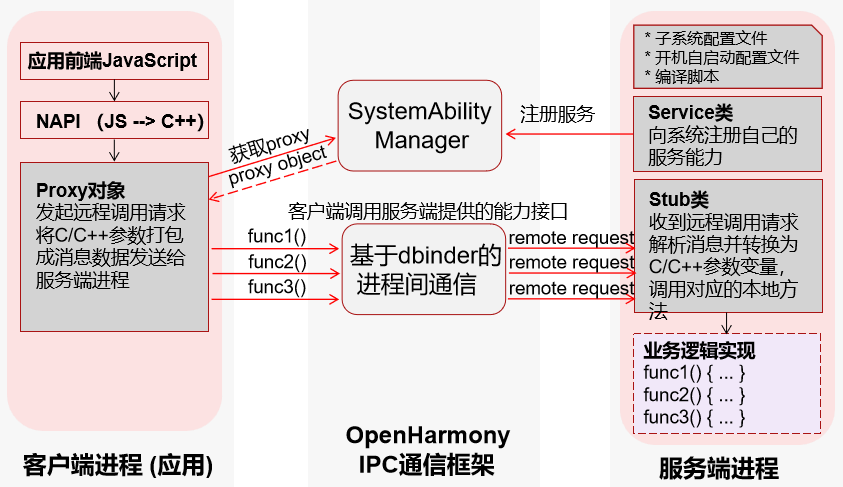
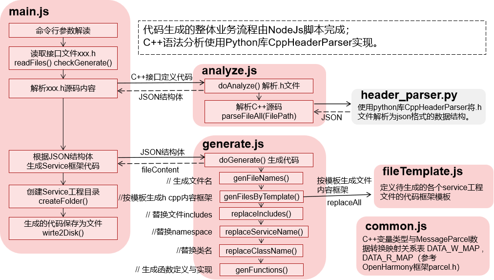

## Develop guide

### Service代码生成工具使用场景

​		当开发人员为OpenHarmony系统框架开发某些功能时，有时需要将这个功能包装成一个独立的服务进程运行在系统中，为了其它应用进程能够调用此服务，开发人员需要基于系统IPC通信框架编写一套远程接口调用实现。		Service代码生成工具能够帮助用户生成框架代码，提升开发效率。用户只需提供一个定义远程方法的.h头文件，工具会自动生成整个Service框架的代码，包含Ability注册、proxy/stub类实现、MessageParcel数据包构造、Service子系统编译及开机自启动相关配置文件。用户可基于框架代码专注于业务功能的编写。



---

### Service工具代码框架说明

~~~
napi_generator\src\cli\h2sa

h2sa
├── docs                                      //文档，（后续文档会整理在一起）
├── examples                                  //样例，测试h文件
│   ├── sample.h
│   └── test.h            
├── h2sa_DEVELOP_README_ZH.md                 //开发文档
├── README_ZH.md                              //usage,使用说明
└── src
    ├── package.json                          //Node.js打包配置文件
    └── src
        ├── gen
        │   ├── analyze.js                    //包含用于分析C++头文件的逻辑。读取头文件内容；解析文件以提取类、方法、参数等信息。
        │   ├── fileTemplate.js               //包含生成代码时使用的模板字符串。模板中的占位符将在代码生成过程中被实际的数据替换，以生成所需的代码文件。（之后换成inl或者tmpl模板文件，并分出不同版本的文件夹，不同类型的文件）
        │   ├── generate.js                   //包含核心的代码生成逻辑。调用analyze.js来获取分析结果；使用fileTemplate.js中的模板和分析结果来生成代码。
        │   ├── header_parser.py              //脚本，与analyze.js协同工作，用于解析C++头文件
        │   └── main.js                       //项目的入口。初始化日志记录和其它工具；解析命令行参数，以确定用户想要执行的操作；调用generate.js来启动代码生成过程。
        └── tools
            ├── common.js                     //包含整个项目中使用的通用函数和常量
            ├── FileRW.js                     //包含文件读写操作的JavaScript模块
            ├── NapiLog.js                    //日志记录模块
            ├── re.js                         //包含正则表达式相关功能的模块
            └── tool.js                       //包含一些辅助工具函数
~~~

### 运行逻辑



### 适配其它版本的方法

#### 场景说明

为了实现工具生成的接口被其它子系统或者应用调用，需将生成的代码经系统框架开发者二次开发后编译集成到OpenHarmony系统中，使其生成动态库，供OpenHarmony应用层调用。此处介绍如何将工具生成的源码集成到OpenHarmony 4.1 relsease，可基于此方法集成OpenHarmony 5.0 relsease。

#### 修改编译文件

1. 修改testservice/BUILD.gn文件，将utils/native 改为 commonlibrary/c_utils，将samgr_standard改为samgr，− 将hiviewdfx_hilog_native改为hilog，在ohos_shared_library("testservice")中include_dirs内新增"//base/startup/init/interfaces/innerkits/include/syspara",将ohos_shared_library("testservice")中的deps删除，并删除external_deps中的"startup_l2:syspara",同时在external_deps中新增"c_utils:utils", 将ohos_executable("testclient")中的deps删除，同时在external_deps中新增"c_utils:utils"。修改后的BUILD.gn文件内容如下所示：

   ```
   import("//build/ohos.gni")
   
   ohos_shared_library("testservice") {
     sources = [
       "//testservice/src/i_test_service.cpp",
       "//testservice/src/test_service_stub.cpp",
       "//testservice/src/test_service.cpp"
     ]
     include_dirs = [
       "//testservice/include",
       "//testservice/interface",
       "//commonlibrary/c_utils/base/include",
       "//base/startup/init/interfaces/innerkits/include/syspara",
     ]
   
     external_deps = [
       "hilog:libhilog",
       "ipc:ipc_core",
       "safwk:system_ability_fwk",
       "samgr:samgr_proxy",
       "c_utils:utils",
     ]
   
     part_name = "testservice_part"
     subsystem_name = "testservice"
   }
   
   ohos_executable("testclient") {
       sources = [
       "//testservice/src/i_test_service.cpp",
       "//testservice/src/test_service_proxy.cpp",
       "//testservice/src/test_client.cpp"
     ]
   
     include_dirs = [
       "//testservice/include",
       "//testservice/interface",
       "//commonlibrary/c_utils/base/include",
     ]
   
     external_deps = [
       "hilog:libhilog",
       "ipc:ipc_core",
       "samgr:samgr_proxy",
       "c_utils:utils",
     ]
   
     part_name = "testservice_part"
     subsystem_name = "testservice"
   }
   ```

2. 修改testservice/bundle.json文件，将"name": "@ohos/testservice"修改为 "name": "@ohos/testservice_part"；将"samgr_standard"改为"samgr"，"utils_base"修改为"c_utils"；将"hiviewdfx_hilog_native"修改为"hilog"；− 将"deps":"components"下的"starup_l2"删除。修改后的bundle.json文件内容如下所示：

   ```
   {
       "name": "@ohos/testservice_part",
       "description": "system ability framework test",
       "homePage": "https://gitee.com/",
       "version": "4.1",
       "license": "Apache License 2.0",
       "repository": "",
       "publishAs": "code-segment",
       "segment": {
           "destPath": "testservice"
       },
       "dirs": {},
       "scripts": {},
       "component": {
           "name": "testservice_part",
           "subsystem": "testservice",
           "adapted_system_type": [
               "standard"
           ],
           "rom": "2048KB",
           "ram": "~4096KB",
           "deps": {
               "components": [
                   "hilog",
                   "ipc",
                   "samgr",
                   "c_utils",
                   "safwk"
               ],
               "third_party": [ "libxml2" ]
           },
           "build": {
               "sub_component": [
                   "//testservice:testservice",
                   "//testservice/sa_profile:testservice_sa_profile",
                   "//testservice:testclient",
                   "//testservice/etc:test_service_init"
               ],
               "inner_kits": [
               ],
               "test": [
               ]
           }
       }
   }
   ```

3. 步骤 1 修改testservice/sa_profile下的文件以及testservice/etc/test_service.cfg文件， 将testservice/sa_profile/9016.xml文件重命名为9016.json,并将内容修改为json格式，修改后的9016.json文件如下所示：

   ```
   {
     "process":"testservice_sa",
         "systemability":[
             {
                 "name":9016,
                 "libpath":"libtestservice.z.so",
                 "run-on-create":false,
                 "auto-restart":true,
                 "distributed":false,
                 "dump-level":1
             }
         ]
   }
   ```

   修改testservice/sa_profile/BUILD.gn文件：将sources = [ "9016.xml" ]修改为sources = [ "9016.json" ]

   修改testservice/etc/test_service.cfg文件：将"path"内的testservice_sa.xml修改为testservice_sa.json

#### roadMap

| 时间点 | 预期任务                                                     | 验收标准                                                     | 完成情况 |
| :----- | ------------------------------------------------------------ | ------------------------------------------------------------ | -------- |
| 9月份  | 1，代码去重方案提供（不同版本模板，proxy-stub框架，hidumper框架，hitrace）；<br />2，适配5.0release版本，增加代码中hidump、hitrace等日志跟踪定位工具的使用； | 1，设计文档；<br />2，适配5.0时，可以编译出对应版本的工具，且编译验证成功 |          |
| 10月份 | 增加testapp调用 sa接口，包括死亡监听；                       | testapp                                                      |          |

