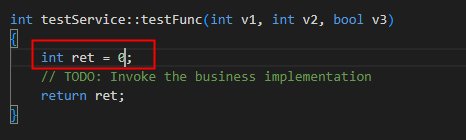

# Service框架生成代码集成到OpenHarmony的方法

## 场景说明

为了实现工具生成的接口被其它子系统或者应用调用，需将生成的代码经系统框架开发者二次开发后编译集成到OpenHarmony系统中，使其生成动态库，供OpenHarmony应用层调用。本文介绍如何将工具生成的源码利用OpenHarmony编译系统生成动态库供应用层调用。

## 编译

将生成的整个testservice目录复制到OpenHarmony源码根目录下（与base、foundation目录平级）

### OpenHarmony 3.1 release

#### 修改系统公共文件

1. 服务配置
   foundation/distributedschedule/samgr/interfaces/innerkits/samgr_proxy/include/system_ability_definition.h增加以下两行(ID说明： TEST_SERVICE_ID值与用户指定的ID一致；TEST_SERVICE_ID宏值定义必须为这个，因为代码中使用的就是这个)
   
   ```
   TEST_SERVICE_ID                                = 9016,
   {TEST_SERVICE_ID, "testservice" },
   ```

2. 子系统配置
   build/subsystem_config.json
   增加以下内容

   ```
   "testservice": {
   "path":"testservice",
   "name": "testservice"
    }
   ```

3. 产品配置，如Hi3516DV300
   productdefine/common/products/Hi3516DV300.json

```
 "testservice:testservice_part":{}
```

### OpenHarmony 3.2 release

#### 修改编译文件

1. 修改testservice/BUILD.gn文件，将utils/native 改为 commonlibrary/c_utils，将samgr_standard改为samgr。修改后的BUILD.gn文件内容如下所示：

   ```
   import("//build/ohos.gni")
   
   ohos_shared_library("testservice") {
     sources = [
       "//testservice/src/i_test_service.cpp",
       "//testservice/src/test_service_stub.cpp",
       "//testservice/src/test_service.cpp"
     ]
     include_dirs = [
       "//testservice/include",
       "//testservice/interface",
       "//commonlibrary/c_utils/base/include"
     ]
   
     deps = [
       "//base/startup/syspara_lite/interfaces/innerkits/native/syspara:syspara",
       "//commonlibrary/c_utils/base:utils",
     ]
   
     external_deps = [
       "hiviewdfx_hilog_native:libhilog",
       "ipc:ipc_core",
       "safwk:system_ability_fwk",
       "samgr:samgr_proxy",
       "startup_l2:syspara",
     ]
   
     part_name = "testservice_part"
     subsystem_name = "testservice"
   }
   
   ohos_executable("testclient") {
       sources = [
       "//testservice/src/i_test_service.cpp",
       "//testservice/src/test_service_proxy.cpp",
       "//testservice/src/test_client.cpp"
     ]
   
     include_dirs = [
       "//testservice/include",
       "//testservice/interface",
       "//commonlibrary/c_utils/base/include"
     ]
   
     deps = [
       "//commonlibrary/c_utils/base:utils",
     ]
   
     external_deps = [
       "hiviewdfx_hilog_native:libhilog",
       "ipc:ipc_core",
       "samgr:samgr_proxy",
     ]
   
     part_name = "testservice_part"
     subsystem_name = "testservice"
   }
   
   ```

2. 修改testservice/bundle.json文件，将"name": "@ohos/testservice"修改为 "name": "@ohos/testservice_part"；将"samgr_standard"改为"samgr"，"utils_base"修改为"c_utils"；修改后的bundle.json文件内容如下所示：

   ```
   {
       "name": "@ohos/testservice_part",
       "description": "system ability framework test",
       "homePage": "https://gitee.com/",
       "version": "3.1",
       "license": "Apache License 2.0",
       "repository": "",
       "publishAs": "code-segment",
       "segment": {
           "destPath": "testservice"
       },
       "dirs": {},
       "scripts": {},
       "component": {
           "name": "testservice_part",
           "subsystem": "testservice",
           "adapted_system_type": [
               "standard"
           ],
           "rom": "2048KB",
           "ram": "~4096KB",
           "deps": {
               "components": [
                   "hiviewdfx_hilog_native",
                   "ipc",
                   "samgr",
                   "c_utils",
                   "safwk",
                   "startup_l2"
               ],
               "third_party": [ "libxml2" ]
           },
           "build": {
               "sub_component": [
                   "//testservice:testservice",
                   "//testservice/sa_profile:testservice_sa_profile",
                   "//testservice:testclient",
                   "//testservice/etc:test_service_init"
               ],
               "inner_kits": [
               ],
               "test": [
               ]
           }
       }
   }
   ```

#### 修改系统公共文件

##### 基础配置

1. 服务配置

   foundation/systemabilitymgr/samgr/interfaces/innerkits/samgr_proxy/include/system_ability_definition.h增加以下两行(ID说明： TEST_SERVICE_ID值与用户指定的ID一致；TEST_SERVICE_ID宏值定义必须为这个，因为代码中使用的就是这个)

   ```
   TEST_SERVICE_ID                                = 9016,
   {TEST_SERVICE_ID, "testservice" },
   ```

2. 子系统配置

   build/subsystem_config.json

   增加以下内容

   ```
   "testservice": {
   "path":"testservice",
   "name": "testservice"
    }
   ```

3. 产品配置，如rk3568

   vendor/hihope/rk3568/config.json

   若用户不需要配置selinux，则将"build_selinux"属性改为false

   ```
   "build_selinux": false,
   ```

   增加以下内容

   ```
   {
     "subsystem": "testservice",
     "components": [
       {
         "component": "testservice_part",
         "features": []
       }
     ]
   }
   ```

   注意：若用户需要配置selinux相关配置，则将开关改为true，再根据自身需求进行相关配置

4. 权限配置

   在相应产品目录下

   vendor/hihope/rk3568/security_config/high_privilege_process_list.json

   增加以下内容

   ```
   {
       "name": "testservice",
       "uid": "system",
       "gid": ["root", "system"]
   }
   ```

##### selinux权限配置

若要配置selinux权限，首先应将vendor/hihope/rk3568/config.json中"build_selinux"属性改为true，然后修改以下文件：

1. testservice/etc/sample_service.cfg

   ```
   "secon" : "u:r:testservice:s0"
   ```

2. base/security/selinux/sepolicy/base/public/service_contexts 

   ```
   9016                 u:object_r:sa_testservice:s0
   ```

3. base/security/selinux/sepolicy/base/public/service.te 

   ```
   type sa_testservice, sa_service_attr;
   ```

4. base/security/selinux/sepolicy/base/te/init.te

   ```
   allow init testservice:process { getattr rlimitinh siginh transition };
   ```

5. base/security/selinux/sepolicy/base/public/type.te

   ```
   type testservice, sadomain, domain;
   ```

6. /base/security/selinux/sepolicy/base/te目录下增加新service的te文件，新增文件名即为服务名，例如：testservice

   ```
   allow testservice init_param:file { map open read };
   allow testservice sa_testservice:samgr_class { add get };
   ```

### 补充 服务端/客户端 业务逻辑实现

**服务端**
test_service.cpp
在testservice/src/test_service.cpp注释“// TODO: Invoke the business implementation”处添加各个接口的服务端实现代码，当前版本生成服务端代码需要用户先初始化，给int ret值赋初值0，如下所示：



远程方法的参数包装已在生成代码test_service_stub.cpp中统一处理，开发人员无需关注

**客户端**
test_client.cpp 为自动生成的客户端样例代码。编译烧录后，会在/system/bin/目录下生成可执行程序test_client
在testservice/src/test_client.cpp的main函数中使用proxy对象进行远程方法调用，参考注释示例。如下图：


远程方法的参数包装已在生成代码test_service_proxy.cpp中统一处理，开发人员无需关注

编码完成后，执行镜像编译命令

```
./build.sh --product-name 产品名
```

如：若编译Hi3516DV300开发板，则执行

```
./build.sh --product-name Hi3516DV300
```

若编译rk3568开发板，则执行

```
./build.sh --product-name rk3568
```

## 运行

将编译好的镜像烧录到开发板后，使用hdc_std shell登录开发板。
查看服务端进程是否已正常启动

```
ps -ef | grep testservice
system         288     1 0 00:02:13 ?     00:00:00 testservice_sa  --- 服务进程已正常运行
```

如下图所示:


运行客户端

```
/system/bin/testclient 
```


 (客户端具体执行哪些远程调用方法请在test_client.cpp的main方法中实现)

