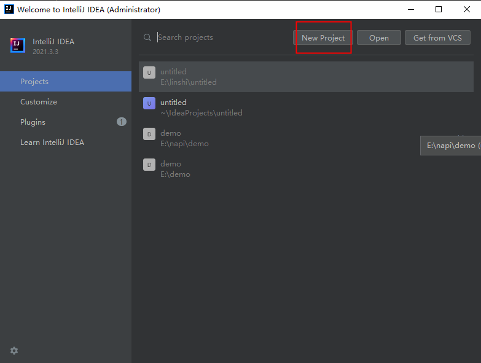
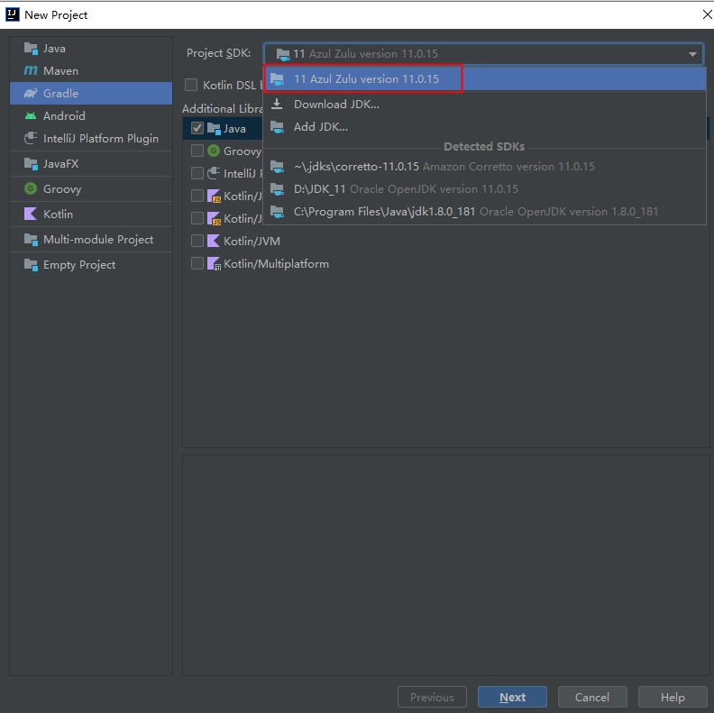
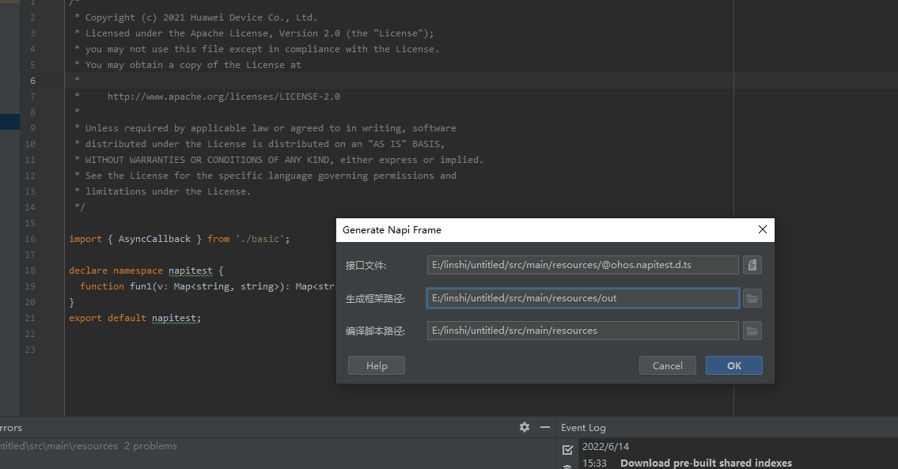

# IDEA插件开发环境配置

## 基础环境准备

### 约束
JDK 11 ，IDEA Community 2021.3.3

### 步骤

1.将napi_generator目录下的可执行文件分别放置在napi_generator\src\generator\resources\cmds目录下对应系统的文件夹下。

2.下载IDEA Community 与 JDK11 配置好环境。
点击 https://www.jetbrains.com/idea/download/ 下载Community版本，并完成安装。

3.打开IDEA Community 应用程序。
依次点击项目File>Open 选择napi_generator/src/generator项目文件夹。

4.项目配置
项目打开完成，点击File>Project Structure。

5.配置Modules
Project Settings > Modules 新建Modules。点击上方“-”删除原有的Modules，然后点击“+”选择 New Module。

6.配置Module SDK.
在New Module对话框中，选择IntelliJ Platform Plugin。若为首次环境配置，请在Module SDK 下拉框中点击 Add IntelliJ Platform Plugin SDK 选择IDEA Community安装目录，点击OK,在Select Internal Java Platform 选择 JAVA SDK 11（213版本只支持 11)，点击New Module对话框中Next。

7.配置Content root.

Content root选择napi_generator/src/generator文件夹，module name会自动变为generator。点击Finish，若出现提示已存在是否覆盖的提示，请点“Yes”完成配置。

8.Modules配置完成后，若在SDKs中无相应JDK和Plugin SDK,请点击+号分别添加 Add Java JDK和Add Intellij PlantForm Plugin SDK,Java JDK为java11的安装目录，Plugin SDK为 IDEA Community 2021.3.3的安装目录。

9.若完成步骤7配置，点击OK完成配置。Rebuild项目，若IDEA不能点击右上角的运行，点击Plugin后下三角选择Edit Configurations...选项，Run/Debug Configurations框中Use classpath of moudle选择generator，点击ok，等待安装完成，即可点击运行按钮。若IDEA依然不能点击右上角的运行，请重复以上全部操作。

## 配置开发调试环境

1.IntelliJ IDEA工具进入上述generator项目页面，执行右上角的run。

2.IntelliJ IDEA会自动拉起一个应用程序，首次运行若没有项目，可选择Welcome to IntelliJ IDEA框中点击New Project新建项目。然后在New Project框中左侧选择Gradle,右侧Project SDK选择11，点击next；根据需要修改Location，最后点击Finish，完成配置。

3.在新打开项目中，将.d.ts文件放入untitled\src\main\resources路径下。并且检查需要转换的d.ts文件中是否声明了import的d.ts文件，如果存在需要将import的d.ts文件也放入到untitled\src\main\resources路径下。选择.d.ts文件,右键选择generate Napi Frame选项，工具打开generate Napi Frame弹窗。接口文件路径默认填写，此处不修改；生成框架路径默认填写，此处修改为新增out文件夹下；编译脚本路径默认填写，不修改。点击ok，生成文件。

4.执行结束后会在目录下生成对应的文件。

