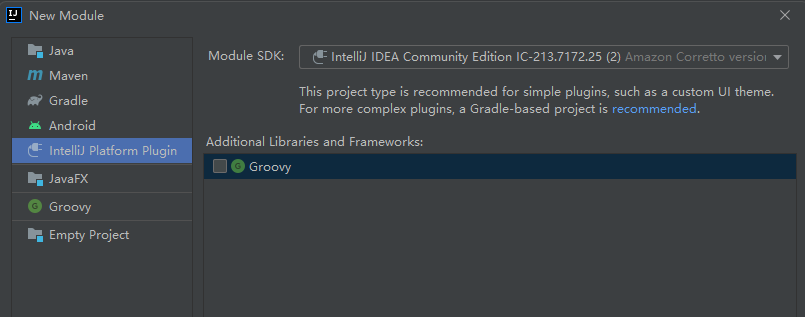
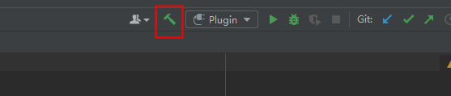

# Native生成工具IntelliJ插件开发说明（暂不支持）

## 工具代码框架介绍

native生成工具由由C++语法解释器和代码生成器两部分组成。C++语法解释器解析用户输入的.h文件内容，通过C++语法解析，将文件内容分解为类、方法、入参、成员属性等元素；代码生成器根据从语法解析器得到的这些元素，转换为对应的typescript语法的接口、方法、参数代码，生成.ts文件内容；同时通过语法解析器得到的元素，生成.h文件对应的napi框架代码和接口调用测试代码。native生成工具支持命令行和IntelliJ插件，本文主要介绍IntellIJ插件。

## 工具开发

### IntelliJ 插件开发说明

#### 环境说明

系统：建议Windows 10

#### 开发步骤

##### 环境准备

1.下载源码

```
git clone git@gitee.com:openharmony/napi_generator.git
```

2.下载工具

[生成工具 ](https://gitee.com/openharmony/napi_generator/releases/tag/生成工具) 选择tool.rar下载并解压

3.将下载解压后的工具：native_gen-win.exe可执行程序和header_parser.exe拷贝到napi_generator/src/intellij_plugin/h2dtscpp/native_IntelliJ_plugin/resources/cmds/win目录下。

4.下载并安装IDEA Community：IntelliJ IDEA 2021.3.3 (Community Edition）、JDK11配置好环境。IDEA Community版本可以左键单击以下链接下载。

[下载链接](https://gitee.com/link?target=https%3A%2F%2Fwww.jetbrains.com%2Fidea%2Fdownload%2F)

5.打开IDEA Community应用程序。 依次点击项目File>Open 选择napi_generator/src/intellij_plugin/h2dtscpp/native_IntelliJ_plugin项目文件夹。


6.项目打开完成，点击File>Project Structure,在出现的界面中点击Project,下图的SDK选择JDK 11，Language level也选择版本11，选择或者新建complier output目录为项目文件下的out目录。

 

7.Project Settings > Modules 新建Modules。点击上方“-”删除原有的Modules，然后点击“+”选择 New Module。

 

8.在New Module对话框中，选择IntelliJ Platform Plugin。若Module SDK中无可选SDK，请在Module SDK 下拉框中点击 Add IntelliJ Platform Plugin SDK 选择IDEA Community安装目录，点击OK。 



9.Content root选择~/napi_generator/src/intellij_plugin/h2dtscpp/native_IntelliJ_plugin文件夹，module name填写generator。点击Finish，若出现提示已存在是否覆盖的提示，请点“Yes”完成配置。 


10.Modules配置完成后，若在SDKs中无相应JDK和Plugin SDK,请点击+号分别添加 Add Java JDK和Add Intellij PlantForm Plugin SDK,Java JDK为java11的安装目录，Plugin SDK为 IDEA Community 2021.3.3的安装目录。


11.若完成以上步骤配置，点击OK完成配置。Rebuild项目，若IDEA不能点击右上角的运行，点击Plugin后下三角选择Edit Configurations...选项，Run/Debug Configurations框中Use classpath of moudle选择generator，点击ok，等待安装完成。


12.点击Intellij IDEA工具右上角Built Project按钮，等待工程built完成。



13.在IDEA Community中依次点击Build>Prepare All Plugin Modules for development"，jar包生成完成后在工具右下角提示jar包生成成功，且包含jar包存放位置。


