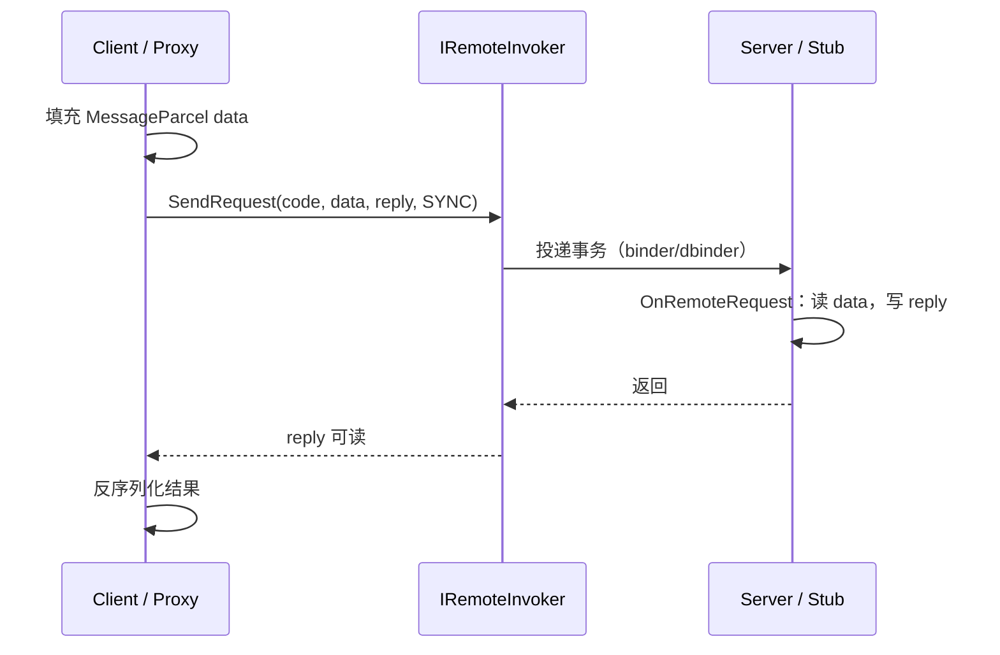

# OpenHarmony IPC 架构说明（ipcarch）

> **文档目的**：从**设计者视角**说明 `foundation/communication/ipc` 的**分层、接口、调用链与扩展点**，使**普通程序员**能建立心智模型，并作为后续 **IPC 代码生成 / 多协议 / 同步·异步·流式** 扩展的**规格基线**。  
> **源码根路径**：`foundation/communication/ipc/`（下文路径均相对 OpenHarmony 源码根）。  
> **部件元数据**：`foundation/communication/ipc/bundle.json`（`ipc_core`、`libdbinder`、`ipc_capi`、NAPI、Rust、Taihe/ANI 等 inner_kits）。  
> **实操流程（设计→编译→板测）**：同目录 `SKILL.md` 与 `ohipc.py`（构建、日志/返回值判据，`test` / `test-concurrent` / `perf` / **`test-parcel`**）。**零基础逐步教程（ipc_example 全链路）**：**`howtoipc.md`**（**`ohipc.py howto`**）。**跨进程测试报告**：`IPC_EXAMPLE_CROSS_PROCESS_TEST_REPORT.md`。

---

## 1. 要解决什么问题（设计目的）

### 1.1 进程间通信的共性需求

多进程系统里，模块需要：

| 需求 | 说明 |
|------|------|
| **位置透明** | 调用方像调本地对象一样发请求，不关心对端在哪个进程/设备。 |
| **类型与数据打包** | 标量、字符串、结构体、**文件描述符**、**另一张 Binder 引用**等要能安全跨进程传递。 |
| **同步 / 异步** | 多数 RPC 要**等结果**；部分通知希望**发后即忘**（异步/oneway 语义）。 |
| **线程与并发** | 服务端需在**线程池**中并发处理事务，并能取**调用方 PID/UID/Token** 做鉴权。 |
| **生命周期** | 远端进程崩溃时，客户端能收到 **Death 通知**。 |
| **多传输** | 本机 **Binder**；跨设备 / 软总线场景走 **Databus + DBinder** 等（见 `IRemoteObject::IF_PROT_*`）。 |

### 1.2 OHOS IPC 的解法（一句话）

在 **Linux Binder 风格事务模型**之上，抽象出 **`IRemoteObject::SendRequest(code, data, reply, option)`**；**客户端**用 **Proxy** 打包 **Parcel**，经 **Invoker** 下发到内核/DBinder；**服务端**用 **Stub** 在同一接口上 **OnRemoteRequest** 拆包并回写 **reply**。**Broker** 负责「本地接口 ↔ 远端 `IRemoteObject`」的装配。

### 1.3 与「后期自动生成框架」的关系（考核导向）

若要用工具自动生成 **客户端 + 服务端**：

- **稳定锚点**是：`SendRequest` 的 **事务码 `code`**、**MessageParcel 读写顺序**、**MessageOption 标志**、**接口描述符（Interface Token）**。
- **生成器应输出**：业务接口（纯虚）、`Stub::OnRemoteRequest` 分发、`Proxy` 各方法里 `data/reply` 的序列化代码；可选 **C / Rust / NAPI** 绑定同一套 **code + 布局**。
- **流式 / 大块数据**在现有模型中常通过 **FD + Ashmem/共享缓冲** 或 **分片多次 SendRequest** 实现；真正「单事务无限流」需扩展协议或旁路通道（见 **§10 改进方向**）。

---

## 2. 分层架构

```text
┌─────────────────────────────────────────────────────────────┐
│  业务 / IDL 生成层（各子系统：*.idl → Proxy/Stub 子类）          │
├─────────────────────────────────────────────────────────────┤
│  IRemoteBroker + BrokerRegistration + iface_cast            │
│  （接口描述符 DECLARE_INTERFACE_DESCRIPTOR / AsObject）       │
├─────────────────────────────────────────────────────────────┤
│  IRemoteObject（契约）                                         │
│    ├─ IPCObjectProxy（客户端，handle + Invoker）              │
│    └─ IPCObjectStub（服务端，OnRemoteRequest 入口）            │
├─────────────────────────────────────────────────────────────┤
│  MessageParcel（载荷） + MessageOption（TF_SYNC/TF_ASYNC…）   │
├─────────────────────────────────────────────────────────────┤
│  IRemoteInvoker                                               │
│    ├─ BinderInvoker（本机 binder 驱动路径）                    │
│    └─ DBinderBaseInvoker / DBinderDatabusInvoker（分布式等）   │
├─────────────────────────────────────────────────────────────┤
│  内核 Binder / DBinder 会话 / SoftBus 等                       │
└─────────────────────────────────────────────────────────────┘
```

**横向能力**（与调用链正交）：

- **IPCSkeleton**：工作线程、`GetCallingPid/Uid/TokenId`、JoinWorkThread 等（`interfaces/innerkits/ipc_core/include/ipc_skeleton.h`）。
- **统计 / Trace / Freeze**：`ipc_feature_*` 等特性开关（见 `bundle.json`）。
- **多语言出口**：`ipc_capi`、`ipc_napi`、`rust`、`taihe/ani` 等（同一核心语义，不同 FFI）。

---

## 3. 核心接口与逻辑关系

### 3.1 `IRemoteObject`（一切远端引用的基类）

**路径**：`interfaces/innerkits/ipc_core/include/iremote_object.h`

**关键语义**：

- **`SendRequest(uint32_t code, MessageParcel &data, MessageParcel &reply, MessageOption &option)`**  
  - 所有跨进程调用的**最终落点**（Proxy 转发；Stub 在服务端被框架调用）。
- **协议枚举**：`IF_PROT_BINDER`（默认）、`IF_PROT_DATABUS` 等 —— 决定底层走哪类 **Invoker**。
- **DeathRecipient**：远端死亡回调。
- **事务码范围**：与 `ipc_types.h` 中 `FIRST_CALL_TRANSACTION` / `LAST_CALL_TRANSACTION` 及框架保留码（`PING_TRANSACTION`、`DUMP_TRANSACTION` 等）配合使用。

### 3.2 `IPCObjectProxy` / `IPCObjectStub`

**路径**：`ipc_object_proxy.h`、`ipc_object_stub.h`

| 角色 | 类型 | 典型行为 |
|------|------|----------|
| 客户端 | **IPCObjectProxy** | `IsProxyObject() == true`；`SendRequest` → 选 Invoker → 阻塞/异步等待 reply |
| 服务端 | **IPCObjectStub** | `IsProxyObject() == false`；实现 **`OnRemoteRequest(code, data, reply, option)`**，按 `code` 分支处理 |

**设计意图**：把「**句柄 handle** / **协议**」与「**业务分发**」拆开 —— 业务只关心 `code` 与 Parcel 布局，连接建立由框架与 samgr 等完成。

### 3.3 `MessageParcel` / `MessageOption`

**路径**：`message_parcel.h`、`message_option.h`

- **MessageParcel**：在 `Parcel` 之上扩展 **WriteRemoteObject / ReadRemoteObject**、**FD**、**WriteRawData**、**InterfaceToken** 等，对应 Binder 对 **flat_binder_object**、fd 数组的支持。
- **MessageOption**：
  - **`TF_SYNC` / `TF_ASYNC`**：同步 vs 异步（实现上影响是否等待 reply、是否走 oneway 路径）。
  - **`TF_ACCEPT_FDS`**、**`TF_WAIT_TIME`** 等：能力扩展。
  - 异步唤醒等：`TF_ASYNC_WAKEUP_LATER` 等（与实现版本相关）。

### 3.4 `IRemoteBroker` 与 `iface_cast`

**路径**：`iremote_broker.h`

- **`IRemoteBroker::AsObject()`**：从「业务 Broker」回到 **`IRemoteObject`**，便于注册、传递。
- **`DECLARE_INTERFACE_DESCRIPTOR`** + **`BrokerRegistration`**：用**描述符字符串**在进程内注册 **Proxy 构造器**，实现 **`iface_cast<IXXX>(obj)`** 式安全转型。

**对不同对象的解法**：

| 对象 | 做法 |
|------|------|
| 拿到裸 `sptr<IRemoteObject>` | 先 **`CheckObjectLegality`** / 描述符校验，再 **`iface_cast`** 成业务接口 |
| 本地实现 | 直接继承 **Stub**，由 Stub 暴露 **AsObject**；对端拿到的是 Proxy |

### 3.5 `IRemoteInvoker` → `BinderInvoker` / DBinder 族

**路径**（示例）：`ipc/native/src/core/invoker/include/iremote_invoker.h`、`binder_invoker.h`；`ipc/native/src/core/dbinder/include/*.h`

- **Invoker** 是 **Proxy 与内核/会话之间的唯一发送口**：`SendRequest(handle, code, data, reply, option)`。
- **BinderInvoker**：本机 **ioctl/binder** 路径（经典 Android/OpenHarmony 模型）。
- **DBinderBaseInvoker / DBinderDatabusInvoker**：在 **分布式 / 软总线** 场景下，把事务映射到 **dbinder_transaction_data**、会话与 socket 等（源码中可见 `IF_PROT_DATABUS`、`DBINDER_*_TRANSACTION` 等与 `ipc_types.h` 呼应）。

**优点**：新增传输时，只要实现 **IRemoteInvoker** 并与 **IPCObjectProxy** 的 proto 选择逻辑对接，**上层 Proxy/Stub/Parcel 可大量复用**。

### 3.6 `IPCSkeleton`

**路径**：`ipc_skeleton.h`

服务端进程在**非主线程**处理 Binder 事务时，通过 **JoinWorkThread** 进入框架线程池；并提供 **Calling PID/UID/Token/Sid** 等，供 **ACL、SELinux、AccessToken** 与业务鉴权。

---

## 4. 调用流程（同步 / 异步）

### 4.1 同步调用（最常见）



```text
Client: Proxy.Foo(args)
   → 构造 MessageParcel data/reply
   → data.WriteInterfaceToken(DESCRIPTOR)   // 常作为首包校验
   → 序列化参数 → IRemoteObject::SendRequest(FOO_CODE, data, reply, TF_SYNC)
        → IPCObjectProxy → Invoker::SendRequest → binder/dbinder
Server: Stub::OnRemoteRequest(FOO_CODE, data, reply, option)
   → 校验 token、反序列化、业务逻辑、写 reply
   → 返回错误码
Client: 从 reply 反序列化结果
```

### 4.2 异步 / oneway 语义

- 使用 **`MessageOption::TF_ASYNC`**（或与实现等价的 flags），使 **不必阻塞等待 reply**（具体是否拷贝 reply 缓冲区取决于 Invoker 与驱动实现）。
- **注意**：异步下**错误处理与顺序**弱于同步；大数据与背压需业务层协议。

### 4.3 框架保留事务

`ipc_types.h` 中 **`PING_TRANSACTION`、`DUMP_TRANSACTION`、`INTERFACE_TRANSACTION`** 等由框架或调试工具使用；**业务 `code` 应避开**这些保留值。

---

## 5. 数据与「多种数据格式」

### 5.1 Parcel 能直接表达什么

| 能力 | API 方向 | 典型用途 |
|------|----------|----------|
| 基本类型 / 字符串 | Parcel 基类 | 常规 RPC 参数 |
| **原始字节块** | `WriteRawData` / `ReadRawData` | 自定义二进制布局、压缩数据 |
| **文件描述符** | `WriteFileDescriptor` / `ReadFileDescriptor` | 共享内存、socket、管道 |
| **嵌套 Binder** | `WriteRemoteObject` / `ReadRemoteObject` | 回调接口、多接口传递 |
| **Ashmem** | MessageParcel 与 `ashmem` 头关联 | 大块缓冲映射 |

### 5.2 不同场景的选型

| 场景 | 建议 |
|------|------|
| 小参数、频繁调用 | 全走 **Parcel 标量序列化** |
| 大缓冲区 / 多媒体 | **FD + Ashmem** 或 **单次 WriteRawData**（注意 **Binder 事务大小上限**） |
| 结构化强类型 | **IDL 生成**读写顺序，避免手写漂移 |
| 流式（边产边消） | 现状多为 **多次 RPC** 或 **专用 socket/共享环缓**；见 **§8.3** |

### 5.3 「C++ 全量类型」与跨进程：**能测什么、什么根本不能传**

很多 C++ 类型在**单进程**里有意义，在 **Binder/Parcel** 模型里**没有对应物**——不是框架「未实现」，而是**语义上不可传递**：

| C++ 侧常见形态 | 跨进程 IPC 结论 | 可落地的替代 |
|----------------|-----------------|--------------|
| **函数指针 / 成员函数指针** | **不可传** | 约定 **事务码 `code`** 或 **枚举 op + 数据**；对端 `switch` 调本地函数 |
| **`std::function` / 带捕获 lambda** | **不可传**（捕获闭包非字节布局） | 同上；或注册 **回调 Binder**（`IRemoteObject`）由对端 `SendRequest` |
| **裸指针、引用、迭代器** | **不能把地址当句柄** | 传 **POD 句柄 id**、**FD**、**Ashmem**、**Binder**；对端再映射 |
| **任意 `class` / `struct`（非 POD）** | **不自动可传** | 实现 **`Parcelable::Marshalling/Unmarshalling`**；或拆成字段逐项 `Write*` |
| **`std::map` / `set` / 自定义树** | Parcel **无一等 API** | **手写序列**：先 `WriteInt32(size)`，再按稳定顺序写 key/value；或 IDL 生成 |
| **`std::optional` / `variant`** | 无内置 | 写 **discriminant** + 分支布局；IDL **union** 风格 |
| **`std::string` / `std::u16string`** | **可传** | `WriteString` / `WriteString16` 及 `Read*` |
| **各标量 `bool/int/float/...`** | **可传** | `Parcel` 对应 `WriteInt32` 等 |
| **`std::vector<T>`（T 为标量或 string）** | **可传**（框架提供向量 API） | 见 **§5.4** `WriteInt32Vector`、`WriteStringVector` 等 |
| **`enum class`** | **可传** | 固化为底层整型宽度后 `WriteInt32` / `WriteInt64` |
| **「像 class 的远端对象」** | **不传类实例** | 传 **`sptr<IRemoteObject>`**；对端持 **Proxy**，行为靠 **RPC** |

**结论**：所谓「全覆盖」在工程上应定义为：**覆盖 Parcel/MessageParcel 提供的读写面 + 业务选择的 Parcelable/IDL 布局**，并**单测证明读写对称**；而不是把 C++ 类型系统逐类型映射到 Binder。

### 5.4 `c_utils::Parcel` / `MessageParcel`：**原生读写面清单**（对标「全量」）

以下以 **`commonlibrary/c_utils/base/include/parcel.h`** 与 **`foundation/communication/ipc/.../message_parcel.h`** 为准（版本迭代时以源码为准）。

**标量（及 `WritePointer`）**：`bool`，`int8/16/32/64`，`uint8/16/32/64`，`float`，`double`，`uintptr_t`（`WritePointer`/`ReadPointer`——跨进程通常**不承载可解引用地址语义**，仅当你明确协议含义时使用）。

**字符串**：`WriteCString`，`WriteString`（`std::string`），`WriteString16` / `WriteString16WithLength`，`WriteString8WithLength`；对称 `Read*`。

**字节与定长块**：`WriteBuffer` / `ReadBuffer`，`WriteUnpadBuffer`，`WriteDataBytes` 等（见 `parcel.h`）。

**向量（同质集合）**：`WriteBoolVector`、`WriteInt8Vector` … `WriteDoubleVector`，`WriteStringVector`，`WriteString16Vector` 及对称 `Read*Vector`；另有模板 `WriteVector`/`ReadVector` 配合成员读写函数。

**对象与嵌套**：`WriteParcelable` / `ReadParcelable`，`WriteStrongParcelable` / `ReadStrongParcelable`，`WriteObject` / `ReadObject`（`sptr` 与 `Parcelable` 体系）。

**MessageParcel 扩展**：`WriteRemoteObject` / `ReadRemoteObject`，`WriteFileDescriptor` / `ReadFileDescriptor`，`WriteRawData` / `ReadRawData`（注意 **容量与 MIN/MAX_RAWDATA** 注释），`WriteAshmem` / `ReadAshmem`，`WriteInterfaceToken` / `ReadInterfaceToken`，`Append`，异常位 `WriteNoException` / `ReadException`。

**与「class」的关系**：跨进程的「类」要么是 **Parcelable 数据快照**，要么是 **Binder 远端引用**；不存在第三种「把 C++ vtable 拷过去」的路径。

### 5.5 向「类型全覆盖」扩展 **`ipc_example`** 的推荐用例（待实现清单）

当前 `ipc_demo_client` 在**保留原 string/struct/Binder 流程**之外，已通过 **`ECHO_*` 事务**覆盖 **§5.4** 中的标量、`u16string` 边界、`Int32`/`String` 向量、`WriteBuffer`、**FD**、**Parcelable**、**Ashmem**，并在客户端打印 **`UT_*` / `PERF_*` / `CONC_*` / `SUMMARY_UT`**（见 ohipc **`SKILL.md` §5.4** 与 **`ohipc.py`** 正则判据）。若仍需扩展，可继续增量事务（保持 **Stub/Proxy 读写顺序一致**）：

| 优先级 | 用例 | 验证点 |
|--------|------|--------|
| P0 | 单 RPC 往返 **各标量一种**（或打包结构体含 `bool/float/double`） | 与 `Parcel` 读写一致 |
| P0 | **`std::vector<int32_t>` + `std::vector<std::string>`** | `WriteInt32Vector` / `WriteStringVector` |
| P1 | **嵌套 `Parcelable`**（内含子结构 + 可选 discriminant） | `Marshalling` 对称 |
| P1 | **`WriteBuffer` 或 `WriteRawData`** 小字节块 | 边界长度、与 FD 路径区分 |
| P1 | **FD 传递**（如 `pipe`/`memfd` 只读一段魔数） | `WriteFileDescriptor` 对端 `Read` 一致 |
| P2 | **Ashmem** 往返（小缓冲即可） | `WriteAshmem` / `ReadAshmem` 与映射生命周期 |
| P2 | **`std::u16string` 与 `WriteString16Vector`** | 与 UTF-8 路径并列覆盖 |

**不要求、也不应做**：传函数指针/成员指针/`std::function` 等「伪覆盖」——应在文档与评审中明确列为 **N/A（不适用）**。

---

## 6. 应用场景矩阵

| 场景 | 推荐形态 | 依赖 |
|------|----------|------|
| 系统服务（SA） | **Stub 驻留服务进程** + 客户端 **Proxy** | 常配合 **samgr** 取 `IRemoteObject` |
| 应用 ↔ 系统服务 | 同上 + **AccessToken / SELinux** | `IPCSkeleton::GetCalling*` |
| 同设备高吞吐 | **Binder + Parcel/FD** | 避免超大单次事务 |
| 跨设备 | **IF_PROT_DATABUS + DBinder** | 分布式会话、软总线错误码 `SOFTBUS_IPC_ERRNO` |
| C/Rust/JS | **ipc_capi** / **rust** / **napi** | 与 C++ 核心语义对齐 |
| 轻量设备（mini/small） | **c_lite / rpc** 子树与单编变体 | `bundle.json` `adapted_system_type` |

---

## 7. 仓库内样例与测试（按目录）

以下路径适合**对照阅读**（非穷举）：

| 类型 | 路径 |
|------|------|
| C++ 单测（核心） | `foundation/communication/ipc/test/unittest/ipc/native/core/` |
| 手写 Stub/Proxy 端到端 demo | `foundation/communication/ipc_example/`（ohipc 技能板测；类型扩展见 **§5.5**） |
| C API | `foundation/communication/ipc/test/unittest/ipc/native/c_api/` |
| c_lite 客户端/服务端 | `foundation/communication/ipc/test/unittest/c_lite/ipc/client/`、`.../server/` |
| RPC 模块测试 | `foundation/communication/ipc/test/moduletest/rpc/cppapi/` |
| DBinder 相关 | `foundation/communication/ipc/test/unittest/dbinder_service/` |

**系统级端到端样例**：`foundation/communication/sampletest_service`（SystemAbility + IPC 发布）可与 **ohservices** 技能文档配合阅读。

---

## 8. 优点、边界与改进方向（架构师视角）

### 8.1 优点

- **抽象稳定**：`IRemoteObject + SendRequest` 与 Android Binder 生态接近，**学习成本低**。
- **传输可插拔**：Invoker 分层便于 **Binder / DBinder** 共存。
- **安全钩子齐全**：Calling 身份、Token、SELinux 与系统服务模型一致。
- **多语言出口** inner_kits 明确，利于**统一 IDL 多目标代码生成**。

### 8.2 局限与注意点

- **事务尺寸与延迟**：超大 payload 不适合单次 SendRequest；需 **FD 转移**或分片。
- **异步语义复杂**：与内核、DBinder 组合时，**错误传播与顺序**需仔细看实现与版本说明。
- **手写 Parcel 易错**：参数顺序或类型一改就**静默不兼容**；应优先 **IDL + 生成**。
- **流式非一等公民**：无内置「长流 RPC」抽象，需业务协议。

### 8.3 改进方向（面向自动生成与未来能力）

1. **统一 IDL → 多语言 Stub/Proxy**：以 **code 枚举 + Parcel 布局 + 版本号** 为 IR，一次描述生成 C++/C/Rust/JS。
2. **显式 streaming 模型**：在 IDL 层增加 `stream<T>` / chunk 协议，生成端侧 **状态机**（或绑定独立 **Unix socket** 并只做首包鉴权）。
3. **版本与兼容**：接口 **version + 可选字段** 编码规则，生成 **兼容读**逻辑。
4. **观测性**：统一 **Trace / 负载统计**（已有 feature 位）与**慢调用**采样标准。
5. **形式化校验**：对 `OnRemoteRequest` 的 **code 全覆盖** 与 **Parcel 读写对称** 做静态检查或 UT 模板生成。

---

## 9. 自动生成 IPC 框架的「最小实现清单」（实施蓝图）

若你要实现一个**独立于 OHOS 的生成器**，建议对齐下列**概念映射**：

| 生成物 | 职责 |
|--------|------|
| **XxxProxy** | 打包 `data`；`SendRequest`；解 `reply`；暴露同步/异步 API |
| **XxxStub** | `OnRemoteRequest` switch(code)；调用业务 **IXxx** 实现 |
| **IXxx** | 进程内纯虚接口 |
| **Parcel 布局表** | 每个 `code` 对应字段顺序、类型、是否含 FD/Binder |
| **Option 策略** | 每方法默认 SYNC / ASYNC / 超时 |
| **错误码** | 与 `ipc_types.h` 风格一致或做一层映射 |

**OHOS 上落地**：生成代码应 **`external_deps` 依赖 `ipc:ipc_core`**（或 `ipc_single`），并与 **samgr / SA** 注册方式一致（见 ohservices 文档）。

---

## 10. 关键文件索引（速查）

| 主题 | 路径 |
|------|------|
| 对外 C++ 头（innerkits） | `foundation/communication/ipc/interfaces/innerkits/ipc_core/include/` |
| C API 聚合 | `foundation/communication/ipc/interfaces/innerkits/c_api/include/ipc_kit.h` |
| Binder Invoker | `foundation/communication/ipc/ipc/native/src/core/invoker/include/binder_invoker.h` |
| Invoker 工厂 | `foundation/communication/ipc/ipc/native/src/core/invoker/include/invoker_factory.h` |
| DBinder | `foundation/communication/ipc/ipc/native/src/core/dbinder/include/` |
| DBinder 对外 | `foundation/communication/ipc/interfaces/innerkits/libdbinder/include/` |
| 事务码与错误 | `foundation/communication/ipc/interfaces/innerkits/ipc_core/include/ipc_types.h` |

---

## 11. 小结（给「一般程序员」的一句话）

**记住三件事**：(1) 所有跨进程调用最后都是 **`SendRequest` + Parcel**；(2) **Proxy 发包、Stub 收包**；(3) **Invoker 决定走本机 Binder 还是分布式 DBinder**。在此之上，用 **IDL 生成**解决「格式与顺序」问题，用 **FD/Ashmem** 解决「大块与流式」问题，用 **IPCSkeleton** 解决「谁调了我」的问题。

---

*本文基于当前 `foundation/communication/ipc` 源码结构整理；若与后续版本实现细节不一致，以源码与官方设计文档为准。*
