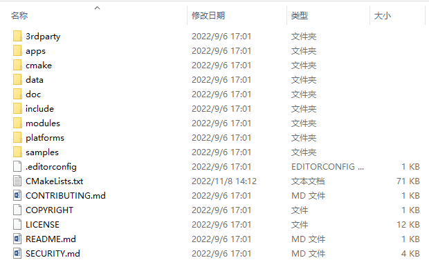
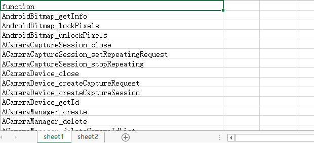
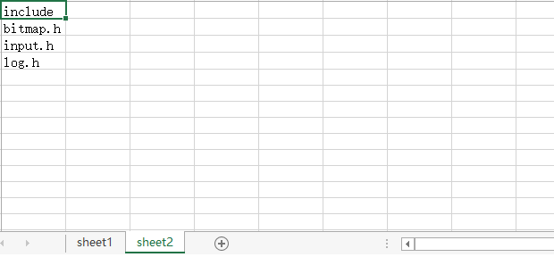

# scan工具

## 简介

scan工具可以扫描三方库中包含OpenHarmony源码不包含的接口，并输出result.xlsx文档。开发者移植三方库到OpenHarmony源码中，若三方库中包含一些OpenHarmony中不存在的接口，便会增加移植难度。此时可使用API扫描工具，提前预知风险接口，降低移植难度，提高开发效率。

## 约束
系统：建议Ubuntu 20.04或者Windows 10

依赖版本：VS Code 1.62.0

## 使用方法

1.下载Andr_N_Games_api.xlsx文件，并放置在napi_generator/src/tool/api/src文件夹下，下载链接如下：

// todo

2.安装typescript：在napi_generator/src/tool/api/src目录下执行命令：

	npm i typescript

3.安装stdio：在napi_generator/src/tool/api/src目录下执行命令：

	npm i stdio

4.根据使用者指定三方库项目源码，工具会输出风险接口。为了方便使用者快速上手工具，此处使用opencv项目为例，项目目录如下：



5.在napi_generator/src/tool/api/src下执行以下命令：

```
node scan.js -d E:\aboutTest\opencv-4.x\opencv-4.x -o E:\aboutTest\opencv-4.x\opencv-4.x
```

其中,参数详情如下：
	-d, 被扫描项目的路径
	-o, 可选参数，默认为当前路径下，输出结果存放路径。

6.在window环境下的，根据输入三方库项目,生成的输出文件result.xlsx，如下所示：


其中生成的result.xlsx文件，风险接口如下所示：




